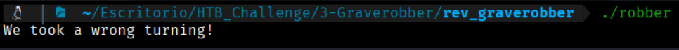
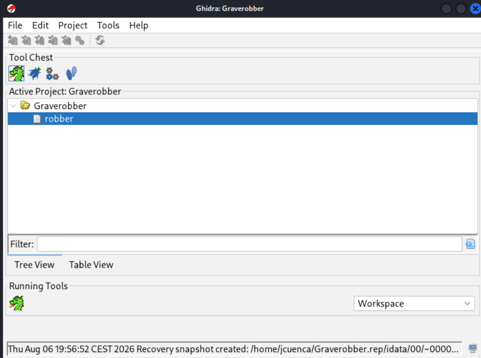
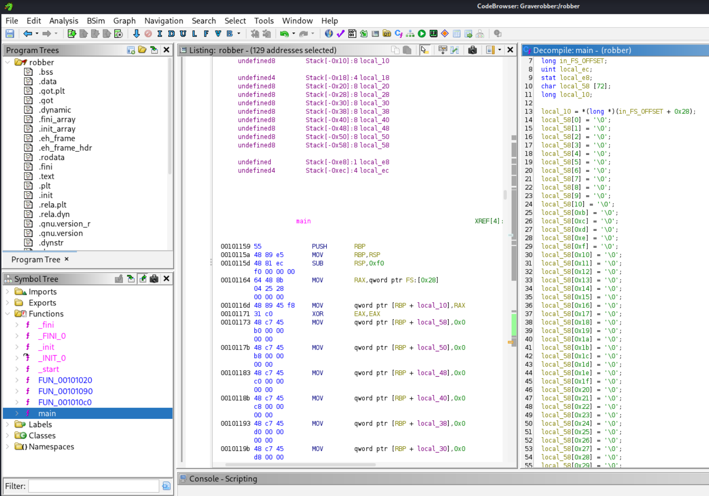
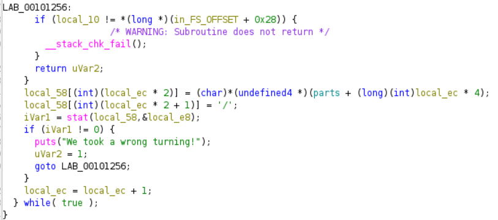
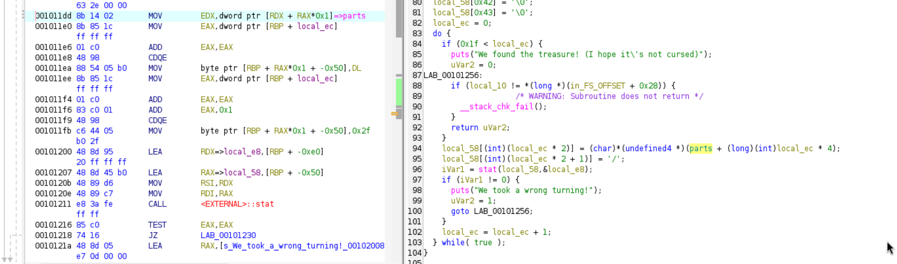
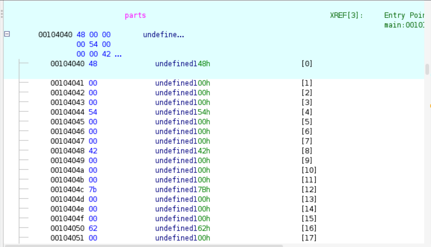
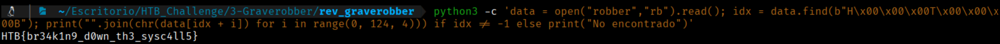

1. First of all, we will execute the binary provided:
```bash
$ ./robber
```


We see that the program terminates immediately after this message. Seeing this, we will analyze the code using the tool previously used in another challenge, Ghidra.

### Decompilation Process in Ghidra

To analyze the program's internal logic and figure out why it fails, we load the executable into **Ghidra**:

1. **Importing the binary:**
   * We open Ghidra and create a new project (`File` $\rightarrow$ `New Project...`).
   * We drag the `robber` executable into the project window and confirm the import (`OK`).

2. **Automatic Analysis:**
   * We double-click on `robber` to open the **CodeBrowser**.
   * When prompted with the pop-up message *"robber has not been analyzed. Would you like to analyze it now?"*, we    select **Yes** and click **Analyze**.



3. **Accessing the main function:**
   * In the **Symbol Tree** panel (on the left), we expand the **Functions** folder.
   * We search for the **`main`** function and double-click on it.
   * In the right panel (**Decompiler**), Ghidra automatically generates the C pseudocode from the assembly language.



## 3. Analysis of the Decompiled Code

Upon reviewing the decompiled `main` function, we identified the snippet responsible for the error message:

```bash
local_58[(int)(local_ec * 2)] = (char)*(undefined4 *)(parts + (long)(int)local_ec * 4);
local_58[(int)(local_ec * 2 + 1)] = '/';
iVar1 = stat(local_58, &local_e8);
if (iVar1 != 0) {
    puts("We took a wrong turning!");
    uVar2 = 1;
    goto LAB_00101256;
}
```



### Explanation of the Failure
The program attempts to validate the existence of local directories using the `stat()` function. The paths it tries to verify are constructed by reading character by character from a global structure called `parts`. Since these directories do not exist on our system, `stat()` returns a non-zero value (`!= 0`), triggering the message `"We took a wrong turning!"`.
However, we observe that the characters read from `parts` are the original components that form the flag.

---

### 4. Navigation and Memory Inspection (`parts`)
**Jump to Data:**  
In the decompiler view inside `main` (or at instruction `0x001011d6` in the disassembler), we **double-click on the green label `parts`**.



**Real Location of the Data (`0x00104040`):**  
Ghidra automatically redirects us to the global data section at address **`0x00104040`**.



**Observed structure:**  
Upon inspecting the Hex Dump at `0x00104040`, we see that the information is not saved as contiguous text, but as 32-bit integers (`dword` / 4 bytes per element) in Little-Endian, leaving 3 null bytes (`00 00 00`) after each ASCII character.
00104040: 48 00 00 00  -> 'H'
00104044: 54 00 00 00  -> 'T'
00104048: 42 00 00 00  -> 'B'
0010404c: 7b 00 00 00  -> '{'
...
To avoid decoding character by character, we will create a script to automate this task.

### 5. Direct Extraction with Python (CLI)
To extract the flag directly from the binary without relying on additional analysis tools or scripts, you can read the `.data` section (offset `0x4040`) by running the following one-liner command in the terminal:
$ python3 -c 'data = open("robber","rb").read(); idx = data.find(b"H\x00\x00\x00T\x00\x00\x00B"); print("".join(chr(data[idx + i]) for i in range(0, 124, 4))) if idx != -1 else print("Not found")'

### Step-by-Step Command Explanation
* **`python3 -c '...'`**  
  Executes the code block passed as a string directly from the command line without needing to create a `.py` file.
* **`data = open("robber","rb").read()`**  
  Opens the `robber` binary in read-binary mode (`"rb"`) and reads the entire file into memory as a `bytes` object, storing it in the `data` variable.
* **`idx = data.find(b"H\x00\x00\x00T\x00\x00\x00B")`**  
  Searches for the exact position (*offset*) within the executable file where the flag signature begins. Since each character is stored as a 32-bit integer (4 bytes), the initial `HTB` sequence is represented as the letter followed by 3 null bytes (`\x00`). It returns the exact index or `-1` if not found.
* **`if idx != -1 else print("Not found")`**  
  Control structure flow. Verifies that the pattern was located before attempting to process the memory block.
* **`range(0, 124, 4)`**  
  Generates a sequence of numbers starting at `0` up to `120` (124 bytes in total, corresponding to 31 characters **×** 4 bytes per character), stepping in increments of 4 bytes to skip the null bytes.
* **`chr(data[idx + i])`**  
  Takes the byte corresponding to the character (`data[idx + 0]`, `data[idx + 4]`, etc.) and converts its ASCII code integer value into its text representation.
* **`"".join(...)`**  
  Concatenates all individual characters processed by the iteration to form the complete flag string.
* **`print(...)`**  
  Prints the resulting string to the console's standard output.



Flag --> HTB{br34k1n9_d0wn_th3_sysc4ll5}