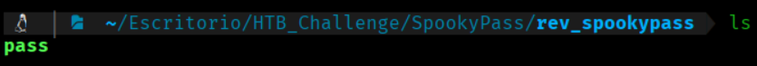
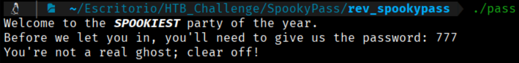
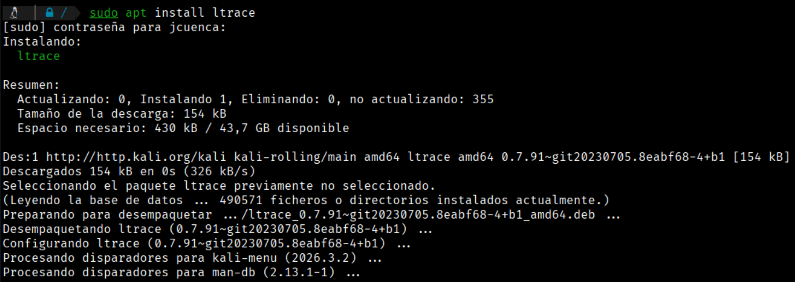
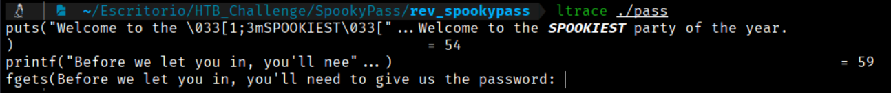
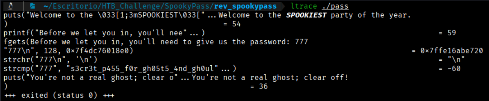
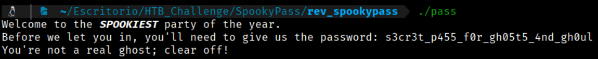
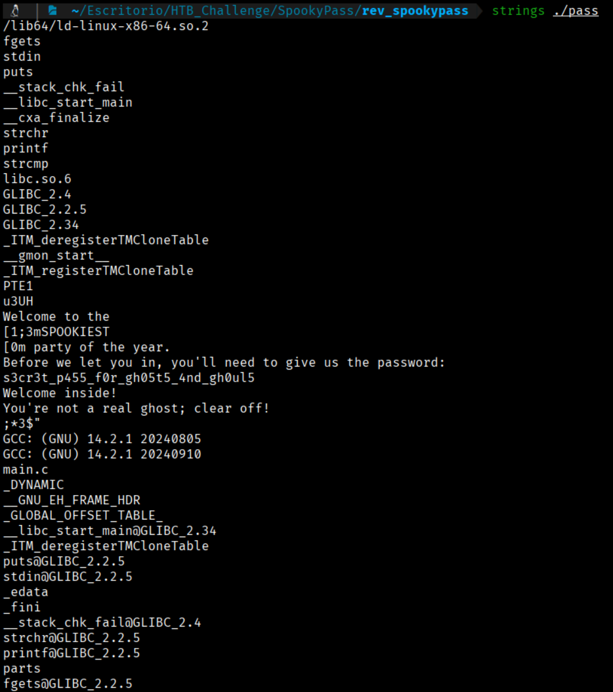
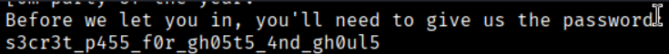
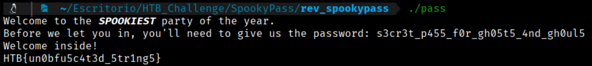

In this challenge, we will first download the provided `.zip` file to inspect its contents.



In this case, it contains a single file named `pass`. Running the file yields the following output:
```bash
./pass
```



It asked us for a password; we entered 777, but that is not the password.

If this program is not very well made, the password it holds as correct and against which it compares the user's input might be stored in a variable as a plain text string.

To check if this is the case, we can do the following:

1.- First, we will install the "ltrace" tool:
```bash
$ sudo apt install ltrace
```


2.- Once installed, we run ltrace:
```bash
$ ltrace ./pass
```


When entering a password, we see that the program uses strcmp to compare our password against something, and that something is the password we are looking for.



This is the important line → strcmp("777", "s3cr3t_p455_f0r_gh05t5_4nd_gh0ul"...).

If I am not mistaken, the password is → s3cr3t_p455_f0r_gh05t5_4nd_gh0ul Let's check if that's the case



Well, we see that it is not the expected password. Another assumption is that "ltrace" might not be showing the password correctly. For this, we will use the "strings" command.

The strings command is a command-line tool in Unix/Linux systems designed to extract and print printable character sequences (ASCII/Unicode readable text) contained within binary or executable files.

Common use cases:

- Reverse Engineering and Malware Analysis: Identify IPs, URLs, filenames, keys, or messages inside a binary without running it.

- Digital Forensics: Find text traces in memory dumps or corrupted files.

- Metadata Inspection: Identify compiler versions (GCC, Clang), libraries used, or original build paths.



If we look closely, we find the password and see that it is now complete → s3cr3t_p455_f0r_gh05t5_4nd_gh0ul5



Let's try this password again.


    
Here is the flag:
```bash 
HTB{un0bfu5c4t3d_5tr1ng5}
```