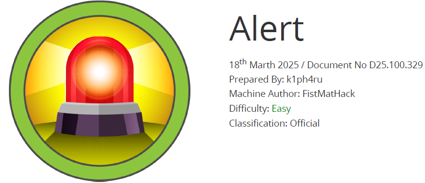

# Scope

Alert is a Linux machine rated as easy, featuring a web application that allows users to upload, view, and share Markdown files. The application contains a cross-site scripting (XSS) vulnerability, which can be abused to reach an internal page affected by an Arbitrary File Read flaw. This weakness is used to obtain a password hash, which is subsequently cracked to recover valid credentials and gain SSH access to the system. Further enumeration reveals a PHP script that runs on a scheduled basis and has overly permissive rights assigned to the management group, of which our user is a member. These misconfigured permissions make it possible to overwrite the script and execute code with root privileges.

# Index
- [Enumeration](Enumeration.md)
- [Fuzzing](Fuzzing.md)
- [Foothold](Foothold.md)
- [Priv Escalation](Priv_Escalation.md)

Go back to [Hack-The-Box_CTF](https://github.com/jesuscuenca-cyber/Hack-The-Box_CTF)

