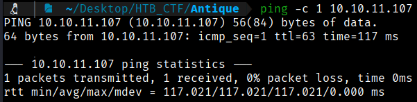
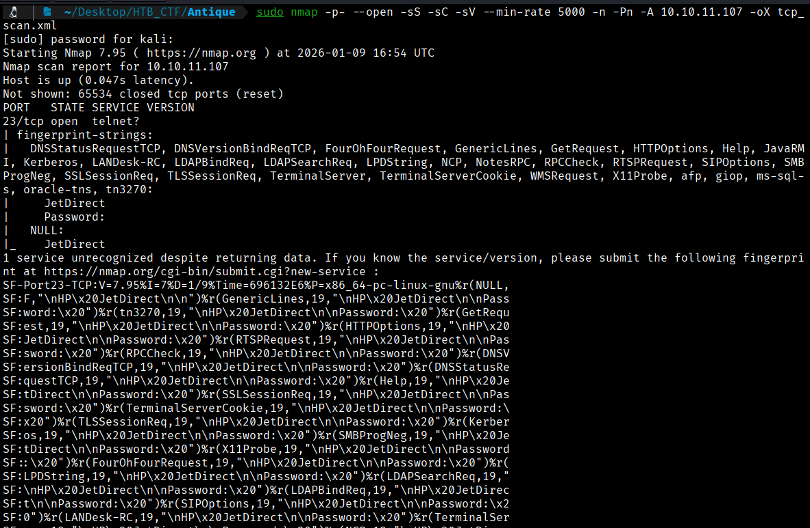
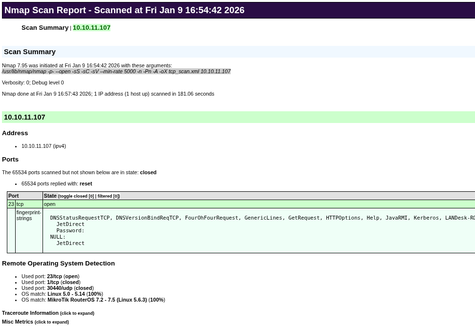
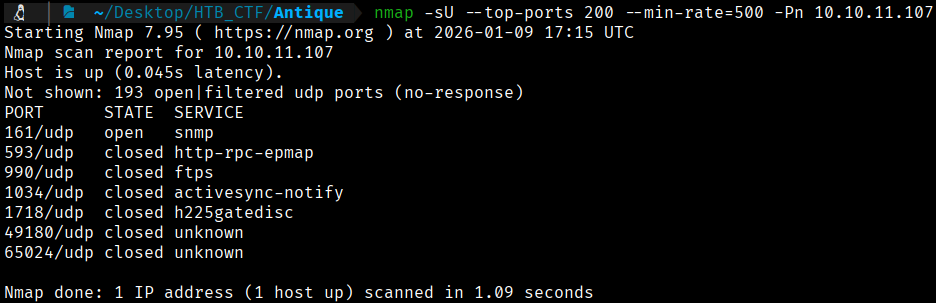
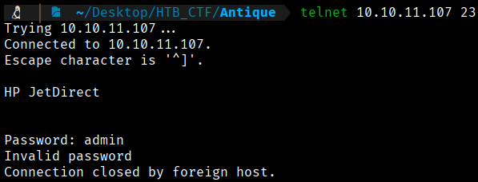
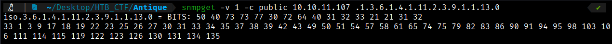

First of all we check that we have connection with IP target.
```bash
$ ping -c 1 10.10.11.107
```


This TTL value on HTB indicates that is a Linux machine.

We will start with our usual Nmap scan and find the following open ports. 
```bash
$ sudo nmap -p- --open -sS -sC -sV --min-rate 5000 -n -Pn -A 10.10.11.107 -oX tcp_scan.xml
$ xsltproc tcp_scan.xml -o tcp_scan.html
```
-p- → Scans all 65,535 TCP ports, not just the most common ones. All 65,535 TCP ports, not just the most common ones, not just the most common ones. 

--open → Shows only ports that are open, filtering out closed or filtered ones.

-sS → Performs a TCP SYN scan (half-open scan), which is fast and stealthy and requires root privileges.

-sC → Runs default NSE (Nmap Scripting Engine) scripts to gather additional information such as common vulnerabilities and service details.

-sV → Attempts to detect service versions running on open ports.

--min-rate 5000 → Forces Nmap to send at least 5000 packets per second, speeding up the scan but increasing the chance of detection or packet loss.

-n →  Disables DNS resolution to make the scan faster.

-Pn → Skips host discovery and assumes the target is alive, useful when ICMP is blocked.

-A → Enables aggressive scan options, including OS detection, version detection, script scanning, and traceroute.

-oX → Output option: write results in XML format to file nmap.xml.  Other formats: -oN (normal), -oG (grepable), -oA (all formats).





The Nmap scan shows that the only open port is 23 (Telnet).

Let's scan UDP ports.



 **Telnet (TCP port 23)** is open and allows remote access, but it usually requires valid credentials.

 **SNMP (UDP port 161)**, if misconfigured (for example, using the `public` community string), can leak sensitive information.

Through SNMP enumeration (e.g., using `snmpwalk`), it is possible to obtain:
  - System users
  - Plaintext passwords or password hashes
  - Credentials for devices such as printers or network services

The practical relationship is that **SNMP acts as an information disclosure vector**, revealing credentials that can later be reused to authenticate via **Telnet**, thereby gaining initial access to the system.

If we try to connecto to Telnet service, we will see that we need credentials to do anything
```bash
$ telnet 10.10.11.107 23
```


So we will enumerate de SNMP port using Snmpwalk tool.
```bash
$ snmpwalk -v 1 -c public 10.10.11.107
```
- Uses **SNMP version 1** (`-v 1`)
- Uses the **community string `public`** (`-c public`)
- Connects to the host **10.10.11.107**
- Enumerates all accessible SNMP information by walking through the OID tree


This confirms that:
- The **SNMP service (UDP port 161)** is active.
- Information can be enumerated via SNMP.
- The exposed system is a **printer**, which is often relevant because such devices may store or leak **credentials** or sensitive configuration details that can later be reused to access other services, such as **Telnet**.

Searching in Google we find the followign information: 

For older models like the HP JetDirect 300x, the default admin password is not publicly documented and may not be recoverable through standard means. A workaround involves using SNMP to retrieve the password via the command `snmpget -v 1 -c public <IP_address> .1.3.6.1.4.1.11.2.3.9.1.1.13.0`, which returns a hexadecimal string that can be converted to ASCII to reveal the password.

If we pay attention to the machine name, maybe we are in front the antique HP printer. So, let's try to do that Google says
```bash
$ snmpget -v 1 -c public 10.10.11.107 .1.3.6.1.4.1.11.2.3.9.1.1.13.0
```


As we saw on Google, now we have a hexadecimal string that can be converted to ASCII to reveal the password.


[Back](README.md)