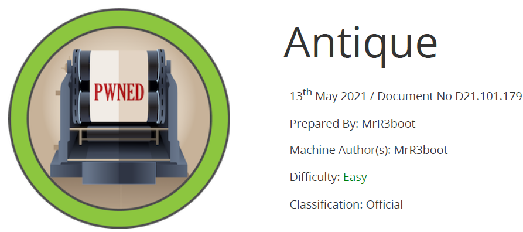

# Scope

Antique is a straightforward Linux machine that includes a network printer leaking credentials via an SNMP string, enabling access to the Telnet service. Initial access is achieved by abusing a printer functionality exposed through the locally running CUPS administration service, which can then be further exploited to escalate privileges and obtain root access on the system.

# Index
- [Enumeration](Enumeration.md)
- [Foothold](Foothold.md)
- [Priv Escalation](Priv_Escalation.md)

Go back to [Hack-The-Box_CTF](https://github.com/jesuscuenca-cyber/Hack-The-Box_CTF)
