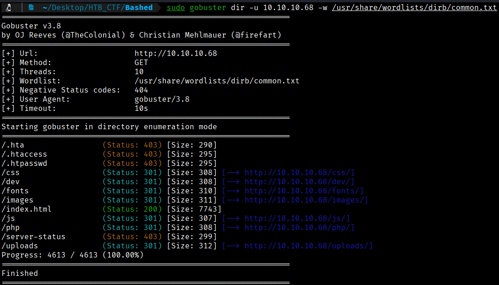
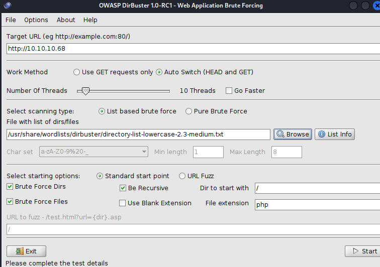
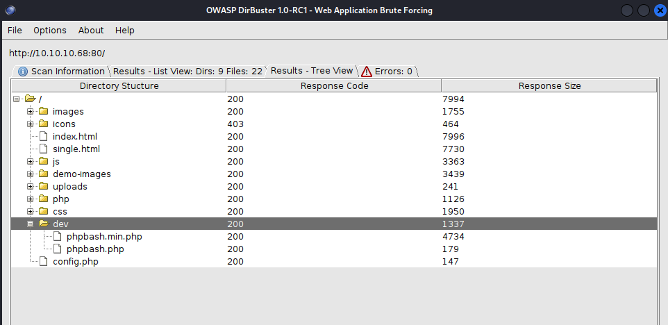

The Gobuster tool will allow us to scan for hidden resources such as subdomains, directories, and parameters.
Let's look for hidden subdomains. 
```bash
$ sudo gobuster dir -u 10.10.10.68 -w /usr/share/wordlists/dirb/common.txt 
```


Let's try to do an enumeration but with another tool, with Dirbuster to compare the results and to try to find more information.





Dirbuster uncovers, among other findings, a *dev* folder that hosts a working version of **phpbash**. This directory is subtly referenced in a blog entry on the main website.


[Back](README.md)