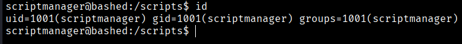
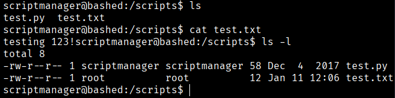
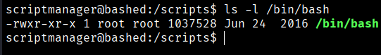
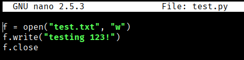
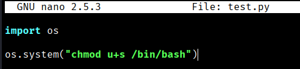
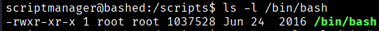
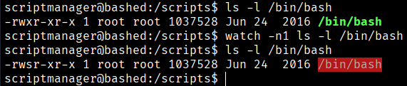
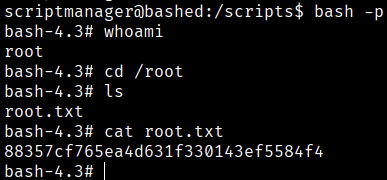

As we saw previously www-data user can run any command as scriptmanager . So if we do
```bash
$ sudo -u scriptmanager bash, now we have scriptamanger
```





Examining the file information in the directory shows that **test.py** is executed every minute.

This can be inferred by inspecting **test.py** and checking the timestamp of **test.txt**.  

The text file is owned by **root**, so it can also be assumed that it runs as a **root cron job**.  

A **root shell** can be obtained simply by modifying **test.py** or creating a new Python file in the **/scripts** directory, since all scripts in that directory are executed.


```bash
$ nano test.py
```



We modify this test.py for this, to try the get a root permisions





So we wait until root execute test.py and we will see that the bash have SUID permisions



So now if we do:
```bash
$ bash -p
```
We got the root permisions in our reverse shell


```bash
Root Flag --> 88357cf765ea4d631f330143ef5584f4
```

[Back](README.md)