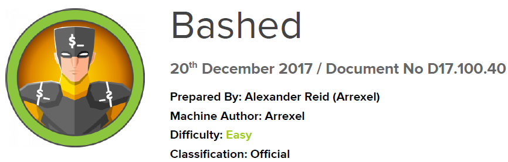

# Scope

Bashed is a relatively simple machine that primarily concentrates on fuzzing techniques and identifying critical files. Since direct access to the crontab is limited.

# Index
- [Enumeration](Enumeration.md)
- [Fuzzing](Fuzzing.md)
- [Foothold](Foothold.md)
- [Priv Escalation](Priv_Escalation.md)

Go back to [Hack-The-Box_CTF](https://github.com/jesuscuenca-cyber/Hack-The-Box_CTF)
