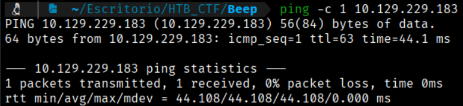
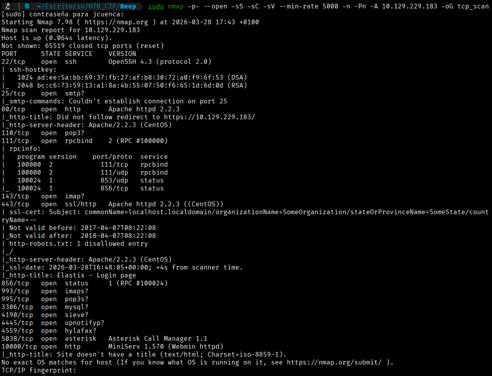
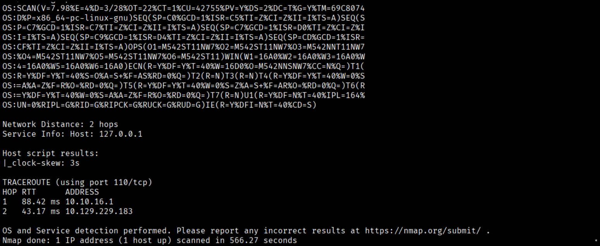
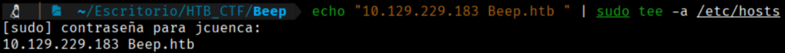
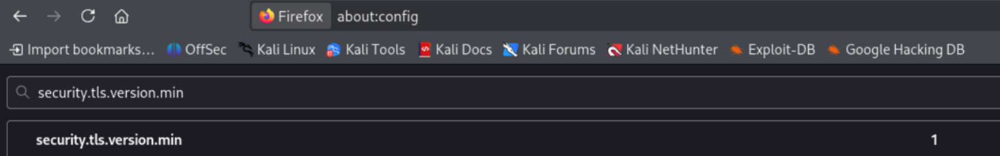
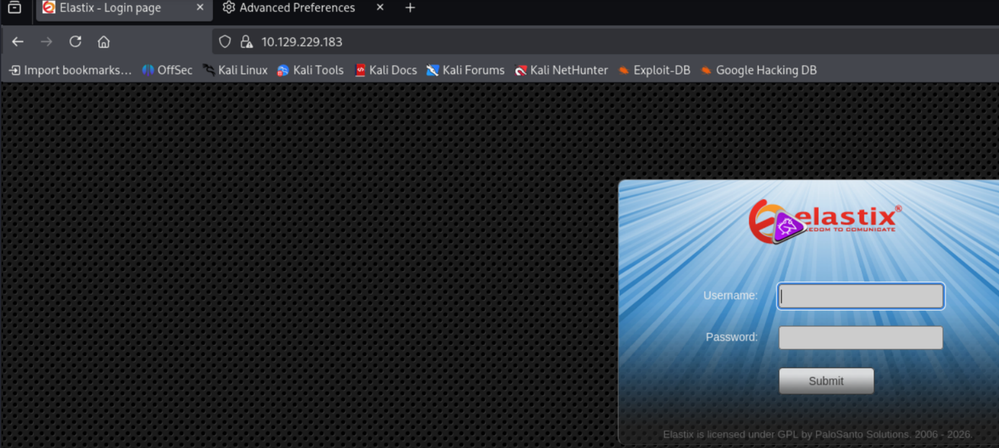
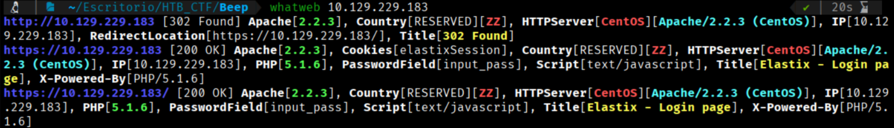

First of all we check that we have connection with IP target.
```bash
$ ping -c 1 10.129.229.183
```


This TTL value on HTB indicates that is a Linux machine.

We will start with our usual Nmap scan and find the following open ports. 
```bash
$ sudo nmap -p- --open -sS -sC -sV --min-rate 5000 -n -Pn -A 10.129.229.183 -oG tcp_scan.xml
```
-p- → Scans all 65,535 TCP ports, not just the most common ones. All 65,535 TCP ports, not just the most common ones, not just the most common ones. 

--open → Shows only ports that are open, filtering out closed or filtered ones.

-sS → Performs a TCP SYN scan (half-open scan), which is fast and stealthy and requires root privileges.

-sC → Runs default NSE (Nmap Scripting Engine) scripts to gather additional information such as common vulnerabilities and service details.

-sV → Attempts to detect service versions running on open ports.

--min-rate 5000 → Forces Nmap to send at least 5000 packets per second, speeding up the scan but increasing the chance of detection or packet loss. 

-n →  Disables DNS resolution to make the scan faster.

-Pn → Skips host discovery and assumes the target is alive, useful when ICMP is blocked.

-A → Enables aggressive scan options, including OS detection, version detection, script scanning, and traceroute.

-oG → Output option: write results in XML format to file nmap.xml.  Other formats: -oN (normal), -oG (grepable), -oA (all formats).




First of all we will try to open with our browser the IP. To access the website, we must add the IP to our /etc/hosts file to resolve the connection with the IP address.
```bash
$ echo "10.129.229.183 Beep.htb " | sudo tee -a /etc/hosts 
```



Now we can go to the IP with our browser. (In this case the ssl certificate is too old, so, you need to configure your firefox like this 



**Remember to configure once you finish you lab because this config is very dangerous.**



 While browsing the web, we go to the Wappalyzer application or run a WhatWeb scan in our command-line console, we will see that we do not obtain any additional information beyond what has already been provided by Nmap.
```bash
$ whatweb 10.129.229.183
```





[Back](README.md)