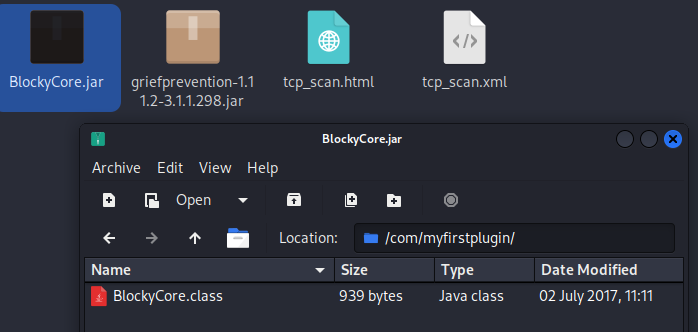
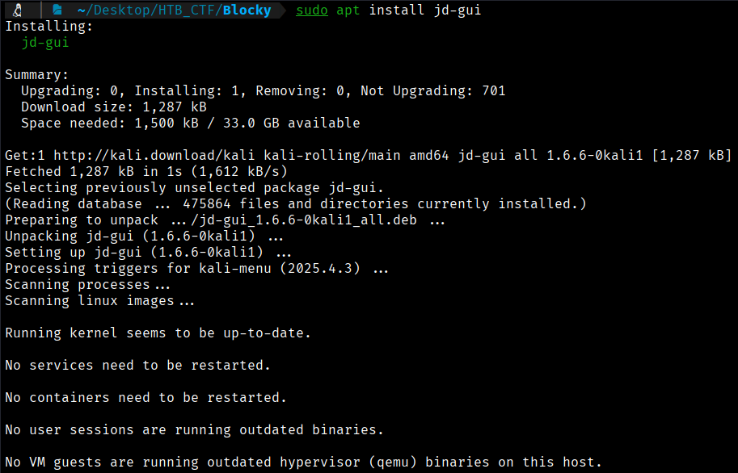
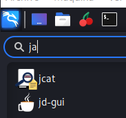
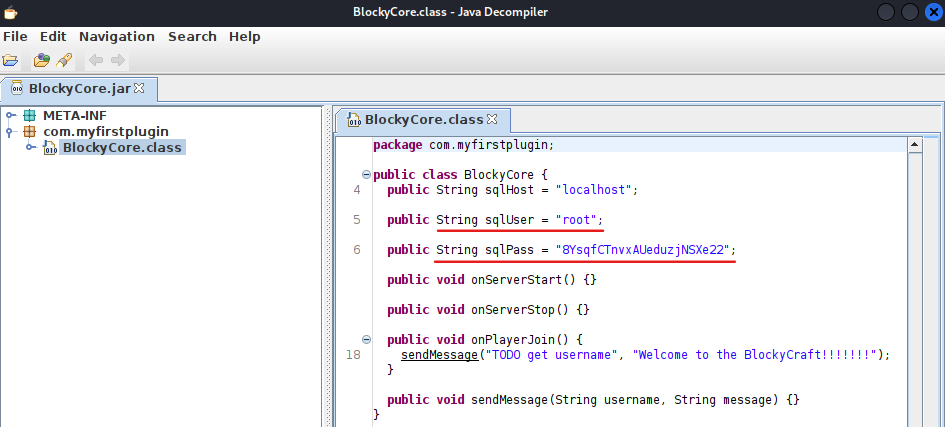
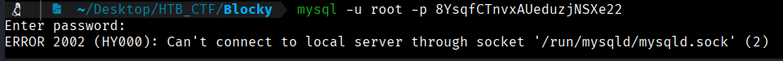
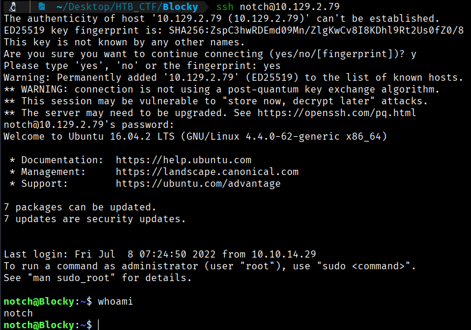
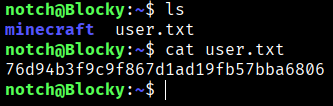

If we open the Java files that were found, we come across **.class** files. In order to open these files, we will install java descompilerl using the command below:


```bash
$ sudo apt install jd-gui
```






Upon inspecting the JAR files, **GriefPrevention** is identified as an open-source plugin that is publicly available. In contrast, **BlockyCore** seems to be custom-made by the server administrator, as its name directly references the server itself. Decompiling the file with **JD-GUI** reveals the credentials for the MySQL root user.
```bash
User: root
Pass: 8YsqfCTnvxAUeduzjNSXe22
```
With this information, we will now attempt to connect to the database using **MySQL** and the credentials that were obtained.
```bash
S mysql -u root -p 8YsqfCTnvxAUeduzjNSXe22   
```
However, this does not appear to be working.



As we observed in our **nmap** scan that port **22 (SSH)** was open, we will try to log in using the user **"notch"**, which we identified in a post on the website itself during the enumeration phase. We will use the MySQL password we found to check whether there is any credential reuse.
```bash
$ ssh notch@10.129.2.79
```


We got it — we have an **SSH connection** and are logged in as the user **"notch"**. Once inside, if we explore the directories, we will find our **user flag**.



```bash
User Flag --> 76d94b3f9c9f867d1ad19fb57bba6806
```


[Back](README.md)