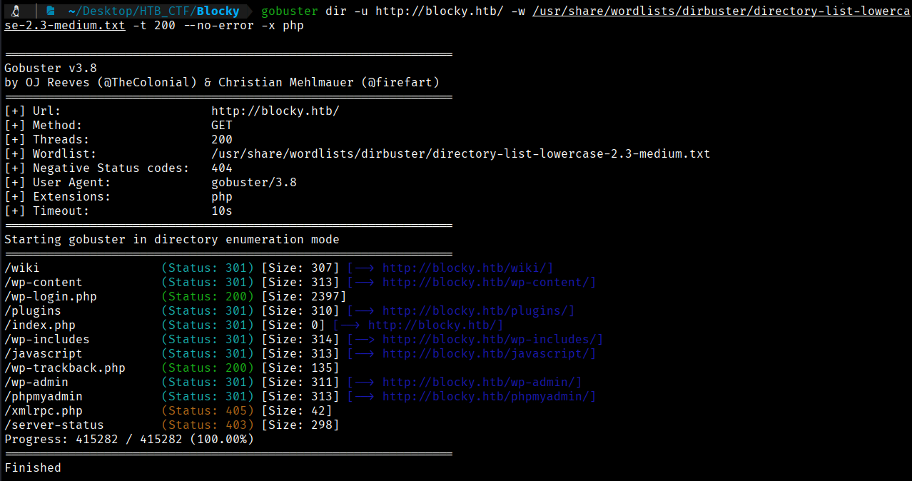
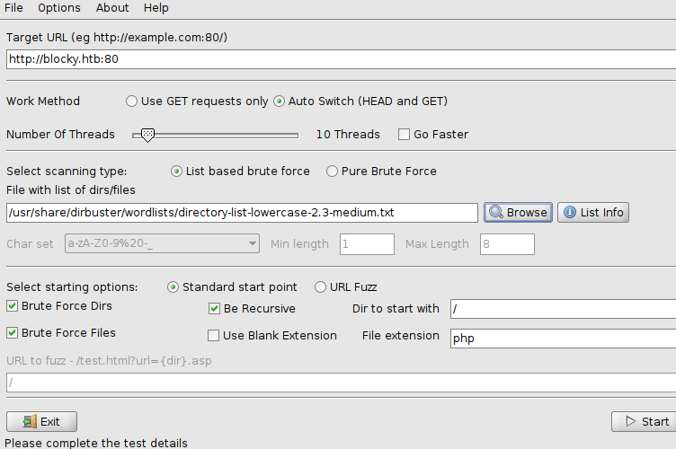
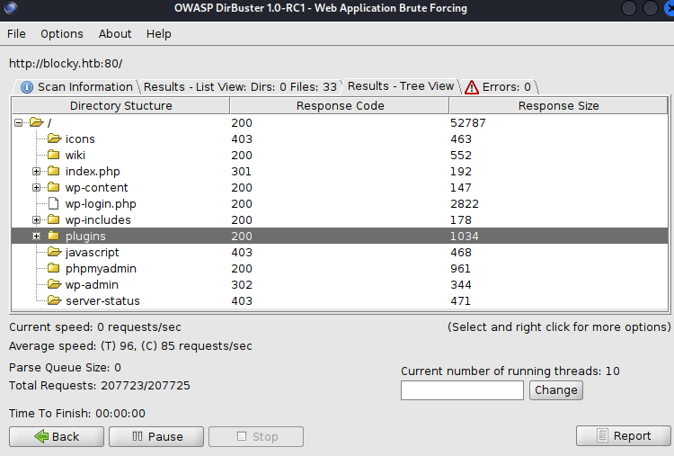
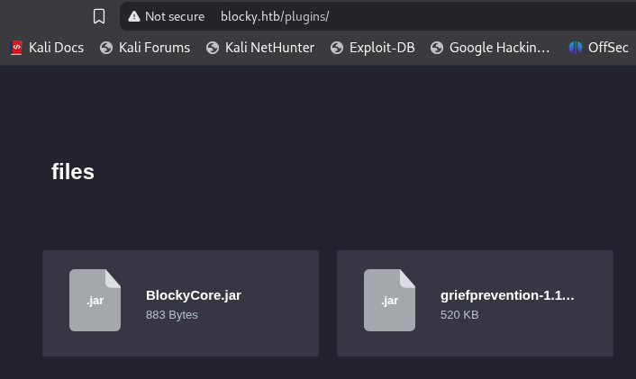

The Gobuster tool will allow us to scan for hidden resources such as subdomains, directories, and parameters.
Let's look for hidden subdomains. 
```bash
$ gobuster dir -u http://blocky.htb/ -w /usr/share/wordlists/dirbuster/directory-list-lowercase-2.3-medium.txt -t 200 --no-error -x php
```
 
- **`-t 200`** → Defines the number of simultaneous threads  
- **`--no-error`** → Filters out common error responses such as **404 Not Found** and **403 Forbidden**  
- **`-x php`** → Specifies the **file extensions** that will be automatically tested (e.g., `.php`) (becasuse thanks to wappalyzer we know that a php is runing in the website)



Let's try to do an enumeration but with another tool, with Dirbuster to compare the results and to try to find more information.





After some trial and error, it becomes clear that *fuzzing* a **WordPress** website poses several challenges, particularly when performing recursive scans and targeting **PHP** files. By using the *Dirbuster lowercase medium* wordlist and restricting the *fuzzing* to directories only, a directory named **plugins** is discovered. This should not be confused with the official WordPress `wp-content/plugins` directory. A quick look inside reveals several **JAR** files, which are used by **Minecraft** to add additional functionality to a server.




[Back](README.md)