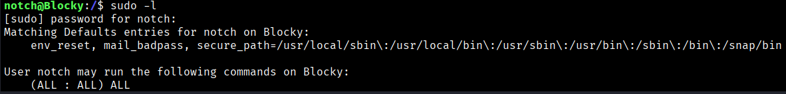
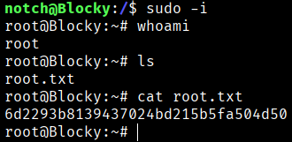

If in our ssh session do;
```bash
$ sudo -l
```
We can see that this user can do ALL comands without restriction



So if we do 
```bash
$ sudo -i
```
Starts a root shell session, as if you had logged in directly as the root user.  
It is different from `sudo <command>` because here you get a full root environment, not just the execution of a single command. And then with root permissions we can search the root flag.


```bash
Root Flag → 6d2293b8139437024bd215b5fa504d50
```


[Back](README.md)