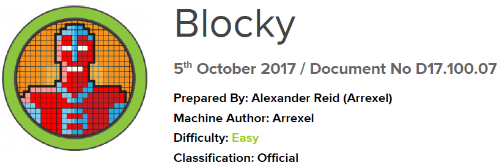

# Scope

Blocky is relatively straightforward overall and is modeled after a real-world system. It highlights the dangers of poor password hygiene, along with the risks of exposing internal files on a publicly accessible machine. In addition, it reveals a significant attack surface: Minecraft. There are tens of thousands of publicly reachable servers, most of which are set up and managed by young and inexperienced system administrators.

# Index
- [Enumeration](Enumeration.md)
- [Fuzzing](Fuzzing.md)
- [Foothold](Foothold.md)
- [Priv Escalation](Priv_Escalation.md)

Go back to [Hack-The-Box_CTF](https://github.com/jesuscuenca-cyber/Hack-The-Box_CTF)
