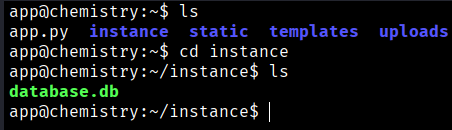
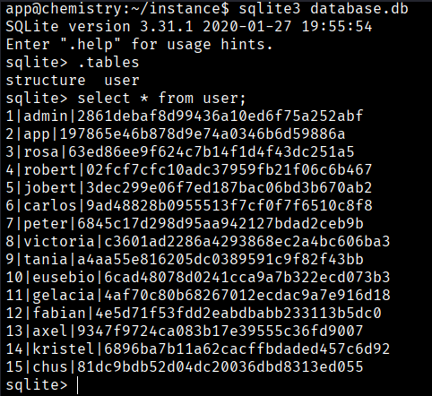
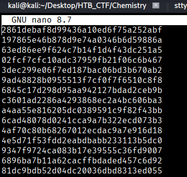
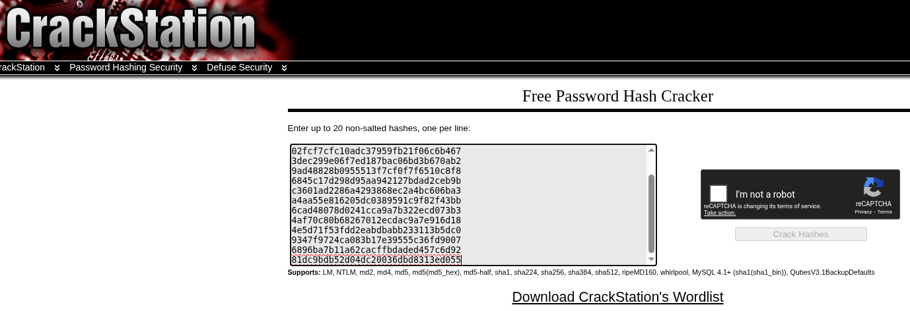
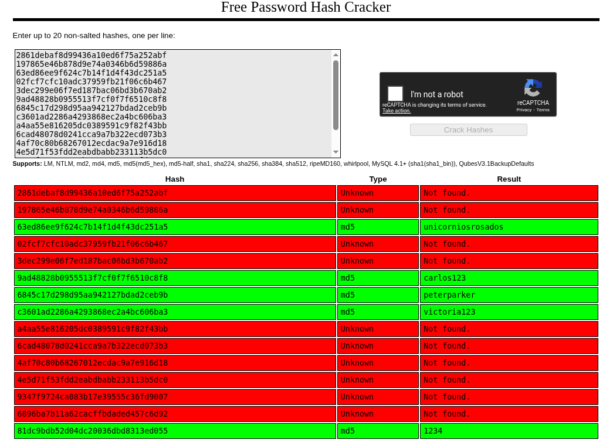
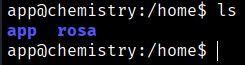
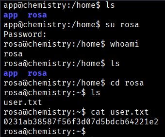

Looking around, we find a database.db file inside the instance directory. In the database file, we find some password hashes of users.


```bash
$ sqlite3 database.db
$ .tables
$ select * from user;
```


We save these hashes in a file and use hashcat to crack them.
```bash
$ cat cut -f 3 -d '|' > hashes
```



We can use https://crackstation.net/ to crakc this hashes





```bash
rosa:unicorniosrosados
carlos:carlos123
peter:peterparker
victoria:victoria123
chus:1234
```
Now we come back to our reverse shell



And we will try to conect as “rosa” user to get the flag because with “app” user we don't have permisions.


```bash
User Flag → 0231ab38587f56f3d07d5bdcb64221e2
```


[Back](README.md)