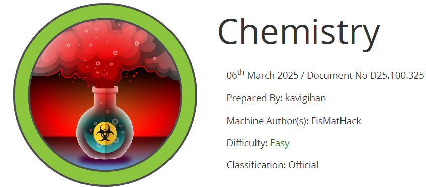

# Scope

**Chemistry** is an easy-rated Linux machine that highlights a **Remote Code Execution (RCE)** vulnerability in the **pymatgen** Python library (**CVE-2024-23346**). The flaw is exploited by uploading a specially crafted malicious CIF file to the target’s **CIF Analyzer** web application.  
After extracting and cracking credential hashes, we successfully authenticate to the system via **SSH** as the **rosa** user.  
For privilege escalation, a **Path Traversal** vulnerability leading to **arbitrary file read** is exploited in the **AioHTTP** Python library (**CVE-2024-23334**), which is used by an internally running web application, allowing access to the **root flag**.

# Index
- [Enumeration](Enumeration.md)
- [Foothold](Foothold.md)
- [Lateral movement](Lateral_movement.md)
- [Priv Escalation](Priv_Escalation.md)

Go back to [Hack-The-Box_CTF](https://github.com/jesuscuenca-cyber/Hack-The-Box_CTF)
