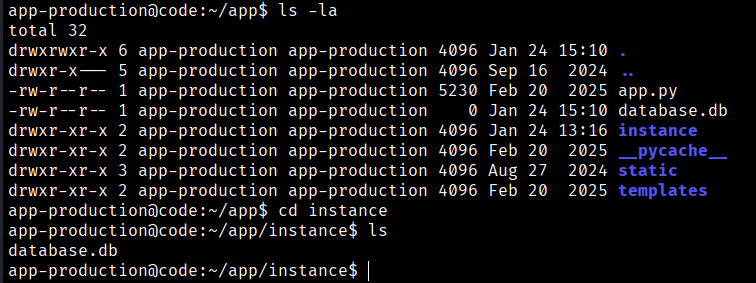
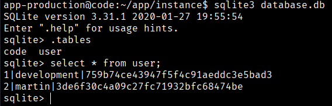
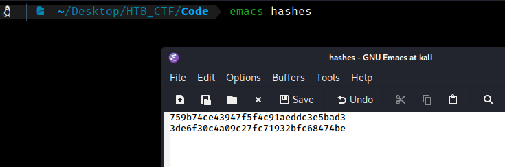
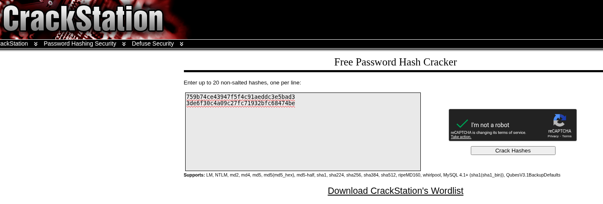
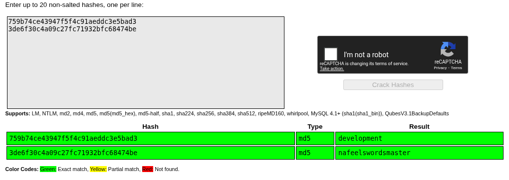
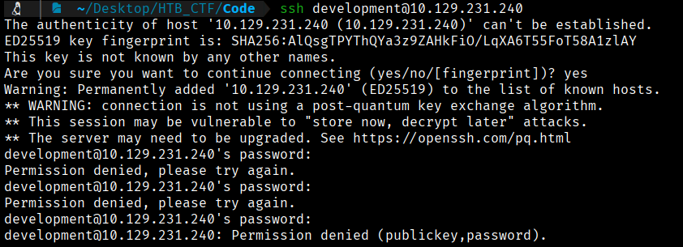
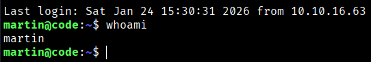

If we run `ls -la` to check the permissions on the directories, we find the `instance` folder, and inside it we see a file called `database.db`.



So we will try to access to “database.db”
```bash
$ sqlite3 database.db
$ .tables
$ select * from user;
```
In the database file, we find some password hashes of users.



We save these hashes in a file and use hashcat to crack them.



We can use https://crackstation.net/ to crakc this hashes





```bash
development:development
martin:nafeelswordsmaster
```

Let's see if these users has reused his password. To do this, we can try to access the system via SSH using the credentials we obtained, since the Nmap scan showed that the SSH port is open.



It seems that the `development:development` credentials do not work correctly, so we will try the other ones we obtained. That works perfectly




[Back](README.md)