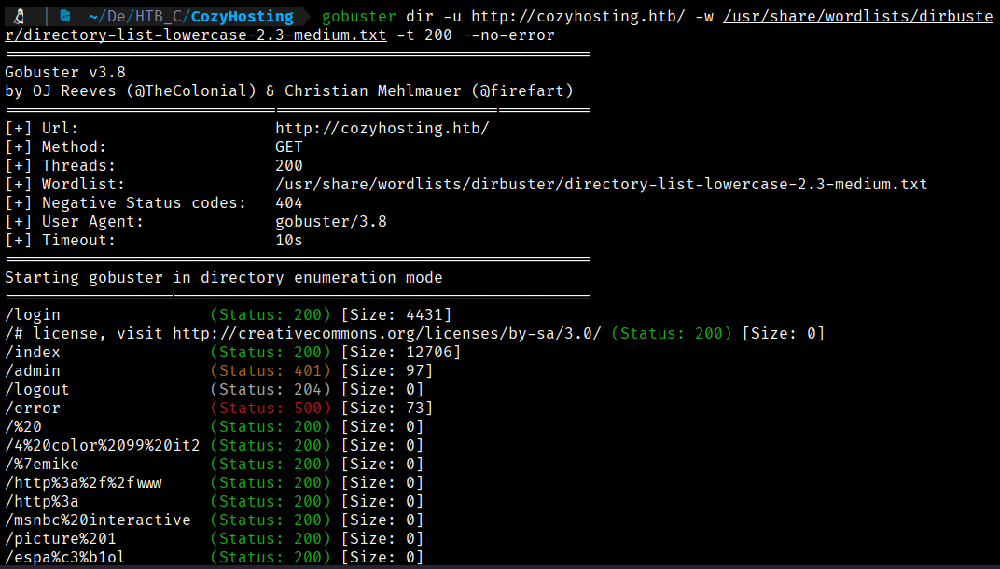
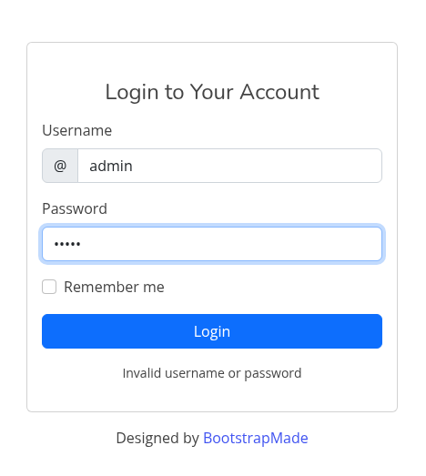
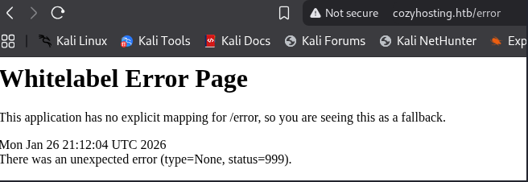
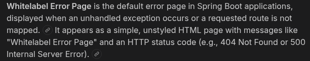
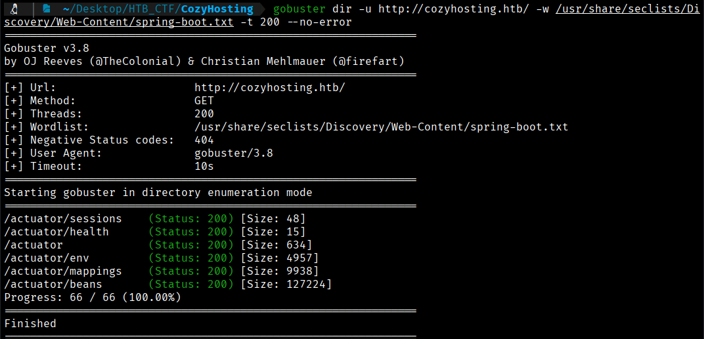

The Gobuster tool will allow us to scan for hidden resources such as subdomains, directories, and parameters.
Let's look for hidden subdomains. 
```bash
$ gobuster dir -u http://cozyhosting.htb/ -w /usr/share/wordlists/dirbuster/directory-list-lowercase-2.3-medium.txt -t 200 --no-error -x php
```
 
- **`-t 200`** → Defines the number of simultaneous threads  
- **`--no-error`** → Filters out common error responses such as **404 Not Found** and **403 Forbidden**  
- **`-x php`** → Specifies the **file extensions** that will be automatically tested (e.g., `.php`) (becasuse thanks to wappalyzer we know that a php is runing in the website)



From all the results obtained, we will keep…

/login
/index
/admin
/logout
/error

Upon accessing the /login page and attempting to authenticate with common credentials, we are unable to gain access to the application.



Browsing to /error returns an error page with a header stating "Whitelabel Error Page" .



Researching this error reveals that this application is using SpringBoot .



We can now run our scan again, this time using a Spring Boot -specific wordlist.
```bash
$ gobuster dir -u http://cozyhosting.htb/ -w /usr/share/seclists/Discovery/Web-Content/spring-boot.txt -t 200 --no-error
```



[Back](README.md)