Our shell places us in the `/app` directory, where we find a Java Archive file named `cloudhosting-0.0.1.jar`. We can extract it into `/tmp/app` using the `-d` flag with `unzip`, which specifies the destination directory.
```bash
$ ls

$ unzip -d /tmp/app cloudhosting-0.0.1.jar
```
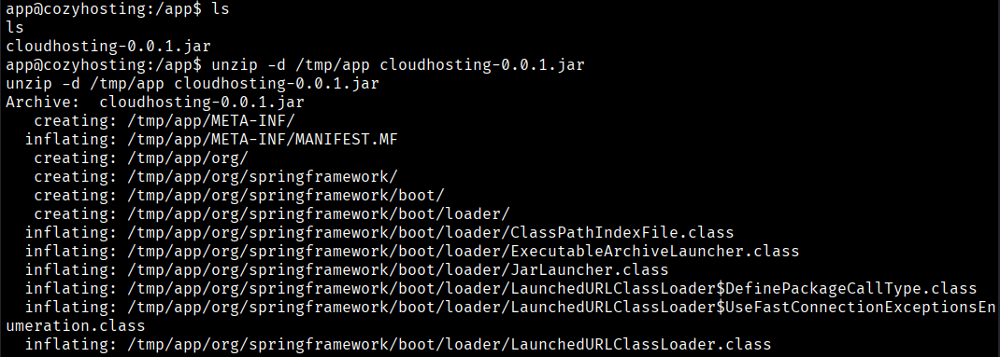

Looking at the /tmp/app/BOOT-INF/classes/application.properties file, we see some database credentials.
```bash
$ cat /tmp/app/BOOT-INF/classes/application.properties
```
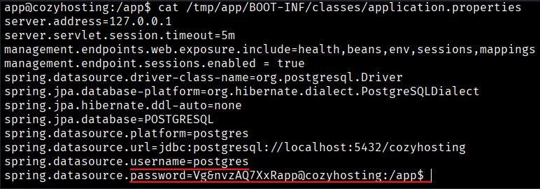

The file discloses the credentials postgres:Vg&nvzAQ7XxR , with which we can connect to the local PostgreSQL instance.
```bash
$ psql -h 127.0.0.1 -U postgres
```
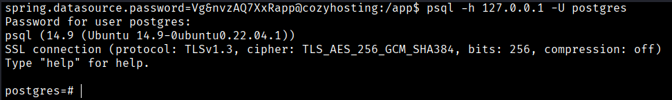

Listing all the available databases, we observe the presence of the cozyhosting database.
```bash
$ \list
```
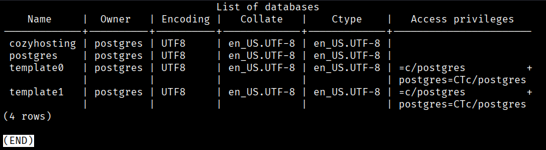

We connect to the database by utilizing the \connect directive.
```bash
$ \connect cozyhosting
```

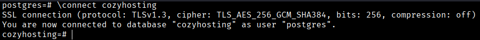

After establishing a successful connection to the database, we can run the `\dt` command to display all the tables available in the database.
```bash
$ \dt
```
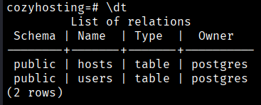

Next, we use a `SELECT` query to retrieve and display all the data stored in the `users` table.
```bash
$ select * from users;
```

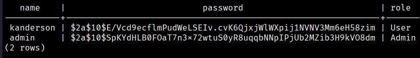

Here, we have two password hashes: one for the user kanderson and the other for the user Admin . We use hashid to identify the hash type:

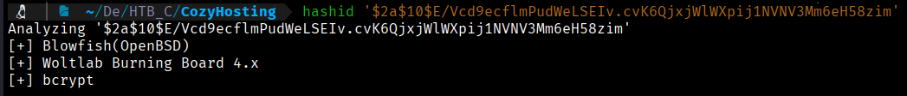

Given that these hashes originate from a Spring Boot web application, bcrypt is the most probable algorithm in use. We save the administrator’s hash to a file and attempt to crack it with Hashcat, using mode `3200` for bcrypt.

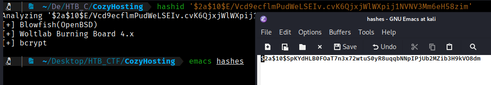

$ hashcat hashes -m 3200 /usr/share/wordlists/rockyou.txt

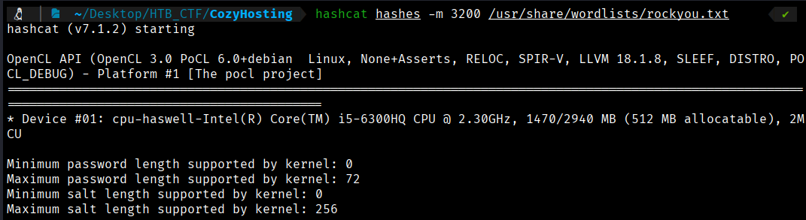

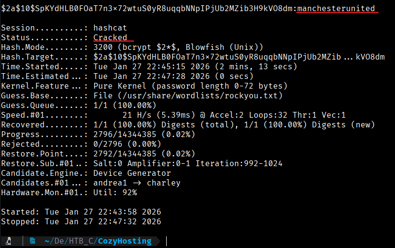

We successfully cracked the hash and recovered the password `manchesterunited`.
```bash
$ cat /etc/passwd
```

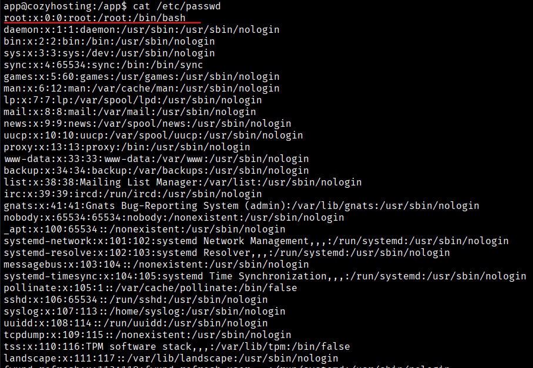

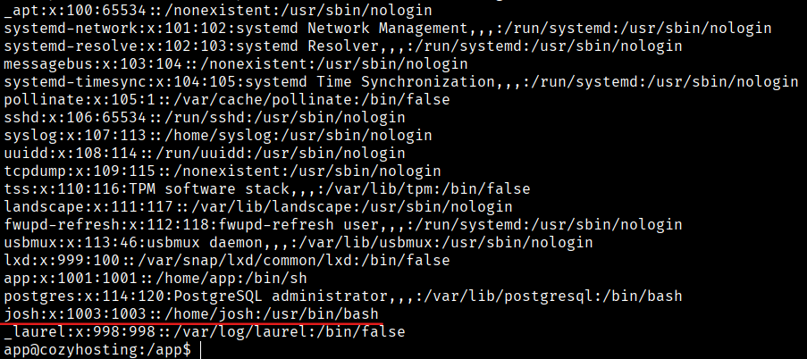

While reviewing the users on the system, we identify an account named `josh`. We can try using the previously recovered password to authenticate as the `josh` user.
```bash
$ ssh josh@10.129.229.88
```
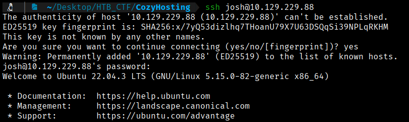

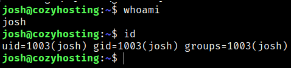

We successfully log in as the user `josh`. The user flag can be found at `/home/josh/user.txt`.

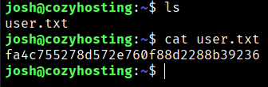

```bash
User Flag → fa4c755278d572e760f88d2288b39236
```


[Back](README.md)