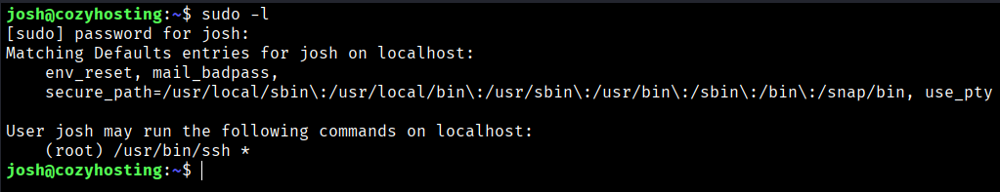
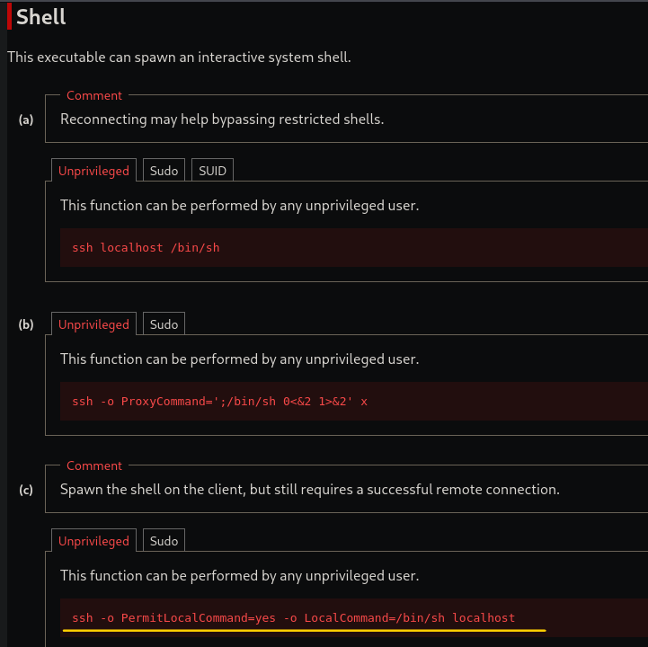
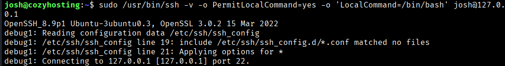
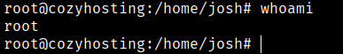
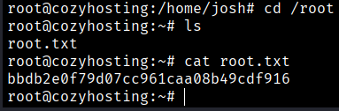

After checking the sudo permissions for the user `josh`, we find that they are allowed to run `/usr/bin/ssh` as root.
```bash
$ sudo -l
```



By visiting the GTFOBins website (https://gtfobins.org/gtfobins/ssh/#shell) and specifying that we have sudo permissions for `ssh`, we find a command that allows us to obtain a shell as root.



We observe that using the `-o` flag allows us to set the `PermitLocalCommand=yes` option. This setting enables the execution of local commands on the client machine once an SSH connection is successfully established.  
By specifying `LocalCommand=/bin/bash`, we define the command to be executed locally after the connection is made. In this case, it launches a Bash shell, resulting in an interactive session with root privileges.

We need to use the absolure route and in the localhost we change this by josh ssh connection.
```bash
$ sudo /usr/bin/ssh -v -o PermitLocalCommand=yes -o 'LocalCommand=/bin/bash' josh@127.0.0.1
```
We need to use a josh password to exec the sudo command





Now we can get the root flag



```bash
Root Flag →  bbdb2e0f79d07cc961caa08b49cdf916
```


[Back](README.md)