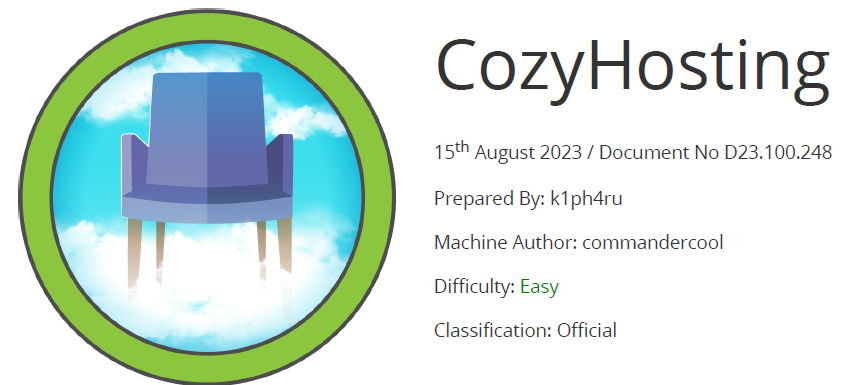

# Scope

CozyHosting is a Linux machine rated as easy that runs a Spring Boot web application with the Actuator endpoint exposed. By enumerating this endpoint, a valid user session cookie can be obtained, which allows access to the main dashboard as an authenticated user.
The web application contains a command injection vulnerability that can be exploited to obtain a reverse shell on the target system. Further analysis of the application’s JAR file reveals credentials hardcoded within the code, which can then be used to access the local database.
Inside the database, a hashed password is found and cracked, granting access to the system as the user **josh**. This user has permission to execute **ssh** with root privileges, which is ultimately abused to gain full administrative access to the machine.

# Index
- [Enumeration](Enumeration.md)
- [Fuuzing](Fuuzing.md)
- [Foothold](Foothold.md)
- [Lateral Movement](Lateral_Movement.md)
- [Priv Escalation](Priv_Escalation.md)

Go back to [Hack-The-Box_CTF](https://github.com/jesuscuenca-cyber/Hack-The-Box_CTF)