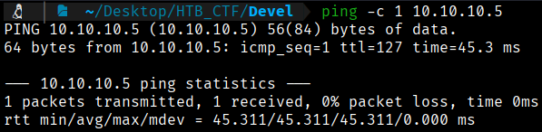
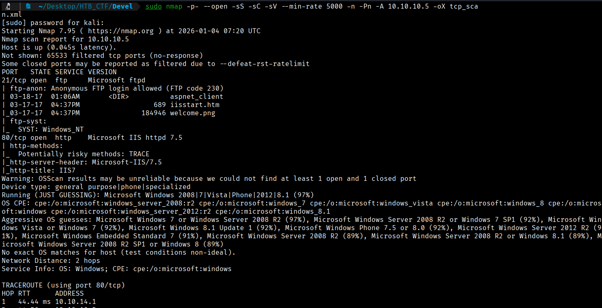
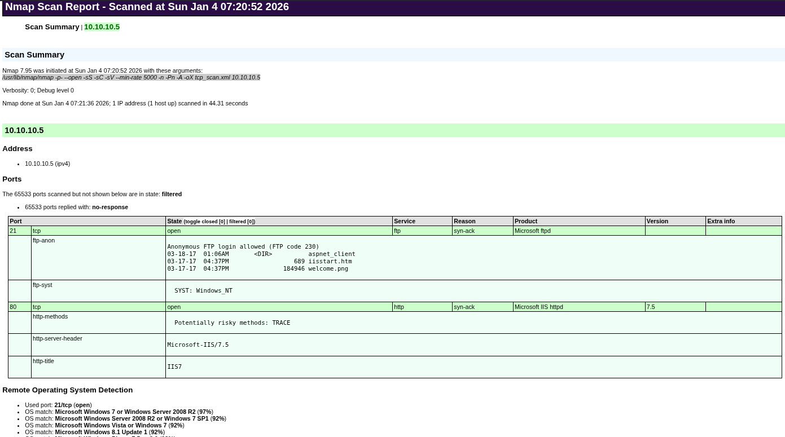
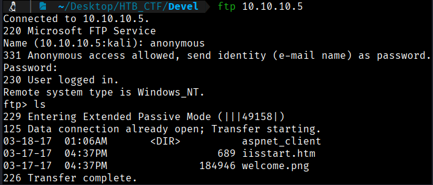
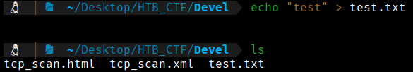
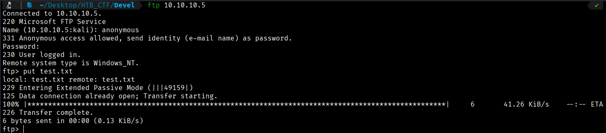

First of all we check that we have connection with IP target.



This TTL value on HTB indicates that is a Windows machine.

Starting with our usual Nmap scan, we see several ports are open. 

$ sudo nmap -p- --open -sS -sC -sV --min-rate 5000 -n -Pn -A 10.10.10.5 -oX tcp_scan.xml
 $ xsltproc tcp_scan.xml -o tcp_scan.html

-p- → Scans all 65,535 TCP ports, not just the most common ones. All 65,535 TCP ports, not just the most common ones, not just the most common ones. 

--open → Shows only ports that are open, filtering out closed or filtered ones.

-sS → Performs a TCP SYN scan (half-open scan), which is fast and stealthy and requires root privileges.

-sC → Runs default NSE (Nmap Scripting Engine) scripts to gather additional information such as common vulnerabilities and service details.

-sV → Attempts to detect service versions running on open ports.

--min-rate 5000 → Forces Nmap to send at least 5000 packets per second, speeding up the scan but increasing the chance of detection or packet loss. 

-n →  Disables DNS resolution to make the scan faster.

-Pn → Skips host discovery and assumes the target is alive, useful when ICMP is blocked.

-A → Enables aggressive scan options, including OS detection, version detection, script scanning, and traceroute.

-oX → Output option: write results in XML format to file nmap.xml.  Other formats: -oN (normal), -oG (grepable), -oA (all formats).





At this point, we can do a enumeration on FTP port with Anonymous:Anonymous credentials as nmap scan says.
```bash
$ ftp 10.10.10.5
```


We can try to put a test.txt to see if we can upload files with Anonymous credentials. For this, we create a test.txt file in our local machine and we will try to put.
```bash
$ echo "test" > test.txt
```




Attempting to connect anonymously via FTP reveals that the server does allow anonymous login with read/write privileges in the IIS server directory.


[Back](README.md)
