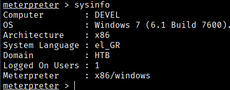
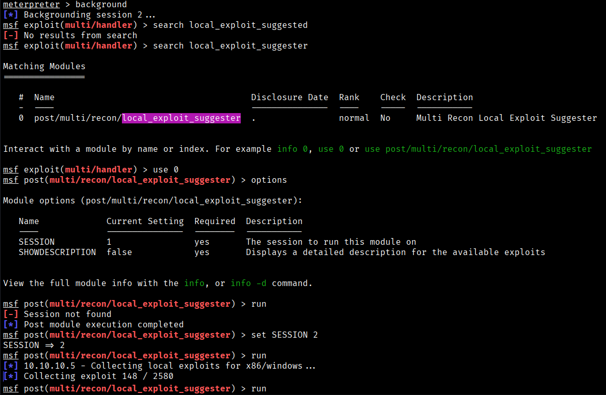
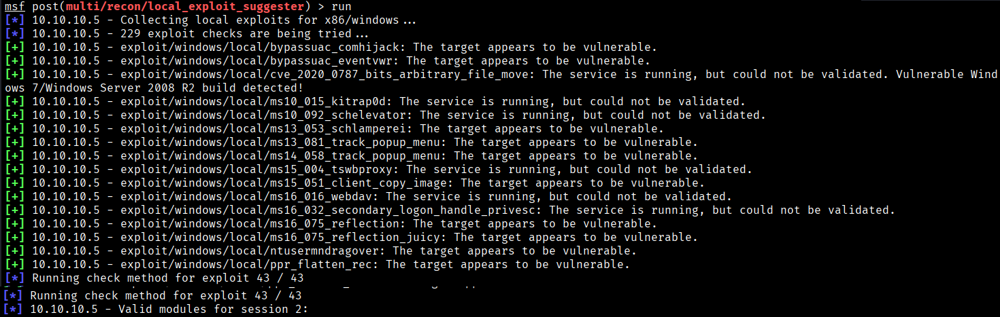
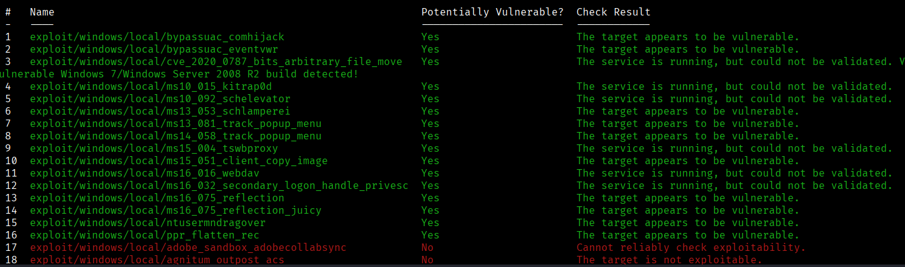
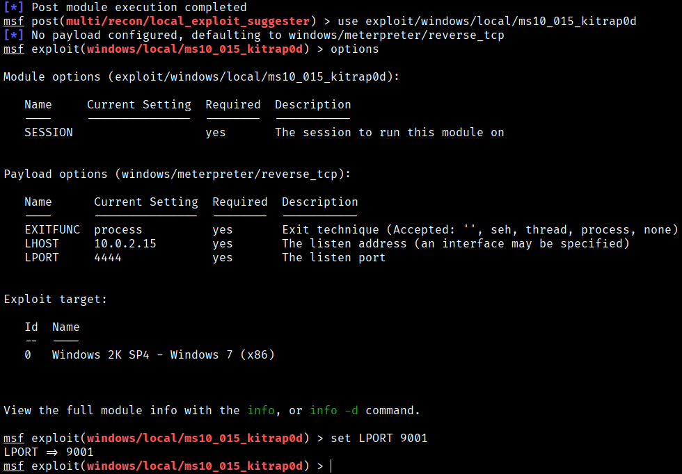
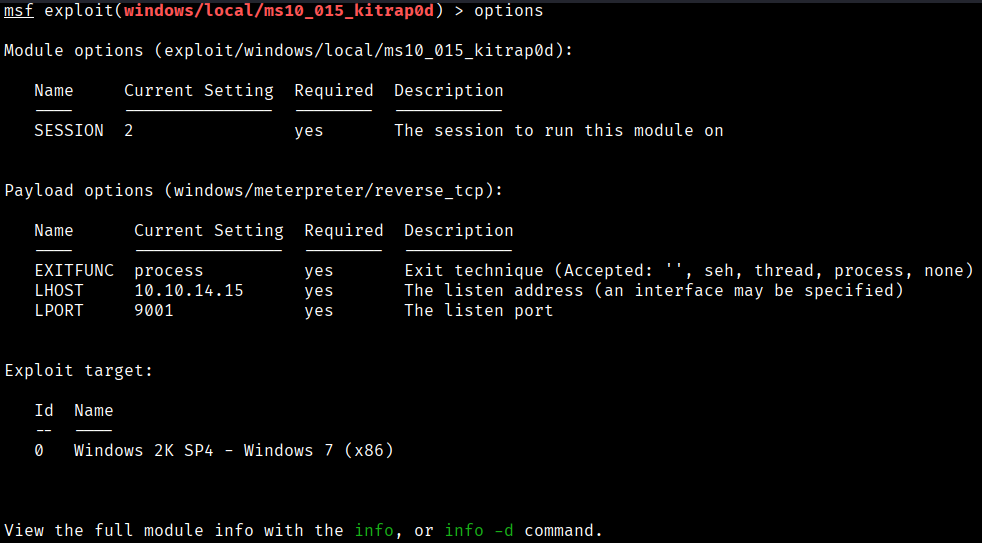
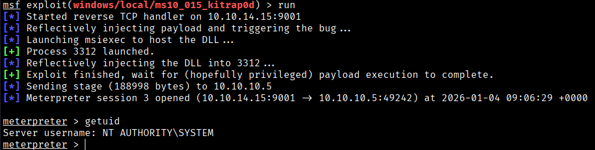
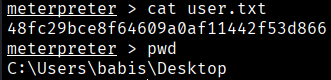
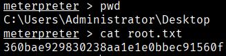

Running `sysinfo` within the Meterpreter session indicates that the target system is based on an x86 architecture, which makes the recommendations from the `local_exploit_suggester` module fairly reliable. This is not always the case when running the module against x64 systems.









Executing the suggester returns several suggested privilege escalation modules, such as:

- `exploit/windows/local/bypassuac_eventvwr`
- `exploit/windows/local/ms10_015_kitrap0d`
- … and nine additional options

After trying several suggested options, the one that worked for me is the following (ms10_015_kitrap0d):





Finally we got a meterpreter session as SYSTEM.



The flags can be found at:





```bash
User Flag → 48fc29bce8f64609a0af11442f53d866
Root Flag → 360bae929830238aa1e1e0bbec91560f
```

[Back](README.md)
