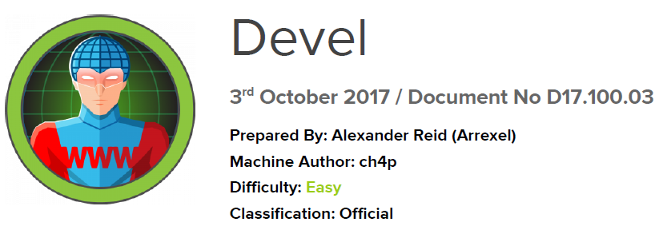

# Scope

Devel, while relatively simple, demonstrates the security risks associated with some default program configurations. It is a beginner-level machine which can be completed using publicly available exploits.

# Index
- [Enumeration](Enumeration.md)
- [Explotation](Explotation.md)
- [Priv Escalation](Priv_Escalation.md)
- [Software Versions](Software_Versions.md)

Go back to [Hack-The-Box_CTF](https://github.com/jesuscuenca-cyber/Hack-The-Box_CTF)