First of all we check that we have connection with IP target.
```bash
$ ping -c 1 10.129.10.137
```

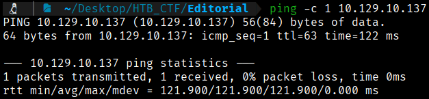

This TTL value on HTB indicates that is a Linux machine.

We will start with our usual Nmap scan and find the following open ports. 
```bash
$ sudo nmap -p- --open -sS -sC -sV --min-rate 5000 -n -Pn -A 10.129.229.88 -oX tcp_scan.xml
$ xsltproc tcp_scan.xml -o tcp_scan.html
```
-p- → Scans all 65,535 TCP ports, not just the most common ones. All 65,535 TCP ports, not just the most common ones, not just the most common ones. 

--open → Shows only ports that are open, filtering out closed or filtered ones.

-sS → Performs a TCP SYN scan (half-open scan), which is fast and stealthy and requires root privileges.

-sC → Runs default NSE (Nmap Scripting Engine) scripts to gather additional information such as common vulnerabilities and service details.

-sV → Attempts to detect service versions running on open ports.

--min-rate 5000 → Forces Nmap to send at least 5000 packets per second, speeding up the scan but increasing the chance of detection or packet loss. 

-n →  Disables DNS resolution to make the scan faster.

-Pn → Skips host discovery and assumes the target is alive, useful when ICMP is blocked.

-A → Enables aggressive scan options, including OS detection, version detection, script scanning, and traceroute.

-oX → Output option: write results in XML format to file nmap.xml.  Other formats: -oN (normal), -oG (grepable), -oA (all formats).

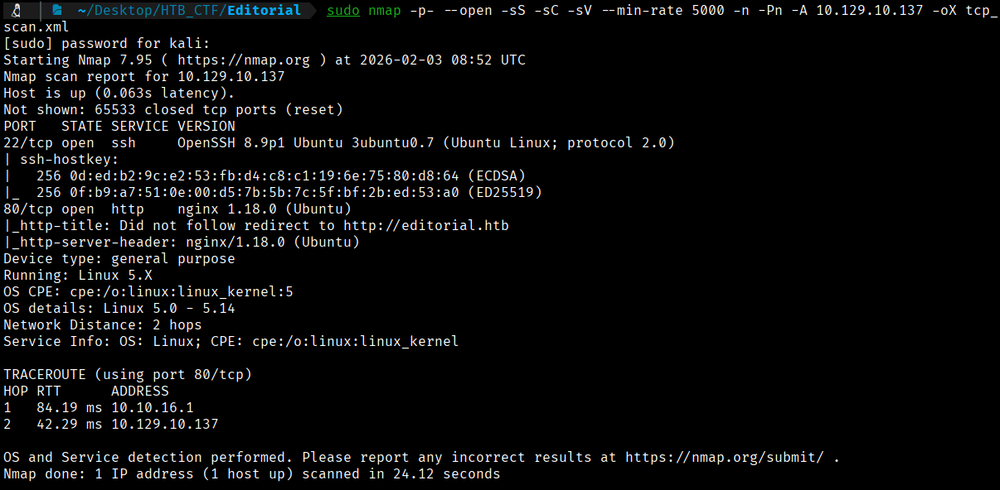

First of all we will try to open with our browser the IP. To access the website, we must add the IP to our /etc/hosts file to resolve the connection with the IP address.
```bash
$ echo "10.129.10.137 editorial.htb echo" | sudo tee -a /etc/hosts 
```
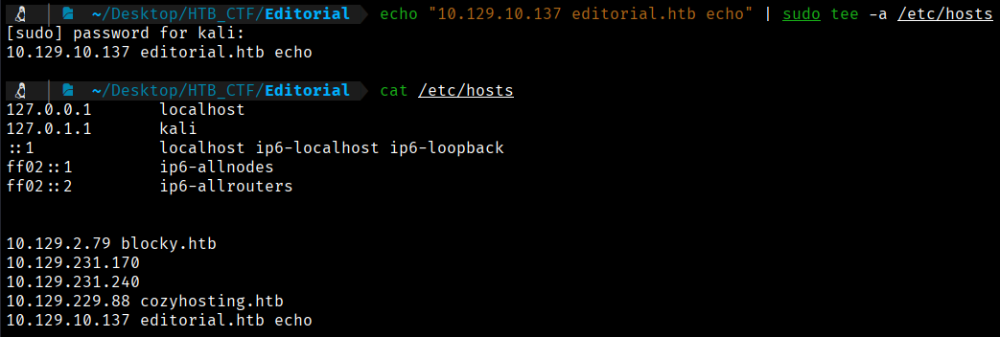

Now we can go to the website through the port 80


With the Wappalyzer application, we can obtain more information about the website, just as we can by using the whatweb command.
```bash
$ whatweb 10.129.10.137
```

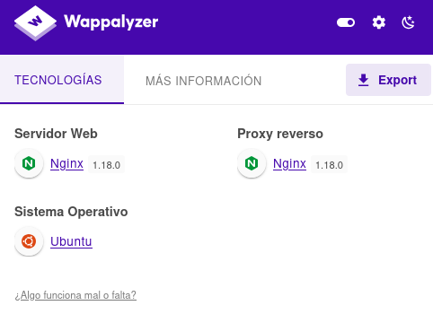

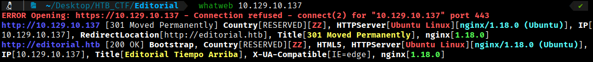

If we navigate to the **"Publish with Us"** we can see that we can upload content to the web and we can also add a URL. We can open Burpsuit to see what do the web with all of these things.

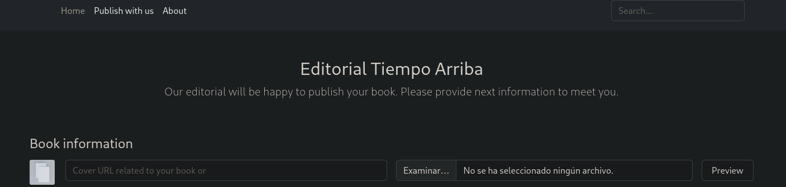

First, in the field where a URL is requested, we will enter our local IP address and open **Burp Suite** to analyze how the request behaves. We will also start a **Netcat listener** to observe the response we receive.
```bash
$ nc -lnvp 443
```

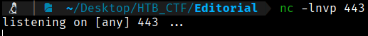

To know our local ip 
```bash
$ ip a
```

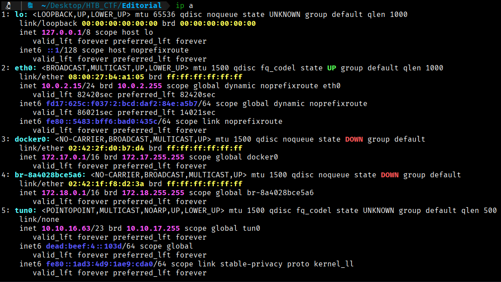

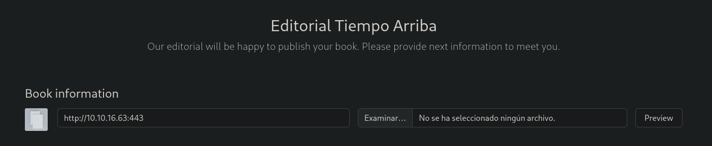

Now we can click in “Preview” button to observe what is happening using **Burp Suite**.

If we send the request to **Repeater**, we can see that we receive a **200 OK** response, and in our listener we observe the following:

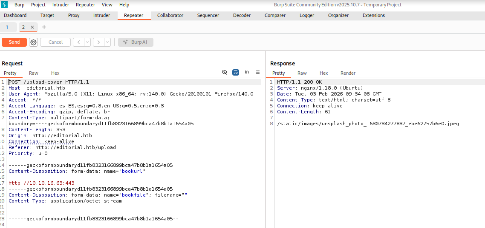

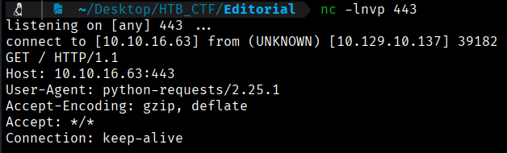

By checking our Netcat listener, we can verify that a callback is successfully received. This shows that the server initiated a connection back to our local machine, confirming that the application is vulnerable to **Server-Side Request Forgery (SSRF)**.

**Server-Side Request Forgery (SSRF)** is a security vulnerability in web applications that allows an attacker to manipulate a server into making HTTP requests to internal addresses, protected services, or external resources that should not normally be accessible from outside.

The attacker exploits application functionality to force the server to send requests to attacker-controlled URLs, such as `127.0.0.1`, `localhost`, or internal services (for example, cloud metadata services like AWS or Azure). This can lead to access to sensitive information, internal port scanning, backend service compromise, or even remote code execution, especially when trust relationships exist between systems.


[Back](README.md)