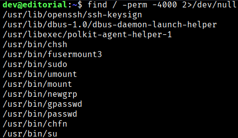
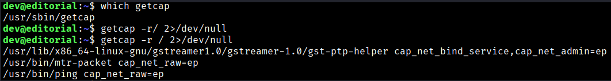
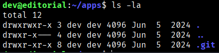
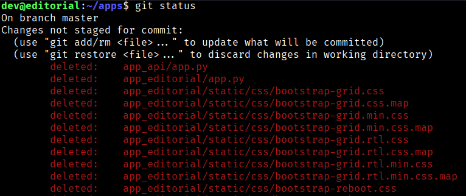
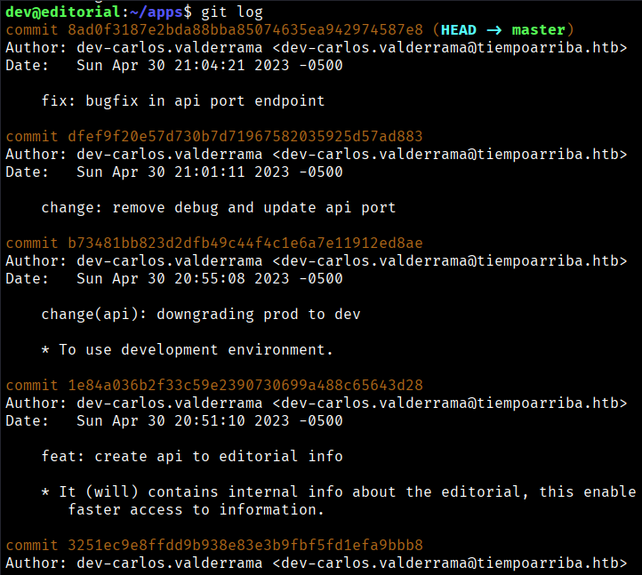
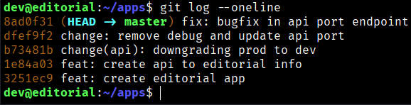
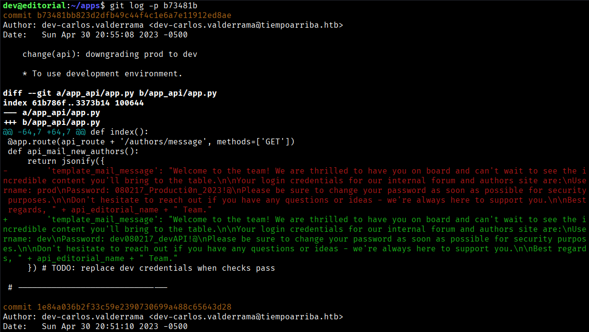
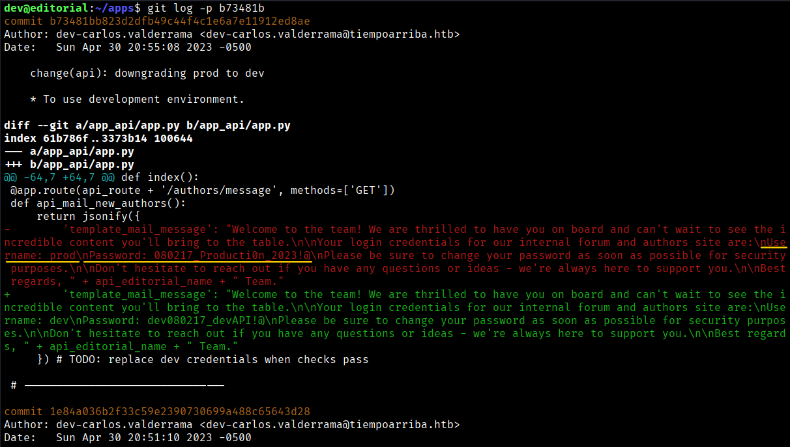
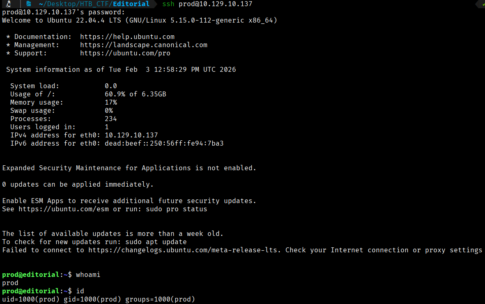
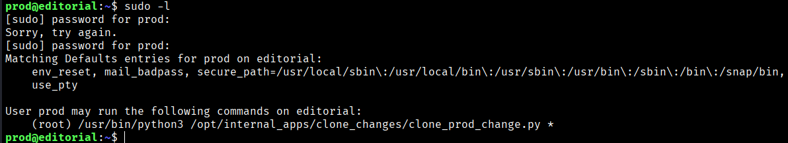

First of all, we check what commands we are allowed to execute as **root**.
```bash
$ find / -perm -4000 2>/dev/null
```


With this, we do not see any binaries that can be exploited.

We can try to see if we found any capabilites to exploit.



With these capabilities, it does not seem possible to achieve anything either.

We can go to the “app” direcotry to see what we find.



We can see a .git file so we can do “git status” to see all the changes
```bash
$ git status 
```



We notice that many files have been deleted, so we proceed to check the logs.
```bash
$ git log
```



To view the activity in a more concise way, we do the following:
```bash
$ git log --oneline
```



One of the activity was “downgrading prod to dev”. It appears that they rolled back due to an error.
```bash
$ git log -p b73481b
```



If we pay attemption, we will see a new credentials.


```bash
User: prod
Pass: 080217_Producti0n_2023!@
```

We can try to connect via **SSH** using these credentials and check what permissions this newly discovered user has.
```bash
$ ssh prod@10.127.10.137
```



In this case, with this credentials we can do some actions as a root.



The output reveals several default user settings, such as **env_reset**, which ensures the environment is sanitized before executing commands, and **secure_path**, which defines a safe executable path. It also shows which commands the **prod** user is allowed to run as **root**. In this case, the **prod** user is permitted to execute a Python script with root privileges.


[Back](README.md)
