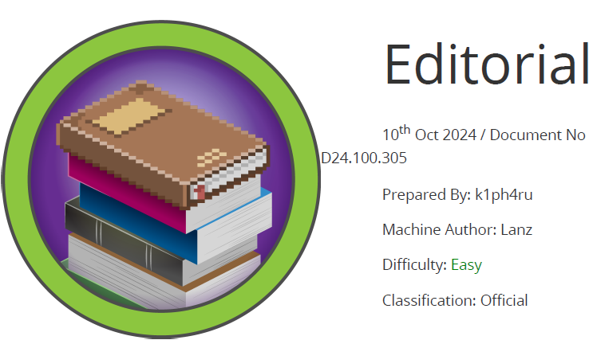

# Scope

Editorial is a Linux machine with an easy difficulty level that features a publishing web application vulnerable to **Server-Side Request Forgery (SSRF)**. This vulnerability is exploited to gain access to an internal API that is running on the system, which is then used to retrieve credentials allowing **SSH** access to the machine.
Further system enumeration uncovers a **Git** repository, which is leveraged to obtain credentials for an additional user. Ultimately, **root** access can be achieved by exploiting **CVE-2022-24439** in combination with the **sudo** configurat.

# Index
- [Enumeration](Enumeration.md)
- [Foothold](Foothold.md)
- [Lateral Movement](Lateral_Movement.md)
- [Priv Escalation](Priv_Escalation.md)

Go back to [Hack-The-Box_CTF](https://github.com/jesuscuenca-cyber/Hack-The-Box_CTF)