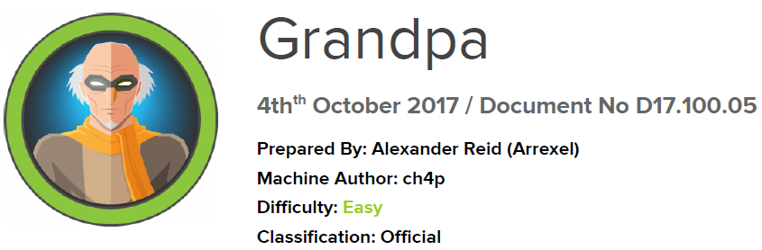

# Scope

Grandpa is considered one of the more straightforward machines on Hack The Box, yet it demonstrates the well-known CVE-2017-7269 vulnerability. This flaw is extremely easy to exploit and, once disclosed, allowed attackers to gain instant access to thousands of IIS servers worldwide.

# Index
- [Enumeration](Enumeration.md)
- [Exploitation](Exploitation.md)
- [Priv Escalation](Priv_Escalation.md)

Go back to [Hack-The-Box_CTF](https://github.com/jesuscuenca-cyber/Hack-The-Box_CTF)