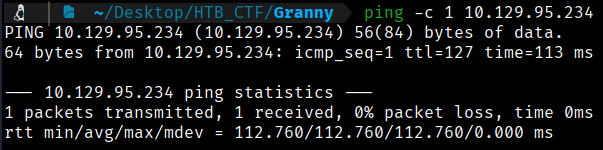
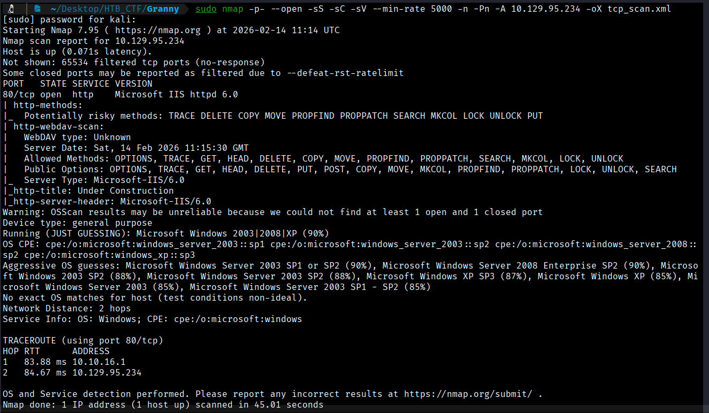
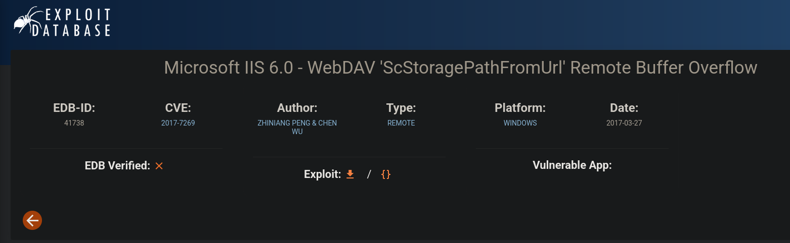

First of all we check that we have connection with IP target.
```bash
$ ping -c 1 10.129.95.234
```



This TTL value on HTB indicates that is a Windows machine.

We will start with our usual Nmap scan and find the following open ports. 
```bash
$ sudo nmap -p- --open -sS -sC -sV --min-rate 5000 -n -Pn -A 10.129.95.234 -oX tcp_scan.xml
```
-p- → Scans all 65,535 TCP ports, not just the most common ones. All 65,535 TCP ports, not just the most common ones, not just the most common ones. 

--open → Shows only ports that are open, filtering out closed or filtered ones.

-sS → Performs a TCP SYN scan (half-open scan), which is fast and stealthy and requires root privileges.

-sC → Runs default NSE (Nmap Scripting Engine) scripts to gather additional information such as common vulnerabilities and service details.

-sV → Attempts to detect service versions running on open ports.

--min-rate 5000 → Forces Nmap to send at least 5000 packets per second, speeding up the scan but increasing the chance of detection or packet loss. 

-n →  Disables DNS resolution to make the scan faster.

-Pn → Skips host discovery and assumes the target is alive, useful when ICMP is blocked.

-A → Enables aggressive scan options, including OS detection, version detection, script scanning, and traceroute.

-oX → Output option: write results in XML format to file nmap.xml.  Other formats: -oN (normal), -oG (grepable), -oA (all formats).





An Nmap scan shows only a single open service: Microsoft IIS 6.0. Further research uncovers a remote code execution flaw (CVE-2017-7269). A proof of concept exploit exists but needs slight adjustments, and there is also a Metasploit module available for this vulnerability. https://www.exploit-db.com/exploits/41738




[Back](README.md)