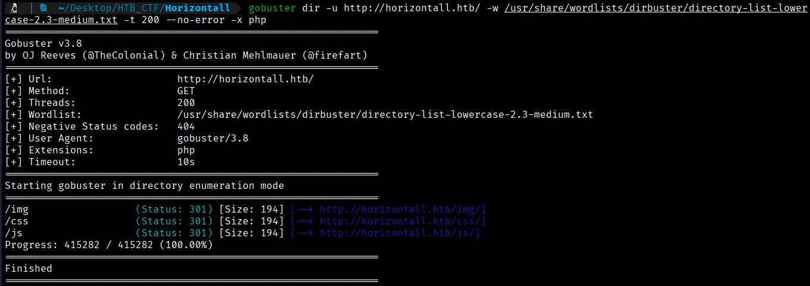
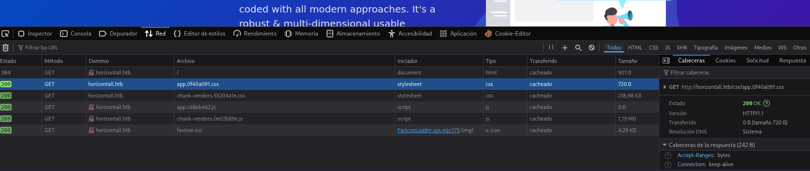
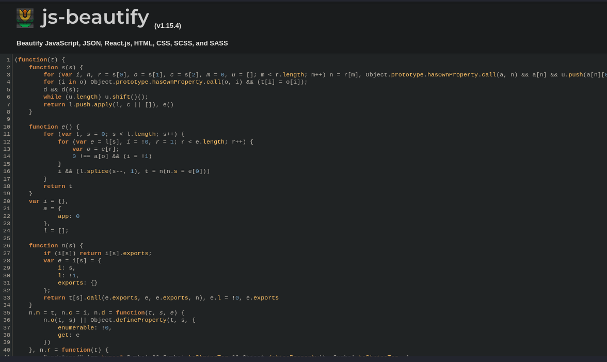
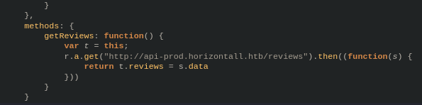
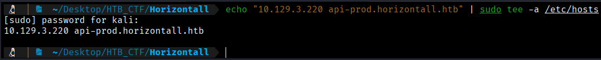
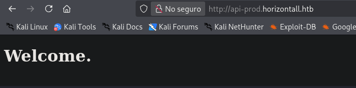
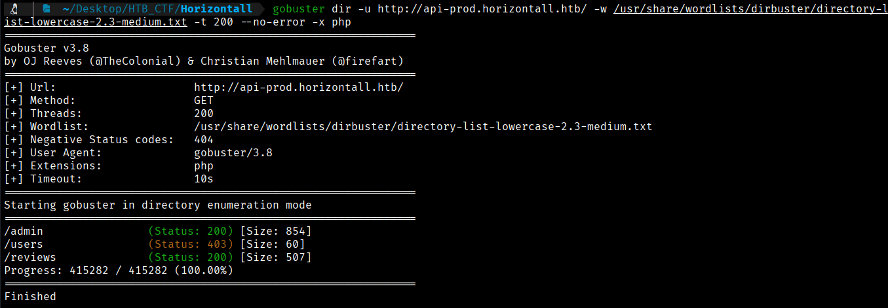

The Gobuster tool will allow us to scan for hidden resources such as subdomains, directories, and parameters.
Let's look for hidden subdomains. 
```bash
$ gobuster dir -u http://horizontall.htb/ -w /usr/share/wordlists/dirbuster/directory-list-lowercase-2.3-medium.txt -t 200 --no-error -x php
```
 
- **`-t 200`** → Defines the number of simultaneous threads  
- **`--no-error`** → Filters out common error responses such as **404 Not Found** and **403 Forbidden**  
- **`-x php`** → Specifies the **file extensions** that will be automatically tested (e.g., `.php`) (becasuse thanks to wappalyzer we know that a php is runing in the website)



So far, we have not found any useful information, so we will inspect the website’s source code to see what we can discover.



By analyzing the requests generated when visiting the website, several interesting JavaScript files can be observed. The application appears to be a Single Page Application (SPA) developed using “https://beautifier.io/”. After beautifying the `app.c68eb462.js` file with an online JavaScript formatter, a previously unknown virtual host is identified.





We should modify our hosts file once again.
```bash
$ echo "10.129.3.220 api-prod.horizontall.htb" | sudo tee -a /etc/hosts
```



We are now able to visit http://api-prod.horizontall.htb .



We are presented with a simple welcome message and no additional functionality.

As navigating to `http://api-prod.horizontall.htb` only displays a basic welcome message, we can use Gobuster to brute-force and identify any existing directories.
```bash
$ gobuster dir -u http://api-prod.horizontall.htb/ -w /usr/share/wordlists/dirbuster/directory-list-lowercase-2.3-medium.txt -t 200 --no-error -x php  
```



The `/admin` directory appears to be the most promising. When navigating to `http://api-prod.horizontall.htb/admin`, we are presented with the administrator panel of **strapi}**.


According to the official webpage (https://strapi.io/), Strapi is an open source Node.js Headless CMS.


[Back](README.md)