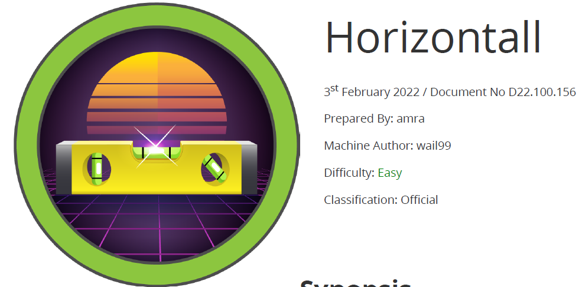

# Scope

Horizontall is a Linux machine rated as easy, with only HTTP and SSH services available. Initial enumeration shows that the website is developed using the Vue.js framework. By inspecting the JavaScript source code, an additional virtual host is identified. This virtual host runs the Strapi headless CMS, which is affected by two known CVEs that can be exploited to achieve remote code execution as the `strapi` user.

Further analysis of services bound exclusively to localhost reveals a Laravel application. Access to the port used by Laravel is obtained through SSH tunneling. The Laravel framework in use is outdated and configured with debug mode enabled, making it vulnerable to another CVE that allows remote code execution, ultimately leading to root-level access.

# Index
- [Enumeration](Enumeration.md)
- [Fuzzing](Fuzzing.md)
- [Foothold](Foothold.md)
- [Priv Escalation](Priv_Escalation.md)

Go back to [Hack-The-Box_CTF](https://github.com/jesuscuenca-cyber/Hack-The-Box_CTF)